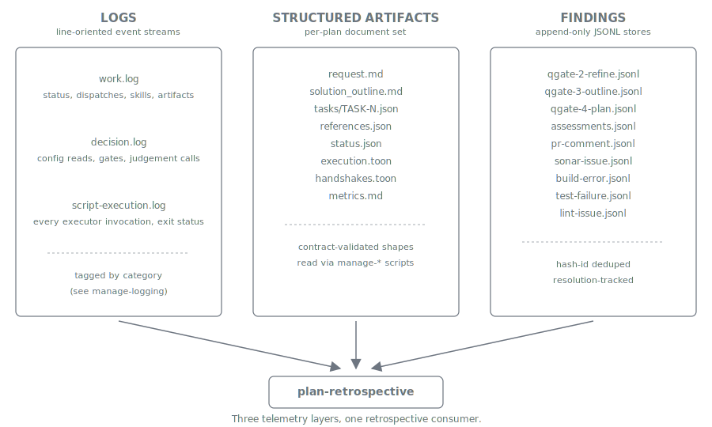

= Audit Trail
:nofooter:
:toc: left
:toclevels: 3
:toc-title: Table of Contents
:sectnums:
:source-highlighter: highlight.js

xref:../../README.md[Plan Marshall] » xref:README.adoc[Concepts]

"What did this run actually do?" is a question that Claude Code sessions answer poorly. The chat history is long, the action sequence has gaps, the model's own summary is generous. Plan Marshall solves the problem by writing everything down as a side-effect of running the plan: every dispatch, every script call, every skill load, every gate decision, every artifact produced, every finding raised, every resolution recorded. The record lives next to the plan on local disk, never leaves the developer's machine, and is detailed enough that `plan-retrospective` can read a finished plan back and produce a quality report without any human prompting.

== Three telemetry layers

Logs are the line-oriented event stream: `work.log` is the narrative (phase milestones, dispatches, skill loads, artifact creation), `decision.log` is the why (config reads, gate decisions, judgement calls), and `script-execution.log` is the ledger of every script the executor proxy ran. Session-scoped environment decisions land in `decision.log` too: the xref:build-server.adoc[build-server] preflight records its outcome (`disabled` / `ready` / `down` + the operator's chosen resolution) on every planning session, and the control skill appends a registration-audit line on every `register` / `unregister` — so a project's build-server posture and how it got there are reconstructable after the fact. Each entry carries a timestamp, severity, hash-id, and a category tag in brackets that retrospective consumers grep by; the canonical tag inventory lives in the `manage-logging` standards.

Structured artifacts are the per-plan document set — request, outline, tasks, status, references, the per-plan execution manifest, the phase-handshake snapshots, and the metrics report. Every file has a contract-validated shape produced by a specific phase; together they reconstruct *what the plan thought it was doing* at every transition. Reads always go through `manage-*` scripts, so the artifact API is the audit layer's API.

Findings are append-only JSONL records — one row per quality signal, hash-id deduplicated, with resolution fields that record *what was done about it*. The Q-Gate findings are the producer side of the analytical reviews; the per-domain findings (`pr-comment.jsonl`, `sonar-issue.jsonl`, `build-error.jsonl`, …) are the producer side of the automated reviews (xref:automatic-reviews.adoc[Automatic Reviews]). Findings explain *what was found and what was done about it* — the structural counterpart to `decision.log`'s prose.

== Why it's comprehensive

Two structural reasons push the audit trail from "best effort" to "exhaustive":

* **The script-executor proxy is the audit point.** Every `python3 .plan/execute-script.py` call routes through one Python entry point that logs the notation, args, and exit status to `script-execution.log` before dispatching. Nothing operational slips past. See xref:security.adoc[Security] for the executor-proxy contract.
* **Phase handshakes make state checkable.** Every phase boundary captures a registry of invariants into `status.json` and verifies them on entry to the next phase. Drift between captured and live state surfaces immediately as a `status: drift` return — visible in `work.log`, persisted in `handshakes.toon`.

The two together mean any run can be replayed from the logs and re-evaluated from the artifacts. No information needs to be re-derived from chat history.

== `plan-retrospective` — the trail's natural consumer

`plan-retrospective` is the opt-in skill that reads the audit trail back and produces a quality-verification report. The design has two layers: a set of deterministic aspect scripts produce TOON *fragments* under `work/` — pure facts derived from the audit trail — and the LLM synthesizes the report from those fragments. Scripts never judge; references never run code. The exact aspect inventory, per-aspect semantics, and report shape live in link:../../marketplace/bundles/plan-marshall/skills/plan-retrospective/SKILL.md[`plan-retrospective/SKILL.md`].

Invocation paths: dispatched automatically as the `post-run-review` finalize step (when configured), invoked standalone as `/plan-marshall action=lessons`, or pointed at an archived plan in "archived mode" to evaluate a completed run after the fact without mutating it.

[CAUTION]
====
**The audit trail is post-hoc, not real-time enforcement.**

The script-executor proxy logs what already happened. The phase handshakes refuse to advance when invariants have drifted, but they refuse *at the boundary* — not the moment an off-script action fires. The trail's contribution is making the next reviewer's job tractable: "the run is on disk, in known shapes, and `plan-retrospective` can synthesize a verdict." It is the safety net under the live enforcement (xref:process-enforcement.adoc[Process Enforcement]), not a replacement for it.
====

[#_from_dispositions_to_durable_preferences]
== From dispositions to durable preferences

The audit trail's finding dispositions are not only a record of what was done — they are a learning signal. When the same finding class repeatedly receives the same user gate-disposition (`suppressed`, `accepted`, or `taken_into_account`), that recurrence is evidence of a durable project preference. Plan Marshall promotes those recurrences into architecture hints through *two* surfaces that share one generalization-and-routing contract:

* **Meta-only cross-plan path (rich).** The project-local `audit-archived-plan-retrospectives` auditor's `preference-pattern-detector` check aggregates `(module, finding-class, disposition)` tuples across the *whole archived-plan corpus*, threshold-gates them via its `THRESHOLDS["preference_disposition_occurrences"]` script constant, and surfaces candidate preferences. This path sees the full corpus and is meta-project-only.
* **Consumer-available per-plan path (cheap).** The built-in `default:finalize-step-preference-emitter` finalize step reads the just-finished plan's dispositions via `manage-findings`, aggregates recurrences *within that single plan*, and threshold-gates via its `marshal.json` `preference_min_recurrence` config knob. Because it ships in the plan-marshall bundle and is discovered via the standard finalize-step mechanism, consumer projects get preference learning too.

Both surfaces generalize each recurrence into a best-practice or insight string framed in the project's voice and route it to the SAME sink — `architecture enrich best-practice` / `enrich insight`, writing into the existing `enriched.json` `best_practices[]` / `insights[]` schema, with no new store. The enriched hints then surface automatically through `get-module-context` into the phase-3-outline Architecture Hints section, biasing future outlines toward the project's demonstrated preferences. The generalization rule, the routing targets, and the privacy invariant are authored once in link:../../marketplace/bundles/plan-marshall/skills/phase-6-finalize/standards/disposition-to-hint-routing.md[`disposition-to-hint-routing.md`]; both surfaces reference it rather than restating it.

The privacy invariant is load-bearing: **generalize, do not log raw dispositions.** Only the generalized hint string is ever written to `enriched.json` — never a per-finding hash ID, never a raw `suppressed`/`accepted` row. The raw disposition corpus stays local under each plan's `artifacts/findings/`, consistent with the retention posture below.

== Retention and privacy

The audit trail is strictly local. Storage lives under `.plan/local/{plans,archived-plans}/{plan_id}/`, which is gitignored. Completed plans move to `archived-plans/` via `/plan-marshall action=cleanup`; archived plans are read-only from the retrospective's perspective. Nothing under `.plan/local/` is ever surfaced to remotes by Plan Marshall itself — if a retrospective is worth sharing, the developer copies `quality-verification-report.md` out by hand. This is deliberate: the trail records local LLM behaviour, model usage, decisions, and per-developer state, and that content should not propagate to a shared repository.

== Related

* link:../../marketplace/bundles/plan-marshall/skills/plan-retrospective/SKILL.md[`plan-retrospective/SKILL.md`] — canonical retrospective skill, the aspect inventory, the fragment-naming pattern, the report structure.
* link:../../marketplace/bundles/plan-marshall/skills/ref-workflow-architecture/standards/artifacts.md[`artifacts.md`] — canonical inventory of every structured artifact a plan produces, with per-phase ownership.
* link:../../marketplace/bundles/plan-marshall/skills/manage-logging/standards/log-format.md[`manage-logging/standards/log-format.md`] — canonical log-entry format, the category tags embedded in `work.log`, and the script-execution log shape.
* link:../../marketplace/bundles/plan-marshall/skills/ref-workflow-architecture/standards/dispatch-logging.md[`dispatch-logging.md`] — the `[DISPATCH]` line contract every subagent dispatch follows.
* link:../../marketplace/bundles/plan-marshall/skills/ref-workflow-architecture/standards/findings-pipeline.md[`findings-pipeline.md`] — the producer / store / consumer / gate architecture and the per-phase blocking partition.
* link:../../marketplace/bundles/plan-marshall/skills/manage-findings/SKILL.md[`manage-findings/SKILL.md`] — the unified store API, finding-type taxonomy, and resolution semantics (`standards/jsonl-format.md` § Resolution semantics).
* link:../../marketplace/bundles/plan-marshall/skills/manage-metrics/SKILL.md[`manage-metrics/SKILL.md`] — per-phase metrics accumulation that feeds `metrics.md`.
* xref:security.adoc[Concepts › Security] — the script-executor proxy that makes the audit trail comprehensive.
* xref:skill-handling.adoc[Concepts › Skill Handling] — the `[SKILL]` log tag and how loaded context is auditable.
* xref:process-enforcement.adoc[Concepts › Process Enforcement] — the four enforcement layers the audit trail records.
* xref:orchestration.adoc[Concepts › Orchestration] — the orchestrator store's log-everything posture: the same record-as-side-effect discipline applied to epic-level decisions and reconciliations under `.plan/local/orchestrator/{slug}/logs/`.
* xref:build-server.adoc[Concepts › Build Server] — the preflight and registration decisions recorded to `decision.log` and the control skill's append-only registration audit.
