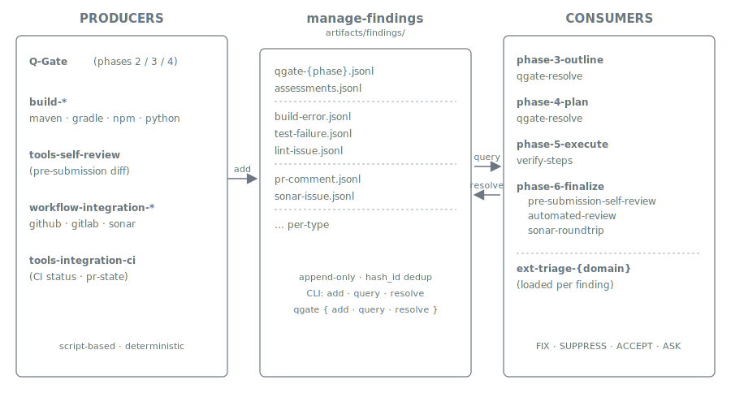

= Automatic Reviews
:nofooter:
:toc: left
:toclevels: 2

Plan Marshall runs a chain of automated reviews across phases 2 through 6 — analytical (Q-Gate over outline and task plan), internal (build / verify), structural (pre-submission self-review), and external (CI, Sonar, PR review comments). Every review feeds the **same** findings pipeline, the **same** per-finding triage envelope, and produces the **same** four decision outcomes (`fixed` / `suppressed` / `accepted` / `taken_into_account`). The uniformity is what makes the chain reproducible.

== TL;DR

* **Six review surfaces**, all funneling into one store:
  - **Q-Gate** over the outline + task plan (phase-3, phase-4, also a phase-2 lesson-derived check).
  - **Build / verify** during phase-5-execute (per-language build skills as producers).
  - **Pre-submission self-review** at the start of phase-6-finalize (structural review of the diff).
  - **Automated review** of PR comments after CI completes (phase-6-finalize).
  - **Sonar roundtrip** after CI completes (phase-6-finalize).
* **One unified store** — `.plan/local/{plans,archived-plans}/{plan_id}/artifacts/findings/{type}.jsonl`, append-only, hash-id deduplicated.
* **One triage envelope** — the `verification-feedback` workflow, parameterised by `producer ∈ {build-runner, sonar, pr-comment, plugin-doctor, pr-state}`. Steps 2-6 are identical across producers; Step 1 is the producer-specific fetch.
* **Per-domain decision knowledge** — pluggable via the `ext-triage-{domain}` extension point. The triage workflow loads the right domain's standards at dispatch time.
* **Four resolution outcomes** — `fixed`, `suppressed`, `accepted`, `taken_into_account`. Persisted with the finding; pending counts gate phase transitions via phase-handshake invariants.

== The findings pipeline — one mechanism, many producers

Every quality signal — a Q-Gate verification failure, a build error, a Sonar issue, a reviewer's PR comment, a self-review hunk concern — becomes a row in one of the per-type JSONL files. The same `manage-findings` API reads/writes them. The same per-finding triage envelope decides what to do with them. Each producer is a script (xref:tools-and-scripts.adoc[Tools and Scripts]), so the producer side is deterministic; LLM judgement enters only at the triage step.

Canonical contract: link:../../marketplace/bundles/plan-marshall/skills/ref-workflow-architecture/standards/findings-pipeline.md[`ref-workflow-architecture/standards/findings-pipeline.md`].

== Analytical reviews — Q-Gate (phases 2 / 3 / 4)

The earliest automated review surface, applied to *planning artifacts* before any code change runs. Workflow: link:../../marketplace/bundles/plan-marshall/skills/plan-marshall/workflow/q-gate-validation.md[`plan-marshall/workflow/q-gate-validation.md`]. Dispatched under `--phase phase-N` (no `--role`) so the level tracks whatever the caller phase configures.

**Three call sites, one workflow body:**

[cols="1,1,3", options="header"]
|===
| Call site | When | What it checks

| `phase-2-refine` Step 13.5 | After a lesson-derived narrative is materialised into the request | Validates the lesson narrative against request intent. Activates the lesson-narrative validator subset.
| `phase-3-outline` Step 11 (Complex Track) | After the LLM produces `solution_outline.md` | Verifies every deliverable against the request and against the deliverable-assessments table (`assessments.jsonl`). Catches false positives (deliverable claims to cover X but doesn't), missing coverage (request mentions Y, no deliverable addresses it), and scope drift.
| `phase-4-plan` Step 9b | After `TASK-N.json` files are materialised | Verifies the task list against the outline — each task maps back to a deliverable + profile, no deliverable is silently dropped, dependencies are coherent.
|===

Q-Gate findings live in `qgate-{phase}.jsonl` (e.g. `qgate-3-outline.jsonl`, `qgate-4-plan.jsonl`) plus an `assessments.jsonl` for the outline-time deliverable assessments. Each finding has a `hash_id`, a `severity`, a `title`, and the same resolution lifecycle as every other finding. Phase-3 / phase-4 cannot complete while a Q-Gate finding is still `pending` — the phase-handshake `pending_findings_blocking_count` invariant gates the transition.

Real sample from an archived plan's `qgate-3-outline.jsonl`:

[source,json]
----
{
  "hash_id": "882466",
  "timestamp": "2026-05-15T10:23:22Z",
  "phase": "3-outline",
  "source": "qgate",
  "type": "anti-pattern",
  "title": "Self-modifying + breaking plan requires phasing rationale or split",
  "resolution": "taken_into_account",
  "resolution_detail": "Added Phasing Rationale block to solution_outline.md …",
  "severity": "warning"
}
----

The decision-log entry for the same finding records the resolution narrative — *which* of the three contract points the LLM addressed and how. See xref:audit-trail.adoc[Audit Trail] for the log shape.

== Internal reviews — phase-5-execute

=== Build / verify (`producer=build-runner`)

Every verify step in `phase-5-execute.steps` runs a canonical build command (xref:build-management.adoc[Build Management]) — `quality-gate`, `build-verify`, `coverage-check`, plus any domain-provided steps. The build skill captures errors and warnings to the log file *and* writes one finding per parsed error into the appropriate JSONL (`build-error.jsonl`, `test-failure.jsonl`, `lint-issue.jsonl`).

When `manage-findings query` reports a non-zero pending count, phase-5-execute dispatches the `verification-feedback` workflow with `producer=build-runner` (under `--phase phase-5-execute --role verification-feedback`). Steps 2-6 of that envelope process every pending finding through the same triage core described below.

**Deterministic shape:**

* The build command resolves through `architecture resolve --command verify --module {module}` — no LLM choice in *which* command runs.
* Build-output parsing is regex-driven (Maven log patterns, pytest assertion regex, ESLint TAP format, mypy line-format).
* Findings dedup by `hash_id` — the same error across re-runs maps to the same finding row.

== Structural review — pre-submission self-review (phase-6-finalize, pre-PR)

`finalize-step-pre-submission-self-review` — order 10 in the default phase-6 step list, runs **before** the PR is created. A structural review of the diff itself. Two-phase by design:

* **Deterministic phase** — `tools-self-review:self_review surface --plan-id {plan_id}` walks the diff and emits six candidate lists in a TOON envelope: regex literals, user-facing strings, markdown sections, symmetric-pair function names, contract source files, schema-bearing files.
* **LLM-judgement phase** — `pre-submission-self-review.md` workflow body (dispatched under `--phase phase-6-finalize`, no `--role`, tracking `phase-6-finalize.default`) reads only the candidates the surface helper produced and applies five checks:
  1. **Symmetric pair test coverage** — `save`/`load`, `init`/`restore`, `push`/`pop`, `acquire`/`release`, `open`/`close`, `start`/`stop` — does a test exercise both halves?
  2. **Regex over-fit** — does the regex match what it should AND not match what it shouldn't?
  3. **Ambiguous user-facing wording** — could an operator read this two ways?
  4. **Duplicate prose / markdown sections** — does the new section overlap a sibling?
  5. **Contract drift** — does a schema-bearing markdown file still describe the post-change shape?

The candidate surface is what makes this reproducible: the LLM never expands the review beyond what the deterministic helper surfaced.

Canonical workflow: link:../../marketplace/bundles/plan-marshall/skills/phase-6-finalize/workflow/pre-submission-self-review.md[`phase-6-finalize/workflow/pre-submission-self-review.md`].

== External reviews — phase-6-finalize, post-CI

Both external roundtrips are gated by the dispatcher-resolved `ci-complete` precondition (declared via `requires: [ci-complete]` in the workflow doc's frontmatter). The phase-6-finalize dispatcher waits for CI to go green (600-second ceiling) before either body runs; on `wait_failed` it marks the step `failed` and continues. Triage budgets are independent of CI queue depth.

=== Automated review — PR comments (`producer=pr-comment`)

Workflow: link:../../marketplace/bundles/plan-marshall/skills/phase-6-finalize/workflow/automated-review.md[`phase-6-finalize/workflow/automated-review.md`].

The producer side fetches PR review comments via `workflow-integration-github:github_pr comments-stage` (or the GitLab equivalent), applies a pre-filter (`comment-patterns.json` — strip bot noise, duplicate threads), and writes one `pr-comment` finding per surviving comment. There is also a configurable review-bot buffer (default 180 s after CI completion) to let downstream review bots finish posting before the fetch.

The consumer side then dispatches `verification-feedback` with `producer=pr-comment` under a 15-minute (900-second) per-agent budget. For each surfaced comment, the triage envelope decides:

* **FIX** — create a fix-task via `manage-tasks`; the plan loops back to phase-5-execute to address it.
* **Reply-with-rationale-and-resolve** — post a reply via `ci pr thread-reply`, then resolve the thread via `ci pr resolve-thread`. The reply rationale is templated per domain (per `ext-triage-{domain}/standards/pr-comment-disposition.md`).
* **Escalate-to-user** (`AskUserQuestion`) — when the decision is ambiguous or the domain isn't recognised.

When the triage envelope's wrapper expires (900 s), the dispatcher marks the step `failed`, logs an error, and continues to the next finalize step. The pipeline does not abort.

=== Sonar roundtrip (`producer=sonar`)

Workflow: link:../../marketplace/bundles/plan-marshall/skills/phase-6-finalize/workflow/sonar-roundtrip.md[`phase-6-finalize/workflow/sonar-roundtrip.md`].

The producer side calls `workflow-integration-sonar:sonar fetch-and-store` (Sonar analysis itself runs inside CI; this step consumes the result via REST). Pre-filters (severity floor, file scope, dismissed-status filter, `sonar-rules.json` exclusions) cut the volume; each surviving issue becomes one `sonar-issue` finding.

The consumer side dispatches `verification-feedback` with `producer=sonar` under the same 15-minute budget. Per-finding decisions:

* **FIX** — create a fix-task; loop back to phase-5-execute.
* **SUPPRESS** — write an inline annotation (`// NOSONAR ...` for Java, `# noqa: ...` for Python, etc. — exact syntax per `ext-triage-{domain}/standards/suppression.md`). Suppressions require an inline rationale comment.
* **ACCEPT** — documented in the finding record; no source change.

When Sonar isn't configured for the project (no project key, no credentials), the workflow short-circuits to `done` with `display_detail: "Sonar not configured"` and the pipeline continues.

== The unified triage envelope — `verification-feedback`

Workflow: link:../../marketplace/bundles/plan-marshall/skills/plan-marshall/workflow/verification-feedback.md[`plan-marshall/workflow/verification-feedback.md`]. **One workflow, five producer modes.**

The `producer` runtime input selects only Step 1's branch — the producer-specific fetch/parse work. Steps 2-6 are identical across producers:

[cols="1,3", options="header"]
|===
| Step | Action

| 1 (producer-mode branch) | `build-runner` / `sonar` / `pr-comment` — store-only query (pre-flight was already mechanical). `plugin-doctor` — inline marketplace analysis (LLM-heavy). `pr-state` — multi-source PR sweep (CI status + comments + Sonar).
| 2 | Per-finding loop — enumerate every pending finding from the store.
| 3 | For each finding: resolve domain from `file_path`, load `ext-triage-{domain}` skill.
| 4 | Apply per-domain standards (severity, suppression, acceptable-to-accept, pr-comment-disposition) to decide **FIX** / **SUPPRESS** / **ACCEPT** / `AskUserQuestion`.
| 5 | Execute the decision — `manage-tasks add` for FIX, source annotation for SUPPRESS, documented rationale for ACCEPT. Record via `manage-findings resolve`.
| 6 | Aggregate — return `status: loop_back` when any fix-task was created (re-enter phase-5-execute), `status: success` otherwise.
|===

The 15-minute wrapper budget is the only timeout — there is no internal soft-timeout or partial-progress checkpoint. High-volume scenarios (massive PR with hundreds of comments) trigger pre-emptive overflow handling that files a `pr-comment-overflow` finding and returns `loop_back`, so the wrapper never times out from sheer volume.

Q-Gate findings flow through the same store but their consumer is the calling phase itself (`phase-3-outline:qgate-resolve`, `phase-4-plan:qgate-resolve`), not the `verification-feedback` envelope — Q-Gate decisions are resolved inline by the phase orchestrator because their fix path is "edit the outline / task plan in `.plan/local/plans/{plan_id}/`", not "add a source-code change".

== Resolution outcomes

Four values, recorded on every finding via `manage-findings resolve --resolution {value}`:

[cols="1,3", options="header"]
|===
| Resolution | Meaning

| `fixed` | A fix-task was created (or the change was made inline) and the finding will re-verify on the next loop. Not counted as "still pending" in invariant checks.
| `suppressed` | An inline annotation has been added with documented rationale. Source change visible in the diff.
| `accepted` | Documented rationale in the finding's `resolution_detail`. No source change.
| `taken_into_account` | The finding informed a higher-order decision (e.g. a phase-3 Q-Gate finding addressed by adding a Phasing Rationale block to the outline). No direct fix or suppression. Closest analogue to "noted and absorbed."
|===

Only `pending` findings contribute to the phase-handshake `pending_findings_blocking_count` invariant. The `5-execute → 6-finalize` transition refuses to advance while the blocking count is non-zero — this is the gate that makes "review must be addressed before finalize" structural rather than convention-based. The same invariant gates `phase-3-outline → phase-4-plan` and `phase-4-plan → phase-5-execute` on the corresponding Q-Gate findings.

== Per-domain triage knowledge — `ext-triage-{domain}`

Each domain bundle plugs in its own decision logic via the `ext-triage` extension point. Contract:

[source,python]
----
class Extension(ExtensionBase):
    def provides_triage(self) -> str | None:
        return "pm-dev-java:ext-triage-java"
----

The referenced skill's `SKILL.md` (or its `standards/` directory) MUST include:

* `standards/severity.md` — when to fix vs suppress vs accept, by severity.
* `standards/suppression.md` — the exact syntax for in-source suppression (annotation, comment, pragma).
* `standards/acceptable-to-accept.md` — situations where `accepted` is the right outcome.
* `standards/pr-comment-disposition.md` — per-domain disposition table for PR comments with reply-rationale templates per category.

Current implementations:

* link:../../marketplace/bundles/pm-dev-java/skills/ext-triage-java/SKILL.md[`pm-dev-java:ext-triage-java`]
* link:../../marketplace/bundles/pm-dev-frontend/skills/ext-triage-js/SKILL.md[`pm-dev-frontend:ext-triage-js`]
* link:../../marketplace/bundles/pm-dev-oci/skills/ext-triage-oci/SKILL.md[`pm-dev-oci:ext-triage-oci`]
* link:../../marketplace/bundles/pm-dev-python/skills/ext-triage-python/SKILL.md[`pm-dev-python:ext-triage-python`]
* link:../../marketplace/bundles/pm-documents/skills/ext-triage-docs/SKILL.md[`pm-documents:ext-triage-docs`]
* link:../../marketplace/bundles/pm-requirements/skills/ext-triage-reqs/SKILL.md[`pm-requirements:ext-triage-reqs`]
* link:../../marketplace/bundles/pm-plugin-development/skills/ext-triage-plugin/SKILL.md[`pm-plugin-development:ext-triage-plugin`]

Domain detection at triage time is by `file_path` — file extension and path prefix determine which `ext-triage` skill loads. If the path matches no registered domain, the triage envelope falls back to `AskUserQuestion` rather than silently picking a default.

Canonical contract: link:../../marketplace/bundles/plan-marshall/skills/extension-api/standards/ext-point-triage.md[`ext-point-triage.md`].

== Why deterministic + uniform matters

Two properties together give the review pipeline its reproducibility:

* **Producers are scripts, not LLM judgements.** Build logs parsed by regex. Sonar issues fetched via REST. PR comments via `gh` API. The Q-Gate candidate surface produced by `q-gate-validation`'s deterministic validators. No "the LLM decided this comment doesn't need attention today" — every signal makes it to the store unless an explicit pre-filter pattern excludes it. See xref:tools-and-scripts.adoc[Tools and Scripts] for the script-based-integration rationale.
* **The triage envelope is one shape.** A reviewer comparing two runs sees five producer branches in Step 1 and the *same* five-step decision loop after. Per-domain knowledge enters via skill loading (xref:skill-handling.adoc[Skill Handling]) — explicit, traceable, not LLM-discovered.

Combined with the audit trail (xref:audit-trail.adoc[Audit Trail]), every review decision is reconstructable: which finding fired, which domain's standards were loaded, what the LLM decided, and why.

== Related

* link:../../marketplace/bundles/plan-marshall/skills/ref-workflow-architecture/standards/findings-pipeline.md[`findings-pipeline.md`] — canonical pipeline architecture (producer → store → consumer → gate)
* link:../../marketplace/bundles/plan-marshall/skills/extension-api/standards/ext-point-triage.md[`ext-point-triage.md`] — per-domain triage extension contract
* link:../../marketplace/bundles/plan-marshall/skills/plan-marshall/workflow/q-gate-validation.md[`q-gate-validation.md`] — Q-Gate validator workflow (3 call sites, shared body)
* link:../../marketplace/bundles/plan-marshall/skills/plan-marshall/workflow/verification-feedback.md[`verification-feedback.md`] — the unified triage envelope (five producer modes)
* link:../../marketplace/bundles/plan-marshall/skills/phase-6-finalize/workflow/pre-submission-self-review.md[`pre-submission-self-review.md`] — structural self-review workflow
* link:../../marketplace/bundles/plan-marshall/skills/phase-6-finalize/workflow/automated-review.md[`automated-review.md`] — PR review comment workflow
* link:../../marketplace/bundles/plan-marshall/skills/phase-6-finalize/workflow/sonar-roundtrip.md[`sonar-roundtrip.md`] — Sonar issue workflow
* link:../../marketplace/bundles/plan-marshall/skills/manage-findings/SKILL.md[`manage-findings/SKILL.md`] — the unified findings store API
* xref:tools-and-scripts.adoc[Concepts › Tools and Scripts] — why producer-side integrations are scripts
* xref:build-management.adoc[Concepts › Build Management] — the canonical-command resolution that drives build-runner producers
* xref:audit-trail.adoc[Concepts › Audit Trail] — where findings, decisions, and resolutions are recorded
* xref:skill-handling.adoc[Concepts › Skill Handling] — how `ext-triage-{domain}` skills load at triage time
