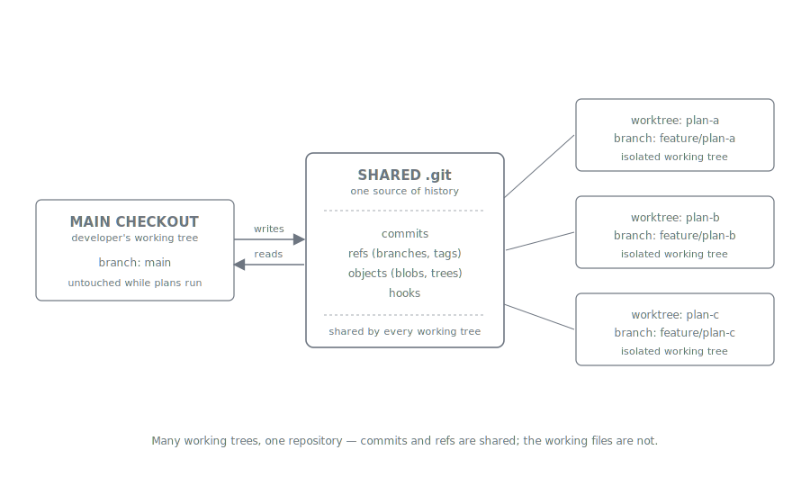
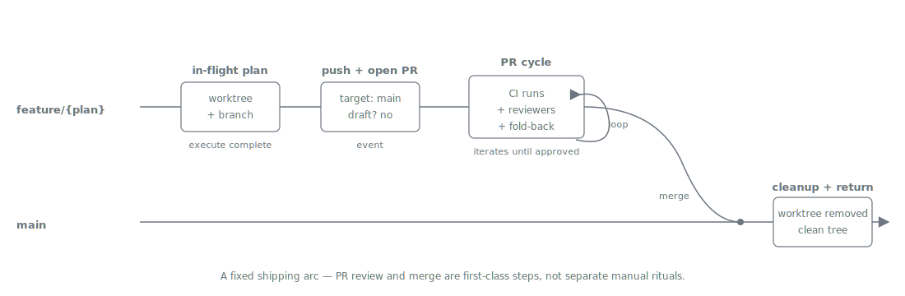

= Branches and Worktrees
:nofooter:
:toc: left
:toclevels: 2

xref:../../README.md[Plan Marshall] » xref:README.adoc[Concepts]

Plan Marshall runs each plan in an isolated working area on its own feature branch so that work is plan-bound from start to finish: concurrent plans never contend for the main checkout's HEAD, and every plan produces one self-contained, reviewable unit that lands on `main` through a single, well-defined shipping arc. Two ideas carry the design — plan-bound isolation while a plan is in flight, and a clean post-execute shipping flow that turns that isolated work into landed mainline state.

== Plan-bound Isolation

A plan is the unit of work. While it is in flight, its file changes belong to that plan and nothing else — no other plan, no ad-hoc edits in the main checkout, no leakage across plans that happen to be running at the same time. Plan Marshall realises this by allocating two paired resources for each plan: a dedicated *feature branch* for the commit history and a dedicated *git worktree* for the working files. The branch carries the plan's commits; the worktree gives the plan its own filesystem instance to edit, build, and verify in. Both are anchored to the same underlying repository — they share commits, refs, and objects — so a plan's branch is reachable from the main checkout and its commits show up in `git log` like any other work. What the worktree adds is a *separate place on disk*: the agent does not have to switch the main checkout's HEAD to operate on the plan, and the developer's main checkout is never the surface the agent edits.

The choice of a worktree (rather than the obvious alternatives) is deliberate. A second clone would duplicate the repository and lose the shared-history property — branches created in one clone would not be visible in the other without a fetch. Stashing and switching the main checkout's HEAD would serialise plans against one working tree and contaminate any unrelated work the developer had in flight. Multiple worktrees on one repository give Plan Marshall exactly what it needs: shared commits and refs, independent working directories.

The isolation pays off in three ways. First, multiple plans can run at the same time because each has its own worktree and branch; the only shared state is the underlying repository (commits, refs, objects) and Plan Marshall's own metadata directory. Second, the main checkout stays usable — a developer reviewing a PR, running an ad-hoc command, or starting another plan does not have to wait for whatever plan is currently in `phase-5-execute` to finish. Third, every plan resolves to one reviewable unit: the diff between the plan's feature branch and `main` is exactly the plan's scope, with nothing else folded in.

[NOTE]
====
The isolation contract is enforced at runtime, not merely by convention. At every phase boundary Plan Marshall captures a `phase_handshake` row that includes the `main_dirty` invariant (the count of uncommitted files in the developer's main checkout) and its companion `main_dirty_files` (the list). When a plan is supposed to be working in its worktree but the boundary capture sees modifications in the main checkout, the invariant has caught a deviation — the agent or harness has written to the wrong tree. The case is rare: agents almost always honour the worktree path they are dispatched with. But it does happen occasionally, and the invariant catches it before the next phase commits against the wrong tree. A stricter assertion fires right after `phase-2-refine` (which has no business touching any source tree at all) and refuses to advance to outline when the main checkout is dirty.
====

== Post-Execute Shipping Flow

When the execute phase finishes, the plan transitions from "isolated work" to "landed mainline state" along a fixed shipping arc. The plan's feature branch is pushed and a pull request is opened against `main`; the orchestrator waits on the PR — CI runs, automated reviewers comment, and any human review feedback is folded back in as additional commits on the same branch. Once the PR is approved and merged, the orchestrator removes the plan's worktree (the paired branch goes with it), switches the main checkout back to `main`, and pulls the latest tip (now containing the just-merged plan). The end state is `main` carrying the plan's commits and the developer back at the main checkout with a clean tree — the plan has shipped.

The point of the arc is that the transition from "in-flight plan" to "landed mainline state" is not improvised. PR review and merge are first-class steps in the plan's own workflow, not separate manual rituals, so the boundary between "the agent is still working" and "the work is part of mainline" is unambiguous and the same shape for every plan.

== Related

* link:../../marketplace/bundles/plan-marshall/skills/workflow-integration-git/standards/worktree-handling.md[`workflow-integration-git/standards/worktree-handling.md`] — canonical contract: path resolution, lifecycle, tri-state assertion, dispatch protocol, the `git -C` rule, cleanup ordering, the `--plan-id` contract
* xref:planning-workflow.adoc[Planning Workflow] — the six phases the plan-bound isolation flows through, from intent capture through shipping
* xref:../user/configuration.adoc#worktrees[User Guide › Configuration › Branch strategy and worktrees] — user-facing knobs (the `branch_strategy` setting and its two values)
