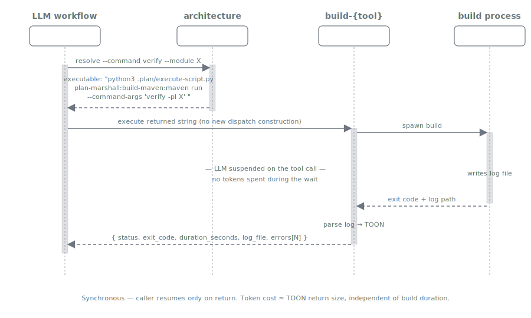

= Build Management
:nofooter:
:toc: left
:toclevels: 2

A technology-neutral build abstraction. From the LLM's point of view a build is a single synchronous method call: "run the canonical command X on module Y, return when it's done." The model is suspended on the tool call until the build finishes — no prompt tokens spent waiting, no log scrolled into context, just one structured TOON back with status, errors, optional partially-filtered warnings, and a pointer to the full log on disk.

This is one of Plan Marshall's most powerful features. It turns a 5–10 minute Maven build (or `pytest` run, or `npm test`, …) from a token-burning, attention-fragmenting interaction into a single dispatched operation.

== TL;DR

Plan Marshall splits build management into two responsibilities:

* **`/marshall-steward`** discovers each module's actual build tool (Maven / Gradle / npm / Python) once at setup time, and builds a per-module mapping from canonical command names (`compile`, `quality-gate`, `module-tests`, `verify`, `coverage`, …) to the concrete tool invocation (`./mvnw verify -Ppre-commit -pl my-module`, `./gradlew :api:build`, `./pw verify core`, etc.). This mapping lives in `.plan/project-architecture/`.
* **The LLM / task executor** asks for a canonical name by module: `architecture resolve --command verify --module my-module` returns the concrete command, then `{tool-skill} run --command-args "verify"` executes it. The model never has to know what underlying tool the module uses.

The result is build-tool independence at the LLM-prompt layer. A skill author writing a verify step writes one workflow that works against Maven, Gradle, npm, and Python modules.

The diagram above shows the synchronous call shape. The LLM holds control during steps 1-3 (resolve, then dispatch run), is suspended for the duration of step 4 (the build subprocess), and resumes only when the build skill returns a single TOON. The sections below walk through each piece.

== The canonical command vocabulary

A small, build-system-agnostic vocabulary of operation names. The full list lives in link:../../marketplace/bundles/plan-marshall/skills/extension-api/standards/canonical-commands.md[`canonical-commands.md`]; the most-used entries:

[cols="1,1,3", options="header"]
|===
| Canonical name | Phase | Description

| `clean` | clean | Remove build artifacts and generated files.
| `compile` | build | Compile production sources.
| `module-tests` | test | Unit tests for the module. **Required for every test-bearing module.**
| `integration-tests` | test | Integration tests (containers, embedded servers, Weld).
| `e2e` | test | End-to-end / acceptance tests.
| `coverage` | test | Test execution with coverage measurement.
| `quality-gate` | quality | Static analysis, linting, formatting. **Required for every module.**
| `verify` | verify | Full verification (compile + test + quality). **Required for every non-pom module.**
| `install` / `package` | deploy | Install or package the artifact.
|===

A skill that wants "run the unit tests" asks for `module-tests` and stays portable. A skill that wants "full local verification before commit" asks for `verify`. The canonical name is what the LLM thinks in; the build-system invocation is what runs.

== Two-step API at execution time

A skill that needs to run a build executes two scripts:

[source,bash]
----
# 1. Resolve canonical → concrete command for a specific module
python3 .plan/execute-script.py plan-marshall:manage-architecture:architecture \
  resolve --command verify --module my-module

# Returns TOON containing:
#   executable: ./mvnw verify -Ppre-commit -pl my-module
#   wrapper:    ./mvnw
#   tool:       maven
#   ...

# 2. Run it via the matching build skill
python3 .plan/execute-script.py plan-marshall:build-maven:maven \
  run --command-args "verify -Ppre-commit -pl my-module" --plan-id {plan_id}
----

Step 1 reads `.plan/project-architecture/{module}/enriched.json` (per-module, persisted) and looks up the requested canonical command in the module's `commands` map. The lookup is deterministic — no LLM judgement, no probabilistic match. If `verify` doesn't resolve, the module legitimately doesn't have it (e.g. pom-only aggregator modules have only `quality-gate`); the LLM gets an error TOON, not a hallucinated guess.

Step 2 dispatches to the build skill that owns the underlying tool (`build-maven`, `build-gradle`, `build-npm`, `build-python`). All four skills implement the same `ext-point-build` contract, declared in their frontmatter:

[source,yaml]
----
implements: plan-marshall:extension-api/standards/ext-point-build
----

So Step 2 looks the same regardless of which tool sits behind the wrapper.

== The return TOON — what the LLM gets back

After however long the build takes, the LLM receives a single structured TOON. **No streaming log output. No partial tokens. No context noise during the wait.** Just the result.

Success shape:

[source]
----
status              success
exit_code           0
duration_seconds    45
log_file            .plan/temp/build-output/default/maven-2026-05-18T10-23-15.log
command             ./mvnw verify -Ppre-commit -pl my-module
----

Failure shape (the same skill auto-parses the log into structured errors on non-zero exit):

[source]
----
status              error
exit_code           1
duration_seconds    23
log_file            .plan/temp/build-output/default/maven-2026-05-18T10-23-15.log
command             ./mvnw verify -Ppre-commit -pl my-module
error               build_failed

errors[N]{file,line,message,category}:
src/main/java/Foo.java    42    cannot find symbol      compile
src/main/java/Bar.java    15    test assertion failed   test_failure

tests:
  passed: 40
  failed: 2
  skipped: 1
----

Warnings are partially filtered by default (`mode: actionable` — accepted-warning patterns are dropped, only actionable items remain). The `--mode structured` mode keeps all warnings and flags accepted ones with `[accepted]`; `--mode errors` drops warnings entirely. The LLM picks the mode based on what it's investigating.

The `log_file` field is the escape hatch — when the structured errors aren't enough, the LLM reads the full log on demand. Most of the time it doesn't need to.

== Why "no tokens spent waiting" matters

Build runs are slow by LLM standards. A Maven `verify` against a multi-module project routinely takes 5–15 minutes. A `coverage` run can be 20+. If the LLM were attached to the build's stdout, every line of `[INFO] Building module-7…` would consume context tokens and fragment attention.

Plan Marshall's build skills capture all build output to the log file before returning anything to the LLM. The skill's return TOON is the *summary*; the LLM looks at the log only when it needs to. This means:

* **A 10-minute build = ~100 tokens spent.** The `status`, `duration_seconds`, `log_file`, and any `errors[]` block. Nothing else.
* **No context pollution.** The build output never enters the LLM's working memory unless the LLM explicitly asks for it via a follow-up `Read` of the log file.
* **Parallel reasoning during the wait.** The skill is a synchronous subprocess from the LLM's perspective — the LLM is suspended waiting on a single tool call, not babysitting a stream.

This compounds: most plans run multiple builds (incremental compile, quality-gate, module-tests, verify). Each is a single tool call, each costs ~100 tokens of context. Without this abstraction, a multi-build plan would burn tens of thousands of tokens on build output noise.

== Where `/marshall-steward` builds the canonical mapping

The mapping from canonical name to concrete invocation is built once at setup time and refreshed on demand. The wizard's Step 9 — *Discover Project Architecture* — walks the project via each domain bundle's `plan-marshall-plugin` extension and produces:

* `.plan/project-architecture/_project.json` — the module index (canonical "which modules exist").
* `.plan/project-architecture/{module}/enriched.json` — per-module persisted state, including the LLM-curated commentary.
* Per-module derived data (paths, packages, build commands with filtered profiles) — computed on demand by `crawl_module_derived` from the live filesystem on every read (see xref:audit-trail.adoc[Audit Trail]).

For each module, the discovery extension also runs the canonical-command resolution rules described in `canonical-commands.md`:

* *Always-available* commands (`clean`, `quality-gate`) for every module.
* *Source-conditional* commands (`compile`) when the module has source files.
* *Test-conditional* commands (`test-compile`, `module-tests`) when the module has tests.
* *Profile-based* commands (`integration-tests`, `e2e`, `coverage`, `benchmark`) when the underlying profile is detected.

Each resolved command is stored **complete** — `verify -Ppre-commit -pl my-module`, not `verify` + a composition rule. The resolver returns the stored string verbatim, so there is no runtime composition logic that could go wrong.

The CLAUDE.md `### Build Commands` block (written by the wizard's Step 9b, see xref:../user/getting-started.adoc#_what_the_wizard_writes_to_claude_md[Getting Started → What the wizard writes to CLAUDE.md]) projects this same mapping into a form humans (and any agent reading CLAUDE.md) can scan: one bullet per canonical command on the default module, plus child-module-only entries where applicable.

== The four built-in build skills

[cols="1,1,3", options="header"]
|===
| Skill | Tool | Coverage

| link:../../marketplace/bundles/plan-marshall/skills/build-maven/SKILL.md[`build-maven`] | Maven (mvnw + system mvn) | Java/Kotlin builds with JaCoCo coverage, OpenRewrite markers, multi-module profile management.
| link:../../marketplace/bundles/plan-marshall/skills/build-gradle/SKILL.md[`build-gradle`] | Gradle (gradlew + system gradle) | Java/Kotlin builds with JaCoCo coverage, quality task detection, multi-project discovery, OpenRewrite markers.
| link:../../marketplace/bundles/plan-marshall/skills/build-npm/SKILL.md[`build-npm`] | npm / npx | TypeScript, Jest, ESLint, TAP parsing with workspace discovery, per-file JS coverage analysis, automatic npm/npx routing.
| link:../../marketplace/bundles/plan-marshall/skills/build-python/SKILL.md[`build-python`] | Pyprojectx (`./pw`) | mypy type-checking, ruff linting, pytest with Cobertura coverage, test-directory-based module discovery.
|===

All four expose the same subcommand set (`run`, `parse`, `coverage-report`, `check-warnings`, `discover`, plus a few tool-specific extras like `search-markers` for OpenRewrite TODO scans). All four return the same TOON shape on success and the same auto-parsed structured errors on failure. The shared contract lives in link:../../marketplace/bundles/plan-marshall/skills/extension-api/standards/build-api-reference.md[`build-api-reference.md`] and link:../../marketplace/bundles/plan-marshall/skills/extension-api/standards/build-execution.md[`build-execution.md`].

Adding a new build tool (Go, Rust, …) is a matter of writing a new `build-{tool}` skill that implements `ext-point-build` and a companion `plan-marshall-plugin` extension that maps the canonical commands to the new tool's invocation. The rest of the system — LLM dispatch sites, finalize-step verify-step list, retrospective fragments — continues to work unchanged because it only ever sees the canonical names.

== Worked example — a verify step

The phase-5-execute `default:build_verify` verify step runs as:

[source]
----
1. Read task.module from TASK-N.json                       (architecture lookup)
2. architecture resolve --command verify --module {module}   → returns ./mvnw verify -pl {module}
3. build-maven run --command-args "verify -pl {module}" --plan-id {plan_id}
   ⏳ … 7 minutes pass …
4. Result TOON returned:
   - status=success → proceed to next verify step
   - status=error  → run check-warnings, capture findings, route to verification-feedback
----

Steps 2 and 3 are the entire LLM-visible build interaction. Steps 1 and 4 are deterministic dispatches inside the verify-step body — no judgement, no streaming output. The LLM's effective prompt cost per build is essentially constant regardless of how big or slow the actual build is.

This is the shape of every build invocation in plan-marshall.

== Related

* link:../../marketplace/bundles/plan-marshall/skills/extension-api/standards/canonical-commands.md[`canonical-commands.md`] — full canonical command vocabulary + resolution rules
* link:../../marketplace/bundles/plan-marshall/skills/extension-api/standards/build-api-reference.md[`build-api-reference.md`] — shared subcommand API across all build skills
* link:../../marketplace/bundles/plan-marshall/skills/extension-api/standards/build-execution.md[`build-execution.md`] — input/output contract, lifecycle, format spec
* link:../../marketplace/bundles/plan-marshall/skills/extension-api/standards/build-systems-common.md[`build-systems-common.md`] — shared standards (timeouts, log handling, acceptable-warning patterns)
* link:../../marketplace/bundles/plan-marshall/skills/extension-api/standards/ext-point-build.md[`ext-point-build.md`] — extension point that all `build-*` skills implement
* link:../../marketplace/bundles/plan-marshall/skills/manage-architecture/standards/manage-api.md[`manage-architecture/manage-api.md`] § Command Resolution — how `architecture resolve` maps canonical → concrete
* xref:../user/configuration.adoc#build-systems[User Guide › Configuration › Build systems] — how to tune the discovered mapping
* xref:../user/getting-started.adoc#_what_the_wizard_writes_to_claude_md[Getting Started → CLAUDE.md Build Commands] — how the wizard projects the canonical commands into CLAUDE.md
