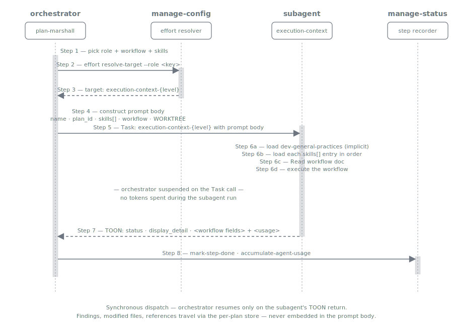

= Execution Context
:nofooter:
:toc: left
:toclevels: 2

xref:../../README.md[Plan Marshall] » xref:README.adoc[Concepts]

Why Plan Marshall ships exactly one role-eligible agent (link:../../marketplace/bundles/plan-marshall/agents/execution-context.md[`plan-marshall:execution-context`]) and how every plan-marshall `Task:` invocation dispatches through it.

== One Generic Dispatcher

`plan-marshall:execution-context` is the sole role-eligible canonical agent in the marketplace. It owns the dispatcher boilerplate (load `dev-agent-behavior-rules`, load caller-specified skills, locate the workflow doc, execute, emit return TOON) exactly once, and parameterises the workflow body at dispatch time. The caller passes five prompt-body fields:

* `name` — human label for logging and `mark-step-done`
* `plan_id` — plan identifier (or the sentinel `none` for free-standing dispatches)
* `skills[]` — caller-loaded skills, in load order
* `workflow` — bundle-prefixed notation for the workflow doc to run (e.g. `plan-marshall:phase-1-init/SKILL.md`, `plan-marshall:plan-marshall/workflow/triage.md`)
* `WORKTREE` — repo-relative working directory (`.` for main checkout)

The dispatcher loads `dev-agent-behavior-rules` implicitly, then the caller-specified `skills[]`, then reads the resolved workflow path and follows it. Workflow-specific runtime inputs (`finding_type`, `track`, `scope`, etc.) flow through additional prompt-body fields the workflow doc declares.

A new LLM-judgement workflow worth pinning its own model is added by writing a new workflow doc that declares `implements: ext-point-execution-context-workflow` and registering a new role key. No new agent file, no new emitted variants.

[#level-variants]
== Level Variants

image::../resources/diagrams/variant-emission.svg[Variant emission — one canonical SKILL declares implements + levels; the build target reads it and emits the canonical no-suffix file plus six suffixed level variants with model and effort baked in, align=center]

The Claude target emits up to **seven** files from the single canonical source: the no-suffix `execution-context.md` (inherit; `implements:` and `levels:` stripped) plus six level-suffixed files (`-low`, `-medium`, `-high`, `-xhigh`, `-xxhigh`, `-max`). Each suffixed variant has `model:` and `effort:` baked into its frontmatter from the canonical level → primitive mapping in `effort-levels.md`. The `-max` variant is Opus-4.7-only — the build emitter's guard skips it when the resolved alias does not accept `effort: xhigh`, leaving six files in that case.

Dispatch sites resolve which variant to call via `manage-config effort resolve-target --phase <phase> [--role <subkey>]`, which returns the canonical name when the level is `inherit`/empty and the matching variant otherwise. The resolver reads `.plan/marshal.json` fresh per dispatch, so an edit to any `plan.<phase>.effort` attribute takes effect on the **next** call — no Claude Code restart required.

[#per-role-model-selection]
== Per-Role Model Selection

What "which model and effort level runs each LLM-judgement workflow" reduces to. Three layers, each with a single canonical spec under `marketplace/bundles/plan-marshall/skills/plan-marshall/standards/`:

[cols="1,3", options="header"]
|===
| Layer | What it is

| **Levels** | Six ordinals (`low`, `medium`, `high`, `xhigh`, `xxhigh`, `max`) plus the `inherit` sentinel. Each ordinal binds to a single `(model, effort)` primitive. Defined in link:../../marketplace/bundles/plan-marshall/skills/plan-marshall/standards/effort-levels.md[`effort-levels.md`].
| **Roles** | Phase-scoped registry of LLM-judgement workflows that may be pinned to a level. Six top-level groups (`phase-1-init` … `phase-6-finalize`), each polymorphic — its value is either a string (single-level shorthand for the whole phase) or an object whose recognised sub-keys are `default`, `verification-feedback`, `post-run-review`. Research dispatches do not get their own sub-key — they inherit the calling phase's `default`. Defined in link:../../marketplace/bundles/plan-marshall/skills/plan-marshall/standards/effort-roles.md[`effort-roles.md`].
| **Variants** | The emitted agent files described in <<level-variants,Level Variants>> above. The resolver picks one of them per dispatch.
|===

The runtime resolution path: caller passes `--phase <phase>` and optionally `--role <subkey>` to `manage-config effort resolve-target`. The resolver walks the bubbling chain `phase.subkey` → `phase.default` → `phase` string shorthand → plan-wide `effort` → `inherit` and returns the first level it finds. The variant emitter has already produced an agent file for that level (or the canonical no-suffix file for `inherit` — see <<level-variants,Level Variants>> above); the orchestrator dispatches that variant by name.

Operator-facing guidance (wizard walkthrough, the three named presets, polymorphic `marshal.json` shape, a worked example, troubleshooting) lives in xref:../user/efforts.adoc[User Guide › Efforts]. The resolver contract itself (precise resolution order, env-var override semantics, the build-time `-max` guard) is in link:../../marketplace/bundles/plan-marshall/skills/plan-marshall/standards/effort-variants.md[`effort-variants.md`].

== Granularity

Not every step belongs in its own dispatch. The granularity heuristics in link:../../marketplace/bundles/plan-marshall/skills/extension-api/standards/dispatch-granularity.md[`extension-api:dispatch-granularity`] govern the call:

* **Script-over-dispatch** — deterministic work (regex matches, structural checks, build invocations) belongs in a script. Dispatches are reserved for LLM judgement.
* **Bundle-shared-context** — a multi-step LLM workflow runs inside ONE dispatch envelope rather than N sequential dispatches.
* **Per-iteration only when parallel-or-different-models** — N parallel dispatches are justified only when each subagent runs independently. The sole such case in the marketplace is `enrich-module` dispatched under phase-6-finalize from architecture-refresh Tier-1.

== Dispatch Lifecycle

The dispatch is synchronous. The orchestrator suspends on the `Task:` call for the entire duration of the subagent's run (skill loads, workflow read, internal loops, AskUserQuestion gates) and resumes only when the subagent returns its TOON record. No tokens are billed to the orchestrator during the suspension — only the subagent's `<usage>` is counted.

Three properties make the 8-step shape worth pinning (step numbers refer to the canonical sequence in link:../../marketplace/bundles/plan-marshall/skills/ref-workflow-architecture/standards/dispatch-walkthrough.md[`dispatch-walkthrough.md`] § Generic eight-step sequence):

* **Step 2's level resolution reads `marshal.json` fresh.** A configuration edit takes effect on the *next* dispatch — no Claude Code restart needed. The variant target string returned by the resolver is what `Task:` is called with.
* **Step 3's prompt body has exactly five required fields.** `name`, `plan_id`, `skills[]`, exactly one of `workflow`/`instructions`, and `WORKTREE`. Workflow-specific runtime inputs (`producer`, `track`, `module`, …) layer on top per the workflow doc's contract.
* **Step 5's skill loads are deterministic.** `dev-agent-behavior-rules` is implicit-first, then each `skills[]` entry in caller-declared order, then `Read` on the workflow doc. The order is part of the contract — see xref:skill-handling.adoc[Skill Handling].

Three worked end-to-end traces (a single-workflow phase entry, a `verification-feedback` sub-dispatch by reference, and a parallel `enrich-module` fan-out) live in link:../../marketplace/bundles/plan-marshall/skills/ref-workflow-architecture/standards/dispatch-walkthrough.md[`ref-workflow-architecture/standards/dispatch-walkthrough.md`].

== Related

* link:../../marketplace/bundles/plan-marshall/agents/execution-context.md[`plan-marshall/agents/execution-context.md`] — the dispatcher itself
* link:../../marketplace/bundles/plan-marshall/skills/extension-api/standards/ext-point-dynamic-level-executor.md[`extension-api/standards/ext-point-dynamic-level-executor.md`] — agent-emission contract
* link:../../marketplace/bundles/plan-marshall/skills/extension-api/standards/ext-point-execution-context-workflow.md[`extension-api/standards/ext-point-execution-context-workflow.md`] — workflow-doc contract
* link:../../marketplace/bundles/plan-marshall/skills/extension-api/standards/dispatch-granularity.md[`extension-api/standards/dispatch-granularity.md`] — granularity heuristics
* link:../../marketplace/bundles/plan-marshall/skills/ref-workflow-architecture/standards/dispatch-walkthrough.md[`ref-workflow-architecture/standards/dispatch-walkthrough.md`] — worked dispatch example
* link:../../marketplace/bundles/plan-marshall/skills/ref-workflow-architecture/standards/dispatch-logging.md[`ref-workflow-architecture/standards/dispatch-logging.md`] — dispatch logging contract
* link:../../marketplace/bundles/plan-marshall/skills/plan-marshall/standards/effort-levels.md[`plan-marshall/standards/effort-levels.md`] — level → primitive binding
* link:../../marketplace/bundles/plan-marshall/skills/plan-marshall/standards/effort-roles.md[`plan-marshall/standards/effort-roles.md`] — phase-scoped role registry
* link:../../marketplace/bundles/plan-marshall/skills/plan-marshall/standards/effort-variants.md[`plan-marshall/standards/effort-variants.md`] — resolver contract (canonical user-facing guide)
* link:../../marketplace/bundles/plan-marshall/skills/marshall-steward/standards/effort-menu.md[`marshall-steward/standards/effort-menu.md`] — wizard preset contract
* xref:../user/efforts.adoc[User Guide › Efforts] — operator-side configuration, presets, worked example
