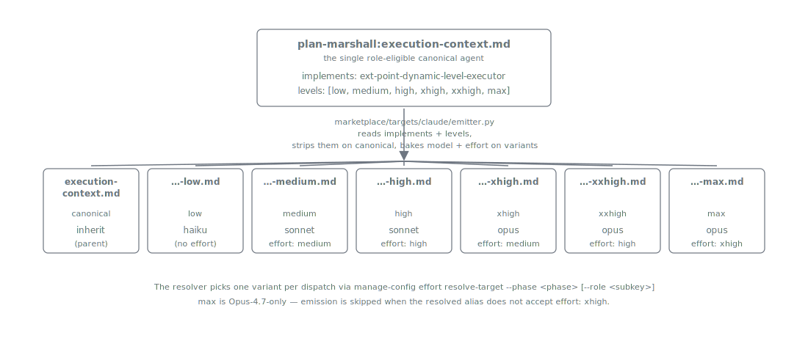

= Execution Context
:nofooter:
:toc: left
:toclevels: 2

xref:../../README.md[Plan Marshall] » xref:README.adoc[Concepts]

Each subagent dispatch in a stock Claude Code session is a fresh ad-hoc invention — a different prompt shape, a different tool subset, a different skill load order, sometimes a different model. Reproducibility suffers, model-tier selection per workflow is impossible, and the prompt-body contract drifts with every refactor. Plan Marshall ships **exactly one role-eligible agent** — `plan-marshall:execution-context` — and every `Task:` invocation in the marketplace dispatches through it. One canonical agent file; six level-suffixed variants emitted at build time; a five-field prompt body that every workflow body declares against.

== One Generic Dispatcher

`plan-marshall:execution-context` is the sole role-eligible canonical agent in the marketplace. It owns the dispatcher boilerplate (load `persona-plan-marshall-agent`, load caller-specified skills, locate the workflow doc, execute, emit return TOON) exactly once, and parameterises the workflow body at dispatch time. The caller passes five prompt-body fields:

* `name` — human label for logging and `mark-step-done`
* `plan_id` — plan identifier (or the sentinel `none` for free-standing dispatches)
* `skills[]` — caller-loaded skills, in load order
* `workflow` — bundle-prefixed notation for the workflow doc to run (e.g. `plan-marshall:phase-3-outline/SKILL.md`, `plan-marshall:plan-marshall/workflow/triage.md`)
* `WORKTREE` — repo-relative working directory (`.` for main checkout)

The dispatcher loads `persona-plan-marshall-agent` implicitly, then the caller-specified `skills[]`, then reads the resolved workflow path and follows it. Workflow-specific runtime inputs (`finding_type`, `track`, `scope`, etc.) flow through additional prompt-body fields the workflow doc declares.

A new LLM-judgement workflow worth pinning its own model is added by writing a new workflow doc that declares `implements: ext-point-execution-context-workflow` and registering a new role key. No new agent file, no new emitted variants.

[#level-variants]
== Level Variants

The Claude target emits up to **seven** files from the single canonical source: the no-suffix link:../../marketplace/bundles/plan-marshall/agents/execution-context.md[`execution-context.md`] (inherit; `implements:` and `levels:` stripped) plus six level-suffixed files (`-low`, `-medium`, `-high`, `-xhigh`, `-xxhigh`, `-max`). Each suffixed variant has `model:` and `effort:` baked into its frontmatter from the canonical level → primitive mapping in link:../../marketplace/bundles/plan-marshall/skills/plan-marshall/standards/effort-levels.md[`effort-levels.md`]. The `-max` variant is Opus-4.8-only — the build emitter's guard skips it when the resolved alias does not accept `effort: xhigh`, leaving six files in that case.

Dispatch sites resolve which variant to call via `manage-config effort resolve-target --phase <phase> [--role <subkey>]`, which returns the canonical name when the level is `inherit`/empty and the matching variant otherwise. The resolver reads `.plan/marshal.json` fresh per dispatch, so an edit to any `plan.<phase>.effort` attribute takes effect on the **next** call — no Claude Code restart required.

[#per-role-model-selection]
== Per-Role Model Selection

The "which model and effort level runs each LLM-judgement workflow" question reduces to three layered concepts — **Levels**, **Roles**, and **Variants**. Levels are the six ordinals (`low` through `max`) plus the `inherit` sentinel, each binding to a `(model, effort)` primitive. Roles are the phase-scoped registry of LLM-judgement workflows that may be pinned to a level — six phase groups, each polymorphic (a string shorthand for the whole phase, or an object whose recognised sub-keys are `default`, `verification-feedback`, `post-run-review`). Variants are the emitted agent files <<level-variants,described above>>; the resolver picks one per dispatch.

The runtime path: caller passes `--phase <phase>` and optionally `--role <subkey>` to `manage-config effort resolve-target`. The resolver bubbles `phase.subkey` → `phase.default` → `phase` shorthand → plan-wide `effort` → `inherit` and returns the first level it finds. The variant emitter has already produced an agent file for that level; the orchestrator dispatches that variant by name.

The canonical specs — link:../../marketplace/bundles/plan-marshall/skills/plan-marshall/standards/effort-levels.md[`effort-levels.md`], link:../../marketplace/bundles/plan-marshall/skills/plan-marshall/standards/effort-roles.md[`effort-roles.md`], link:../../marketplace/bundles/plan-marshall/skills/plan-marshall/standards/effort-variants.md[`effort-variants.md`] — live under `plan-marshall/standards/`. Operator-facing guidance (wizard presets, polymorphic `marshal.json` shape, worked example, troubleshooting) lives in xref:../user/efforts.adoc[User Guide › Efforts].

== Granularity

Not every step belongs in its own dispatch. The granularity heuristics in link:../../marketplace/bundles/plan-marshall/skills/extension-api/standards/dispatch-granularity.md[`extension-api:dispatch-granularity`] govern the call:

* **Script-over-dispatch** — deterministic work (regex matches, structural checks, build invocations) belongs in a script. Dispatches are reserved for LLM judgement.
* **Bundle-shared-context** — a multi-step LLM workflow runs inside ONE dispatch envelope rather than N sequential dispatches.
* **Per-iteration only when parallel-or-different-models** — N parallel dispatches are justified only when each subagent runs independently. The sole such case in the marketplace is `enrich-module` dispatched under phase-6-finalize from architecture-refresh Tier-1.

== Dispatch lifecycle

The dispatch is synchronous. The orchestrator suspends on the `Task:` call for the entire duration of the subagent's run (skill loads, workflow read, internal loops, AskUserQuestion gates) and resumes only when the subagent returns its TOON record. No tokens are billed to the orchestrator during the suspension — only the subagent's `<usage>` is counted. The contract behind that — the eight-step sequence the dispatcher follows, the five-field prompt body, the deterministic skill-load order — is canonical in link:../../marketplace/bundles/plan-marshall/skills/ref-workflow-architecture/standards/dispatch-walkthrough.md[`dispatch-walkthrough.md`] along with three worked end-to-end traces (a single-workflow phase entry, a sub-dispatch by reference, and a parallel fan-out). The concept page stops at "synchronous, contracted, zero-token suspension"; the spec carries the steps.

== Related

* link:../../marketplace/bundles/plan-marshall/agents/execution-context.md[`plan-marshall/agents/execution-context.md`] — the dispatcher itself
* link:../../marketplace/bundles/plan-marshall/skills/extension-api/standards/ext-point-dynamic-level-executor.md[`extension-api/standards/ext-point-dynamic-level-executor.md`] — agent-emission contract
* link:../../marketplace/bundles/plan-marshall/skills/extension-api/standards/ext-point-execution-context-workflow.md[`extension-api/standards/ext-point-execution-context-workflow.md`] — workflow-doc contract
* link:../../marketplace/bundles/plan-marshall/skills/extension-api/standards/dispatch-granularity.md[`extension-api/standards/dispatch-granularity.md`] — granularity heuristics
* link:../../marketplace/bundles/plan-marshall/skills/ref-workflow-architecture/standards/dispatch-walkthrough.md[`ref-workflow-architecture/standards/dispatch-walkthrough.md`] — worked dispatch example
* link:../../marketplace/bundles/plan-marshall/skills/ref-workflow-architecture/standards/dispatch-logging.md[`ref-workflow-architecture/standards/dispatch-logging.md`] — dispatch logging contract
* link:../../marketplace/bundles/plan-marshall/skills/plan-marshall/standards/effort-levels.md[`plan-marshall/standards/effort-levels.md`] — level → primitive binding
* link:../../marketplace/bundles/plan-marshall/skills/plan-marshall/standards/effort-roles.md[`plan-marshall/standards/effort-roles.md`] — phase-scoped role registry
* link:../../marketplace/bundles/plan-marshall/skills/plan-marshall/standards/effort-variants.md[`plan-marshall/standards/effort-variants.md`] — resolver contract (canonical user-facing guide)
* link:../../marketplace/bundles/plan-marshall/skills/marshall-steward/standards/effort-menu.md[`marshall-steward/standards/effort-menu.md`] — wizard preset contract
* xref:../user/efforts.adoc[User Guide › Efforts] — operator-side configuration, presets, worked example
