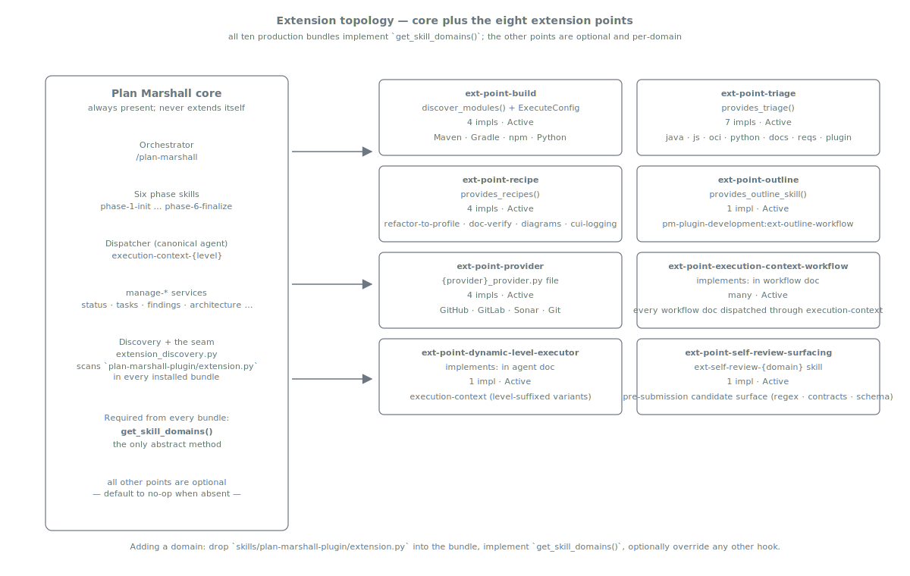

= Extension Architecture
:nofooter:
:toc: left
:toclevels: 2

xref:../../README.md[Plan Marshall] » xref:README.adoc[Concepts]

"How do I add a domain without forking the orchestrator?" is the plumbing question every successful workflow tool eventually has to answer. Plan Marshall's answer is that the core never decides what `Java` or `documentation` or `OCI containers` means — every domain-specific behaviour lives in a separate *bundle* that the core discovers, registers, and calls through a small, fixed set of extension points.

== The seam

The Plan Marshall core — the orchestrator, the six phase skills, the `execution-context` dispatcher, the `manage-*` services — owns the lifecycle. Bundles own the domain knowledge. They meet at a deliberately narrow contract: a handful of `ExtensionBase` hook methods, two declarative `implements:` markers on workflow / agent files, and one filesystem convention for discovery (every bundle ships a `skills/plan-marshall-plugin/extension.py` file at a hardcoded path). Once you know that seam, every domain bundle ships exactly the same way.

The required hook is `get_skill_domains()` — every bundle declares its domain identity and organises its skills by profile (`core`, `implementation`, `module_testing`, `integration_testing`, `quality`, `documentation`, `security`). Everything else is optional: the seam exposes nine extension points beyond that minimum, and a bundle fills in only the slots it actually needs. A frontend bundle might implement three; a documentation bundle might implement four. The unfilled hooks return the default no-op and the core uses its generic behaviour.

One of those nine — *verify* — is a findings-pipeline stage rather than a domain-behaviour hook: a producer declares a `verification_profile`, and the findings it emits pass through an optional adversarial-refute pass that confirms each is a genuine defect before triage sees it (false positives close `rejected`). It runs BEFORE the `triage` extension point in the findings pipeline. The contract lives in xref:../../marketplace/bundles/plan-marshall/skills/extension-api/standards/ext-point-verify.md[`ext-point-verify.md`]; the pipeline placement is in xref:automatic-reviews.adoc[Concepts › Automatic Reviews]. It is NOT to be confused with `ext-point-build-verify-step`, the phase-5 build/verify *command* step (`quality-gate`, `module-tests`, `coverage`) — an unrelated concern.

The `security` profile is *resolution-only*: a bundle declares its focused per-domain security skills under `skills_by_profile.security`, and the proactive `finalize-step-security-audit` resolves them for each affected domain when it runs. Unlike the work profiles (`implementation`, `module_testing`, …), `security` is deliberately NOT auto-included in phase-4 task creation — it never spawns its own implementation tasks; it exists purely as a resolution axis the finalize-step gate reads (see xref:security.adoc[Concepts › Security]).

== Discovery

At install time the executor's `extension_discovery.py` scans every bundle under `marketplace/bundles/` (or the equivalent plugin-cache path) for the hardcoded discovery file. If it exists, the scanner imports it, instantiates the `Extension` class, and calls `get_skill_domains()` to learn the bundle's domain identity. The returned key is registered in `marshal.json` under `skill_domains.{key}`, with a `bundle` field added by `skill-domains configure` that reverse-maps from domain key to source bundle. Every subsequent hook is invoked through the same `Extension` instance whenever its host workflow needs it. The discovery is automatic — no manifest lookup, no per-bundle configuration, no registry to keep in sync.

== Identity, domain axis, compute: three orthogonal resolutions

The seam resolves three independent questions at dispatch time, and keeping their vocabulary distinct is load-bearing because each uses an overloaded word:

* **persona** — the *identity* a task is dispatched **as**. A persona (`implements: persona`) is a named, resolvable bundle of skills; xref:../../marketplace/bundles/plan-marshall/skills/manage-personas/SKILL.md[`manage-personas resolve`] flattens its composition DAG into the explicit `skills[]` the dispatcher carries. See xref:personas.adoc[Personas].
* **profile** — the *domain-specific resolution axis* (`implementation`, `module_testing`, `documentation`, `quality`, …). A profile is not an identity; it is the key the persona's `profiles:` frontmatter uses to pull `profile × domain` skills into the context. `get_skill_domains()` organises each bundle's skills by exactly this set of profiles.
* **role / level** — the *compute selection*: which model and effort level runs an LLM-judgement workflow. The xref:execution-context.adoc[execution-context] resolver maps a phase-scoped role to one of the level variants and dispatches it.

These three are orthogonal: a single dispatch resolves an identity (persona → `skills[]`), a domain axis (profile → domain skills), and a compute tier (role/level → agent variant) independently. "Role" in the compute sense (role/level) is deliberately never used for the identity sense — that is what *persona* names.

== Where this fits

Extension Architecture is the *plumbing* answer to "what is Plan Marshall." The xref:planning-workflow.adoc[Planning Workflow] is the *user-visible* answer. The nine extension points are the contact points between the two: every domain decision a plan makes — which build skill to dispatch (xref:build-management.adoc[Build Management]), which triage skill loads for a Sonar issue (xref:automatic-reviews.adoc[Automatic Reviews]), which skills enter the subagent context for a Java testing task (xref:skill-handling.adoc[Skill Handling]) — flows through one of them.

== Related

* link:../../marketplace/bundles/plan-marshall/skills/extension-api/standards/extension-contract.md[`extension-contract.md`] — canonical `ExtensionBase` Python contract: every method, every return shape, every validation rule, plus the three-step "Adding a new domain" procedure and complete worked examples.
* link:../../marketplace/bundles/plan-marshall/skills/extension-api/SKILL.md[`extension-api/SKILL.md`] — overview index of the nine extension points: build, verify, triage, recipe, outline, provider, execution-context-workflow, dynamic-level-executor, self-review-surfacing.
* link:../../marketplace/bundles/plan-marshall/skills/extension-api/standards/marshal-json-reference.md[`marshal-json-reference.md`] — every `marshal.json` path each hook writes, with cross-refs to its ext-point.
* link:../../marketplace/bundles/plan-marshall/skills/extension-api/standards/profiles.md[`profiles.md`] — the profile-override mechanism per `skill_domains.{domain}.workflow_skills.{profile}`.
* link:../../marketplace/bundles/plan-marshall/skills/extension-api/standards/module-discovery.md[`module-discovery.md`] — the build-side discovery method contract.
* xref:personas.adoc[Concepts › Personas] — the persona / ref / profile identity model: persona (identity) vs profile (domain-resolution axis) vs role/level (compute selection).
* xref:build-management.adoc[Concepts › Build Management] — the `ext-point-build` implementation surface.
* xref:recipes.adoc[Concepts › Recipes] — the `ext-point-recipe` implementation surface.
* xref:automatic-reviews.adoc[Concepts › Automatic Reviews] — where `ext-point-triage` plugs in, and the findings pipeline the `ext-point-verify` stage extends.
* link:../../marketplace/bundles/plan-marshall/skills/extension-api/standards/ext-point-verify.md[`ext-point-verify.md`] — the verify extension point: producer-declared `verification_profile`, adversarial-refute pass before triage, `rejected` resolution for refuted findings.
