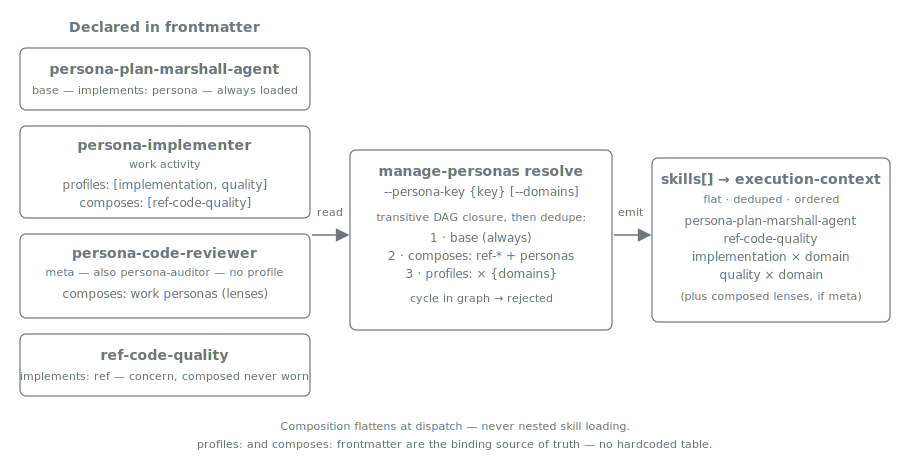

= Personas
:nofooter:
:toc: left
:toclevels: 2

xref:../../README.md[Plan Marshall] » xref:README.adoc[Concepts]

"Who is doing this work?" is a question every dispatch implicitly answers. Plan Marshall used to answer it with a scattering of unnamed skill clusters: a "module tester" was a foundational rules skill plus a testing-methodology skill plus a profile plus the dispatch logic that wired them together — real, but nameless. The persona model gives those clusters a name and a single, resolvable identity, without adding any new control flow. A persona is a *named bundle of skills* that the resolver flattens into the same explicit `skills[]` the dispatcher has always carried.

== Three kinds

The model has exactly three archetypes, distinguished by the frontmatter `implements:` marker each skill carries:

* **persona** (`implements: persona`) — the *action-general identity* you dispatch a task **as**. A persona carries action-general knowledge and resolves domain-specific skills through the profile(s) it declares.
* **ref** (`implements: ref`) — a *cross-cutting concern* woven into actions, with no specialist identity. Refs are composed by personas; they are never worn on their own. They join the existing `ref-*` family (xref:../../marketplace/bundles/plan-marshall/skills/ref-workflow-architecture/SKILL.md[`ref-workflow-architecture`], `ref-documentation`, `ref-toon-format`, …).
* **profile** — the *domain-specific resolution axis* (`implementation`, `module_testing`, `integration_testing`, `documentation`, `quality`, …) combined at runtime on top of a persona to select which domain skills enter the context.

These are layers, not rivals. A runtime context is **one persona** (the action-general identity) **plus** the `profile × domain` skills that persona's profiles resolve **plus** the `ref-*` concerns the persona composes. The original design intent — general rules for an action, combined with domain-specific information at runtime — is exactly this, with the action-general half given a name.

== Persona ↔ profile matrix

Each work-activity persona owns a unique **primary** profile; the reverse `profile → persona` lookup is unambiguous because that primary is unique (xref:../../marketplace/bundles/pm-plugin-development/skills/plugin-doctor/SKILL.md[`plugin-doctor`] enforces the uniqueness). Meta personas own no profile at all.

[cols="2,2,2", options="header"]
|===
| Profile | Identity | Kind

| `core` (special, always-merged)
| `persona-plan-marshall-agent`
| base, always loaded

| `implementation`
| `persona-implementer`
| work activity

| `module_testing`
| `persona-module-tester`
| work activity

| `integration_testing`
| `persona-integration-tester`
| work activity

| `documentation`
| `persona-documenter`
| work activity

| `security`
| `persona-security-expert`
| work activity

| `quality`
| `ref-code-quality`
| concern (`ref`, **not** a persona)

| — (no profile)
| `persona-code-reviewer`
| meta / evaluator

| — (no profile)
| `persona-auditor`
| meta / evaluator
|===

Two deliberate, accepted asymmetries fall out of the matrix:

* **`quality` is a profile that maps to a `ref`.** Quality is a baseline woven into all coding — there is no "do quality" dispatch — so its action-general half is the `ref-code-quality` concern, not a standalone persona. The `quality` *profile* still exists to resolve domain quality skills, and is carried as a **secondary `profiles:` entry** by the work personas that apply it (`persona-implementer` declares `profiles: [implementation, quality]`). The multi-capable `profiles:` field is exactly what makes this clean — no quality persona is needed.
* **`code-reviewer` and `auditor` are personas with no profile.** A profile exists to resolve *domain-specific* skills; review and audit own no domain skill set of their own — they compose the other personas' resolutions as evaluation lenses. They are profile-less by design and emit findings rather than acting.

A third nuance applies to `security`: although `persona-security-expert` is a full work-activity persona, its `security` profile is *resolution-only*. The profile resolves each domain's `skills_by_profile.security` skills when the proactive xref:security.adoc[`finalize-step-security-audit`] gate asks for them, but it is deliberately NOT auto-included in phase-4 task creation — it never spawns its own implementation tasks. The persona is dispatched as an entry-point `persona:` (the finalize step declares `persona: persona-security-expert`, per the binding section below), not derived from a work task's primary profile.

== Addressing and binding

A persona is a first-class skill, addressed by the same `bundle:skill` notation everything else uses — `plan-marshall:persona-security-expert`, `plan-marshall:persona-implementer`. There is no kebab-key registry and no aggregator skill; discovery is by the frontmatter archetype machinery (`implements: persona` / `ref`) plus `plugin.json`, identical to every other skill.

The binding between a persona and its profiles lives in the persona's own frontmatter — the **single source of truth**:

[source,yaml]
----
# marketplace/bundles/plan-marshall/skills/persona-implementer/SKILL.md
implements: persona
profiles: [implementation, quality]
composes: [plan-marshall:ref-code-quality]
----

Two frontmatter fields carry the binding:

* **`profiles:`** — a multi-capable list naming the profile(s) the persona loads. The **first** listed profile is the *primary* (identity) profile; the rest are *applied* profiles. There is no hardcoded persona↔profile table anywhere — the reverse `profile → persona` map is derived by scanning persona frontmatter.
* **`composes:`** — the persona's **direct** composition: the `ref-*` concerns it applies and, for meta personas, the `persona-*` skills it composes as lenses. The base `persona-plan-marshall-agent` is never listed; the resolver always includes it unconditionally.

How a persona is selected depends on the dispatch site:

* **Work tasks resolve their persona from their (primary) profile.** A `module_testing` task automatically loads `persona-module-tester`, derived from the frontmatter binding above — no explicit declaration needed.
* **Entry points declare `persona:` explicitly.** Recipes, finalize steps, and commands have no task profile to derive from, so each declares **exactly one** `persona:`. The declared persona may be a work-activity persona (`finalize-step-security-audit` → `persona: persona-security-expert`) or a meta persona that encapsulates a multi-lens composition internally (`audit-archived-plan-retrospectives` → `persona: persona-auditor`).

In human terms, you refer to "the Security Expert persona" or "the Auditor persona" — the name is the anchor the model never had before.

== Composition — flatten, never nest

A persona declares only its *direct* composition. It is **never** loaded by nested skill loading — one skill pulling in another at runtime, which is unreliable. Instead the resolver computes the full closure ahead of dispatch.

 for the execution-context dispatch", align=center]

xref:../../marketplace/bundles/plan-marshall/skills/manage-personas/SKILL.md[`manage-personas resolve --persona-key {key} [--domains a,b]`] walks the composition DAG and emits one flat, deduped `skills[]` by unioning, in deterministic order:

. the base `plan-marshall:persona-plan-marshall-agent` (always, unconditionally);
. the persona's direct `composes:` entries (`ref-*` concerns and composed `persona-*` skills);
. recursively, the transitive closure of each composed persona's `composes:` and `profiles:`;
. for **each** profile in the persona's `profiles:` list, the `profile × {domains}` domain skills, resolved through the Extension API for every domain in `--domains`.

The dispatcher then passes that flat list as the execution-context's explicit `skills[]` — the same reliable channel that has always carried skills. The composition graph must be a **DAG**: the base is a leaf composed by all, meta personas compose work personas, and there are no cycles (the resolver rejects them with `status: error`, `error: composition_cycle`). This is deterministic *resolution*, not new runtime authority — directly analogous to `architecture resolve` and `manage-config resolve-recipe`.

== Persona is not role-or-level

"Role" is an overloaded word, and the persona model keeps two distinct senses apart:

* **persona** is an *identity* resolution — *who* the task is dispatched as, which skills enter the context. It is the subject of this document.
* **role/level** (see xref:execution-context.adoc[Execution Context]) is a *compute* resolution — *which model and effort level* runs an LLM-judgement workflow. The execution-context resolves a phase-scoped role to one of the level variants (`low` … `max`) and dispatches that variant.

The two are orthogonal: a persona names the skill bundle; a role/level names the model tier. A single dispatch resolves both independently — the persona populates `skills[]`, the role/level selects the agent variant. xref:extension-architecture.adoc[Extension Architecture] keeps the surrounding vocabulary straight: a **persona** is an identity, a **profile** is a domain-resolution axis, and a **role/level** is a compute selection.

== Extensibility

The model is open — new identities slot in by the same pattern, with no core change:

* A new **work-activity** persona is a `persona-*` skill (`implements: persona`) that declares its profile(s) in `profiles:`, names a matching profile in the domain bundles' applicable-profile set, and composes the `ref-*` concerns it applies.
* A new **meta / evaluator** persona is a `persona-*` skill that composes other personas as lenses and omits `profiles:` entirely.
* A new **concern** is a `ref-*` skill (`implements: ref`), composed by whichever personas apply it.

Adding any of these touches neither the resolver, the dispatcher, nor the other personas — discovery is by frontmatter archetype plus `plugin.json`. Likely future additions (`persona-architect`, `persona-planner`, `persona-release-manager`, …) each slot in by this same rule.

== Per-target render

A persona skill may carry an optional **priming preamble** as frontmatter data (`priming_preamble:`), rendered per build target rather than baked into the body. The principle is "declare as data, let the target render": on Claude the preamble is minimal or omitted entirely, because a capable model gains little from role-play prose; on weaker or non-Claude targets the same data can expand into a fuller role frame to hold a consistent posture across a long workflow. `ref-*` skills carry no priming — a concern has no identity to prime.

== Related

* xref:../../marketplace/bundles/plan-marshall/skills/manage-personas/SKILL.md[`manage-personas/SKILL.md`] — the `resolve` verb: transitive composition flatten, `profile × domain` resolution, and the cycle-rejection contract.
* xref:../../marketplace/bundles/plan-marshall/skills/persona-plan-marshall-agent/SKILL.md[`persona-plan-marshall-agent`] — the base identity loaded unconditionally by every dispatch.
* xref:../../marketplace/bundles/pm-plugin-development/skills/plugin-architecture/references/frontmatter-standards.md[`frontmatter-standards.md`] — the `implements:`, `profiles:`, `composes:`, and `persona:` frontmatter fields and the archetype rules.
* xref:extension-architecture.adoc[Concepts › Extension Architecture] — persona (identity) vs profile (domain-resolution axis) vs role/level (compute selection).
* xref:execution-context.adoc[Concepts › Execution Context] — the role/level compute resolution that runs orthogonally to persona identity.
* xref:skill-handling.adoc[Concepts › Skill Handling] — how the resolved `skills[]` enters the subagent context.
