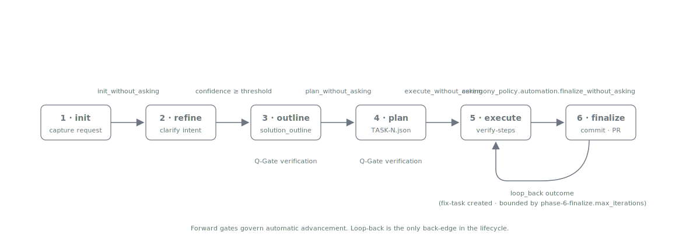

= Planning Workflow
:nofooter:
:toc: left
:toclevels: 2

xref:../../README.md[Plan Marshall] » xref:README.adoc[Concepts]

"What is the agent supposed to be doing right now?" is a question that goes unanswered through most of a long Claude Code session. Plan Marshall organises every non-trivial change as a *plan* that moves through six phases, each with a clear contract about what it produces and what it refuses to do. Each phase is a skill (`phase-1-init` … `phase-6-finalize`) whose workflow doc is dispatched through the xref:execution-context.adoc[execution-context dispatcher]; the `plan-marshall` meta-skill ties them together and is what `/plan-marshall` orchestrates.

The lifecycle is a forward state machine — each phase advances to the next when its review gate permits (see xref:../user/configuration.adoc#review-gates[Configuration › Review gates]). The single back-edge is the `loop_back` outcome from phase-6-finalize, which re-enters phase-5-execute to address fix tasks created during automated review or Sonar roundtrip and is bounded by `phase-6-finalize.max_iterations`.

== Phase Sequence

[cols="1,1,3", options="header"]
|===
|Phase |Skill |Outcome

|1. Init
|`phase-1-init`
|Plan directory created, the link:../../marketplace/bundles/plan-marshall/skills/manage-plan-documents/SKILL.md[request document] captured, references seeded, status initialised.

|2. Refine
|`phase-2-refine`
|Iterative request clarification until the confidence threshold is reached. Refine returns confidence + track + scope estimate; it never edits source files.

|3. Outline
|`phase-3-outline`
|The link:../../marketplace/bundles/plan-marshall/skills/manage-solution-outline/SKILL.md[solution outline] produced via the Simple Track (localised changes) or Complex Track (cross-cutting discovery). Outline is strictly analytical — no source mutations.

|4. Plan
|`phase-4-plan`
|Deliverables transformed into ordered `TASK-*.json` files with skill resolution and optimisation.

|5. Execute
|`phase-5-execute`
|Tasks executed sequentially via a profile-based workflow selector (implementation, module testing, verification). The phase skill is a dumb task runner — task content drives the work.

|6. Finalize
|`phase-6-finalize`
|Git workflow, finalize-step pipeline (pre-submission self-review, automated review, Sonar roundtrip, lessons capture, branch cleanup), commit, push, and PR creation. Project-specific finalize steps can be plugged in via project `finalize-step-*` skills and bundle-optional steps.
|===

The phase pipeline is described in detail in link:../../marketplace/bundles/plan-marshall/skills/ref-workflow-architecture/standards/phases.md[`ref-workflow-architecture/standards/phases.md`]. The lifecycle states a plan transitions through are catalogued in link:../../marketplace/bundles/plan-marshall/skills/ref-workflow-architecture/standards/phase-lifecycle.md[`phase-lifecycle.md`].

== Cross-Cutting Workflows

A handful of workflows run inside multiple phases. They live under link:../../marketplace/bundles/plan-marshall/skills/plan-marshall/workflow/[`plan-marshall/workflow/`] and are dispatched directly through `execution-context`:

* link:../../marketplace/bundles/plan-marshall/skills/plan-marshall/workflow/planning.md[`planning.md`], link:../../marketplace/bundles/plan-marshall/skills/plan-marshall/workflow/planning-outline.md[`planning-outline.md`] — task and outline planning bodies invoked by phases 3 and 4.
* link:../../marketplace/bundles/plan-marshall/skills/plan-marshall/workflow/execution.md[`execution.md`], link:../../marketplace/bundles/plan-marshall/skills/plan-marshall/workflow/q-gate-validation.md[`q-gate-validation.md`] — execution and quality-gate bodies invoked by phase 5.
* link:../../marketplace/bundles/plan-marshall/skills/plan-marshall/workflow/verification-feedback.md[`verification-feedback.md`] — triage envelope shared by phases 5 and 6 (build failures, lint, Sonar findings, PR review comments, plus domain-specific producers configured per project).
* link:../../marketplace/bundles/plan-marshall/skills/plan-marshall/workflow/triage.md[`triage.md`] — generic finding triage.
* link:../../marketplace/bundles/plan-marshall/skills/plan-marshall/workflow/research-best-practices.md[`research-best-practices.md`] — research workflow dispatched by any phase.
* link:../../marketplace/bundles/plan-marshall/skills/plan-marshall/workflow/enrich-module.md[`enrich-module.md`] — Tier-1 architecture enrichment invoked from phase-6 architecture-refresh.
* link:../../marketplace/bundles/plan-marshall/skills/plan-marshall/workflow/recipe.md[`recipe.md`], link:../../marketplace/bundles/plan-marshall/skills/plan-marshall/workflow/planning-lessons-aggregate.md[`planning-lessons-aggregate.md`] — recipe/lesson orchestration.

== Dispatch shape

Every phase boundary is a `Task: plan-marshall:execution-context-{level}` dispatch. The orchestrator runs in the main agent's context; each phase envelope is a separate subagent. A handful of shared workflow bodies (Q-Gate validation, verification-feedback, enrich-module) are invoked from multiple phases — the same `*.md` runs from every caller, but the `{level}` resolves under the calling phase's role registry, so the model and effort can differ per call site. Small, well-scoped changes can skip the Q-Gate via a bypass predicate documented in link:../../marketplace/bundles/plan-marshall/skills/phase-3-outline/SKILL.md[`phase-3-outline/SKILL.md`]; for everything else the gate fires.

The full call graph (every conditional, every shared workflow, every inline-script step) is canonical in link:../../marketplace/bundles/plan-marshall/skills/ref-workflow-architecture/standards/call-graph.md[`call-graph.md`]. The 8-step anatomy of one dispatch (pick role → resolve level → construct prompt → dispatch → load skills + read workflow → execute → return TOON → record outcome) is in xref:execution-context.adoc[Execution Context].

== Phase Boundaries

Two boundaries that catch most violations:

* **Refine never implements code.** If a `phase-2-refine` dispatch edits files outside `.plan/local/{plans,worktrees}/{plan_id}/`, that is a contract violation.
* **Outline never mutates source files.** Outline is read-only outside the plan directory.

== Related

* link:../../marketplace/bundles/plan-marshall/skills/ref-workflow-architecture/standards/phases.md[`ref-workflow-architecture/standards/phases.md`] — full phase pipeline specification
* link:../../marketplace/bundles/plan-marshall/skills/ref-workflow-architecture/standards/phase-lifecycle.md[`ref-workflow-architecture/standards/phase-lifecycle.md`] — plan lifecycle states
* link:../../marketplace/bundles/plan-marshall/skills/ref-workflow-architecture/standards/call-graph.md[`ref-workflow-architecture/standards/call-graph.md`] — dispatch call graph
* link:../../marketplace/bundles/plan-marshall/skills/plan-marshall/SKILL.md[`plan-marshall/SKILL.md`] — orchestrator skill
* link:../../marketplace/bundles/plan-marshall/skills/phase-1-init/SKILL.md[`phase-1-init/SKILL.md`]
* link:../../marketplace/bundles/plan-marshall/skills/phase-2-refine/SKILL.md[`phase-2-refine/SKILL.md`]
* link:../../marketplace/bundles/plan-marshall/skills/phase-3-outline/SKILL.md[`phase-3-outline/SKILL.md`]
* link:../../marketplace/bundles/plan-marshall/skills/phase-4-plan/SKILL.md[`phase-4-plan/SKILL.md`]
* link:../../marketplace/bundles/plan-marshall/skills/phase-5-execute/SKILL.md[`phase-5-execute/SKILL.md`]
* link:../../marketplace/bundles/plan-marshall/skills/phase-6-finalize/SKILL.md[`phase-6-finalize/SKILL.md`]
* link:../../marketplace/bundles/plan-marshall/skills/plan-marshall/workflow/planning.md[`plan-marshall/workflow/planning.md`]
* link:../../marketplace/bundles/plan-marshall/skills/plan-marshall/workflow/execution.md[`plan-marshall/workflow/execution.md`]
* link:../../marketplace/bundles/plan-marshall/skills/plan-marshall/workflow/q-gate-validation.md[`plan-marshall/workflow/q-gate-validation.md`]
* link:../../marketplace/bundles/plan-marshall/skills/plan-marshall/workflow/verification-feedback.md[`plan-marshall/workflow/verification-feedback.md`]
