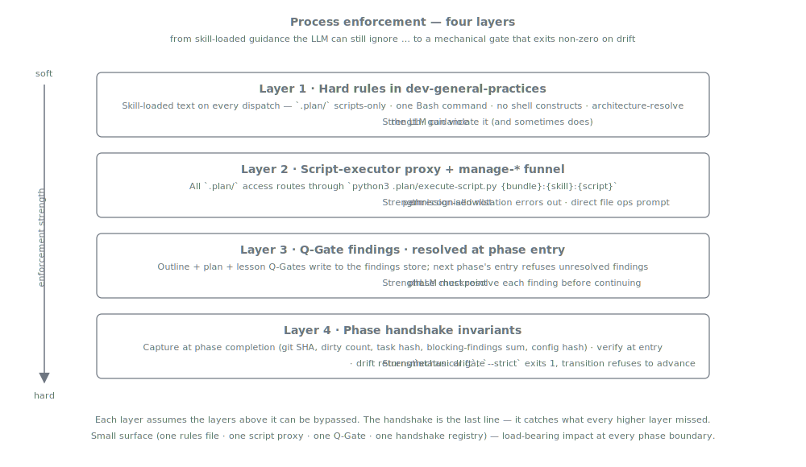

= Process Enforcement
:nofooter:
:toc: left
:toclevels: 2

xref:../../README.md[Plan Marshall] » xref:README.adoc[Concepts]

LLMs are not reliable process followers. They sidestep documented steps, invent plausible-but-wrong CLI verbs, shortcut around checks they consider "obviously satisfied", and report success against state they never produced. Telling them not to does not stop them.

Plan Marshall responds with four cooperating mechanisms ordered from soft (skill-loaded text) to hard (mechanical refusal). Each layer assumes the layer above it can be bypassed; the deeper a violation tries to reach, the more mechanical the resistance becomes.

The four together are small in surface area — one hard-rules file, one script proxy, one Q-Gate gate, one handshake registry — but load-bearing at every phase boundary.

== Layer 1 — Hard rules

Every plan-marshall subagent loads `plan-marshall:persona-plan-marshall-agent` as Tier-1 before anything else (see xref:skill-handling.adoc[Skill Handling]). Its `Workflow Discipline (Hard Rules)` section is the closest thing the marketplace has to "rules in the LLM's context window every time it dispatches" — `.plan/` access through scripts only, one Bash command per call, no shell constructs (`for`/`while`/`$()`/subshells), build commands resolved via the architecture API rather than hard-coded, CI operations through the abstraction rather than direct `gh`/`glab`, triage findings funnelled through `manage-findings` plus `ext-triage-{domain}`.

**Strength**: skill-loaded *guidance*. The LLM might still violate the rules. Layer 1 reduces the probability; the layers below it bound the damage when it does not.

== Layer 2 — The script-executor proxy + manage-* funnel

Virtually every action Plan Marshall takes routes through one Bash pattern: `python3 .plan/execute-script.py {bundle}:{skill}:{script} [args...]`. The executor is a Python proxy with an embedded notation-to-script map — only registered scripts resolve. A single Claude Code `Bash(python3 .plan/execute-script.py *)` allow rule covers hundreds of operations; anything that does not match surfaces a permission prompt.

The bounded counterpart is the `manage-*` interface. The set of files Plan Marshall maintains under `.plan/` is fixed, and each file has exactly one `manage-*` skill as its legitimate writer — `manage-status`, `manage-tasks`, `manage-findings`, `manage-architecture`, `manage-references`, `manage-execution-manifest`, `manage-run-config`. Layer 1 forbids direct file ops; Layer 2 is the path the rule directs the LLM to. Together they collapse "all the ways the LLM might touch state" down to one auditable surface, and every operation lands in `script-execution.log` automatically (xref:audit-trail.adoc[Audit Trail]).

**Strength**: a permission allowlist enforced by Claude Code. The LLM is free to try a direct `Read .plan/foo.json` — the absence of a matching allow rule surfaces a prompt before damage. The broader compromise behind narrowing the runtime surface lives in xref:security.adoc[Security].

== Layer 3 — Q-Gate findings at phase entry

Three phases write Q-Gate findings into the per-plan findings store: `phase-2-refine` for lesson-derived plans, `phase-3-outline` (bypassable for surgical single-deliverable plans), `phase-4-plan` (always). The shape is producer / consumer: the Q-Gate workflow produces findings into `artifacts/findings/qgate-{phase}.jsonl`; the **next phase's entry protocol** queries them and refuses to start work until every pending finding has a resolution.

**Strength**: a *phase checkpoint*. The data lives in the findings store, hash-id deduplicated, so re-running the Q-Gate does not drop pre-resolved entries. Full architectural synthesis (producers, store, consumers, the four resolution outcomes) is in xref:automatic-reviews.adoc[Automatic Reviews].

== Layer 4 — Phase handshake invariants

The mechanical gate. Every phase boundary captures a fingerprint of key invariants at completion; the next phase's entry re-evaluates each fingerprint against live state and refuses to continue on mismatch. This is the difference between *the LLM said it edited 5 files* and *the worktree shows 5 modified files at the expected SHA*.

Today's registry covers 14 invariants — main-checkout state, worktree state, references validity, task state, Q-Gate count, config hash, unfinished-task count, the per-phase blocking-findings partition, and a handful that *raise at capture* rather than recording a value so the boundary cannot just dismiss them. The full table, the five raising-exception class names, the strict-mode contract, and the per-phase blocking partition are documented in link:../../marketplace/bundles/plan-marshall/skills/plan-marshall/references/phase-handshake.md[`phase-handshake.md`].

**Strength**: a *mechanical gate*. On drift the script returns `status: drift` with a `diffs[invariant, captured, observed]` table; `--strict` makes the exit non-zero. For the guarded `5-execute → 6-finalize` boundary, `manage-status transition` inlines the strict verify so refusal and advance are one atomic call — the transition refuses to write the new phase state when drift is present.

== What the layers add up to

The four layers compose to a probabilistic-then-mechanical funnel. Most of the time the LLM follows Layer 1's rules and Layers 2-4 sit quietly. When it slips, a direct `Edit .plan/foo.json` surfaces a Claude Code prompt (Layer 2). An attempt to enter the next phase with unresolved Q-Gate findings is blocked at the entry protocol (Layer 3). A misreported "tasks complete" against a dirty worktree is caught when the handshake re-evaluates `worktree_dirty` and `task_state_hash` (Layer 4).

[CAUTION]
====
**Does this guarantee compliance? No.**

Layer 1 is skill-loaded text, not kernel enforcement. Layer 2 narrows the surface but does not prevent the LLM from trying a prohibited operation — it surfaces a prompt as fallback. Layer 3 depends on the LLM actually invoking `manage-findings qgate query` at phase entry (the phase skill always does, but a rogue workflow body could skip it). Layer 4 is the most mechanical of the four and still depends on the orchestrator running `phase_handshake verify --strict` at the right moment (the lifecycle workflows always do; ad-hoc dispatches do not).

The point is not "the LLM cannot break the process." The point is that breaking the process is *progressively harder* the deeper a violation tries to reach. Most violations terminate at Layer 1 or Layer 2 with a prompt the developer sees. The handful that reach Layer 4 surface as a `drift` TOON the developer reads on screen — at which point the choice is an authorised override (`capture --override --reason X`) or a manual fix, both of which leave an audit trail.
====

== Related

* xref:planning-workflow.adoc[Concepts › Planning Workflow] — the six phases the enforcement protects.
* xref:security.adoc[Concepts › Security] — the broader runtime-surface-narrowing thesis Layer 2 is part of.
* xref:audit-trail.adoc[Concepts › Audit Trail] — what the layers *record* in addition to what they enforce.
* xref:skill-handling.adoc[Concepts › Skill Handling] — why `persona-plan-marshall-agent` loads Tier-1 on every dispatch.
* xref:automatic-reviews.adoc[Concepts › Automatic Reviews] — the findings-pipeline architecture Layer 3 sits on top of.
* link:../../marketplace/bundles/plan-marshall/skills/persona-plan-marshall-agent/standards/agent-behavior-rules.md[`agent-behavior-rules.md`] — the hard-rules file loaded at every dispatch.
* link:../../marketplace/bundles/plan-marshall/skills/ref-workflow-architecture/standards/phase-lifecycle.md[`phase-lifecycle.md`] — Phase Entry / Completion Protocols that wire Q-Gate + handshake into every boundary.
* link:../../marketplace/bundles/plan-marshall/skills/plan-marshall/references/phase-handshake.md[`phase-handshake.md`] — handshake script contract, the 14-row invariant registry, the four exception classes (`MainCheckoutDirtiedDuringPlan`, `PhaseStepsIncomplete`, `TaskGraphInvalid`, `BlockingFindingsPresent`), the drift envelope, and the override path.
* link:../../marketplace/bundles/plan-marshall/skills/ref-workflow-architecture/standards/manage-contract.md[`manage-contract.md`] — the manage-* TOON-in / TOON-out contract the script funnel routes through.
* link:../../marketplace/bundles/plan-marshall/skills/manage-findings/SKILL.md[`manage-findings/SKILL.md`] — the findings store API Layer 3 reads from.
