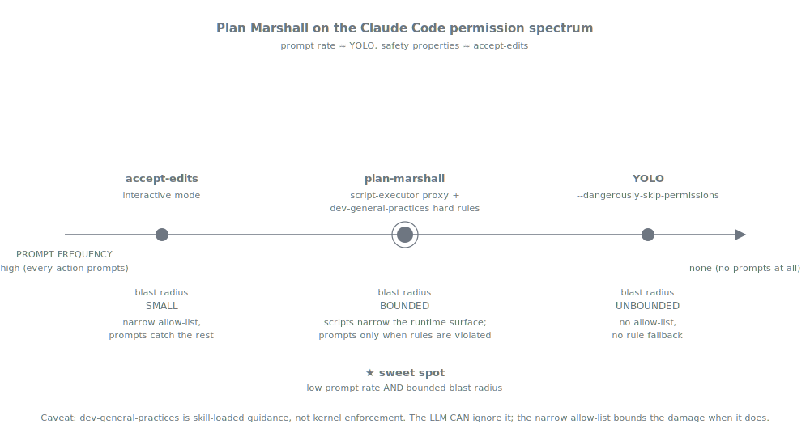

= Security
:nofooter:
:toc: left
:toclevels: 2

xref:../../README.md[Plan Marshall] » xref:README.adoc[Concepts]

Claude Code ships two extremes: **accept-edits** prompts the developer on every meaningful action (safe but flow-killing) and **YOLO** (`--dangerously-skip-permissions`) skips every prompt (fast but a single LLM misstep can do anything within the user's shell). Plan Marshall sits between them with a different approach — **narrow what the LLM does at all**, so the permission surface is small enough to pre-approve with confidence. Two layers cooperate: a normative baseline (`dev-agent-behavior-rules` hard rules) and a technical funnel (the script-executor proxy at `python3 .plan/execute-script.py`).

[CAUTION]
====
**Does this solve the problem completely? No.**

`dev-agent-behavior-rules` is skill-loaded *guidance*, not kernel-level enforcement. The LLM can still ignore the rules; nothing in Claude Code's runtime forces a subagent to honour a skill's `Prohibited actions` list. Plan Marshall lowers the probability of unsafe behaviour and bounds the blast radius via narrow allow-lists — it does not eliminate the risk.

The model is **way fewer prompts than accept-edits, way more secure than YOLO**. For the remaining cases where Claude Code violates the rules anyway, you still get the prompt — just much less often than you would interactively, and the prompt itself is the safety net.
====

== Layer 1 — `dev-agent-behavior-rules` as the normative baseline

Every plan-marshall subagent loads `plan-marshall:dev-agent-behavior-rules` as Tier-1 *before* anything else (see xref:skill-handling.adoc[Skill Handling]). The hard-rules block narrows what the subagent is allowed to *try*: no unconstrained generic subagents (every dispatch routes through `execution-context-{level}`), `.plan/` access through scripts only, one Bash command per call, no shell constructs (`for`/`while`/`$()`/subshells/heredocs), structured queries before `Glob`/`Grep`, build commands resolved via the architecture API rather than hard-coded, CI operations through the abstraction rather than direct `gh`/`glab`.

These rules cut off the gnarliest LLM failure modes — shell injection through `$()`, runaway loops, ad-hoc subagents with full tool access — before they can fire. The rules are guidance, not enforcement, but loaded at every dispatch they sit in the subagent's context at every decision point.

== Layer 2 — The script-executor proxy as a technical funnel

Almost every action plan-marshall takes routes through one Bash pattern: `python3 .plan/execute-script.py {bundle}:{skill}:{script} [args...]`. The executor is a Python proxy with an embedded notation-to-script map: only registered scripts resolve, unknown notations error out, and the executor never `exec`s shell strings — it dispatches to Python directly.

This shape means a single broad Claude Code permission (`Bash(python3 .plan/execute-script.py *)`) covers the bulk of plan-marshall's work. The wildcard is bounded: it can match only arguments the executor itself accepts, and the executor only dispatches to registered scripts. Without the proxy, the same coverage would require either a prompt per operation or a dozens-of-entries-long allow list that's easy to get wrong. With it, hundreds of distinct plan-marshall operations (every `manage-*`, every build, every triage, every finalize step) collapse into one allow entry.

The settings hierarchy itself follows Claude Code's standard two-file split — `.claude/settings.json` is the team-shared allow list (small, version-controlled, same for every developer) and `.claude/settings.local.json` is the per-developer customisation (gitignored, larger, individual). The canonical sample patterns and the resolution rules between them live in `permission-architecture.md`.

== When prompts still happen

Plan Marshall reduces prompt frequency; it does not eliminate prompts. Expect prompts for: Bash file-ops that the LLM tries despite the hard-rule ban (`find`, `cat`, `grep`, `ls`, `head`, `tail`), compound shell commands the rules forbid (`&&`, `;`, `$()`, heredocs, `for`/`while`), direct `gh`/`glab` calls (the abstraction is the documented route), and novel WebFetch domains.

Treat every prompt as a signal. A prompt for something plan-marshall should never have tried means a hard-rule violation made it through the skill-load layer. The right response is usually to deny, redirect, and — if it recurs — capture as a lesson.

== Audit trail

Because every action routes through the script-executor proxy, every script invocation is logged automatically. Combined with the structured `[STATUS]` / `[DISPATCH]` / `[SKILL]` / `[ARTIFACT]` tags emitted by `execution-context`, the per-plan findings JSONL, and the phase-handshake invariants, this produces a comprehensive, machine-readable record of every plan run. The full story — what's logged, where, how `plan-retrospective` evaluates it — is its own concept page: xref:audit-trail.adoc[Audit Trail].

== Related

* link:../../marketplace/bundles/plan-marshall/skills/dev-agent-behavior-rules/standards/agent-behavior-rules.md[`agent-behavior-rules.md`] § Workflow Discipline (Hard Rules) — the normative baseline that every Tier-1 load enforces.
* link:../../marketplace/bundles/plan-marshall/skills/tools-script-executor/SKILL.md[`tools-script-executor/SKILL.md`] — the script-executor proxy contract, the embedded notation map, the error envelopes.
* link:../../marketplace/bundles/plan-marshall/skills/tools-permission-doctor/standards/permission-architecture.md[`permission-architecture.md`] — the three-level settings hierarchy (global / project / local), resolution priority, sample patterns per scope, and the "when to use which file" guidance.
* link:../../marketplace/bundles/plan-marshall/skills/tools-permission-doctor/SKILL.md[`tools-permission-doctor/SKILL.md`] — read-only permission analysis (`tools-permission-fix` covers the write operations).
* link:../../marketplace/bundles/plan-marshall/skills/manage-providers/SKILL.md[`manage-providers/SKILL.md`] — credential storage outside `marshal.json` and `.plan/`, with the filesystem-protection invariants the credential store enforces.
* xref:skill-handling.adoc[Concepts › Skill Handling] — why every subagent loads `dev-agent-behavior-rules` as Tier-1.
* xref:execution-context.adoc[Concepts › Execution Context] — why every subagent dispatch routes through the same generic dispatcher.
* xref:audit-trail.adoc[Concepts › Audit Trail] — what every operation records to disk.
* xref:../user/configuration.adoc[User Guide › Configuration] — surface map of `.claude/settings.json` / `.claude/settings.local.json`.
