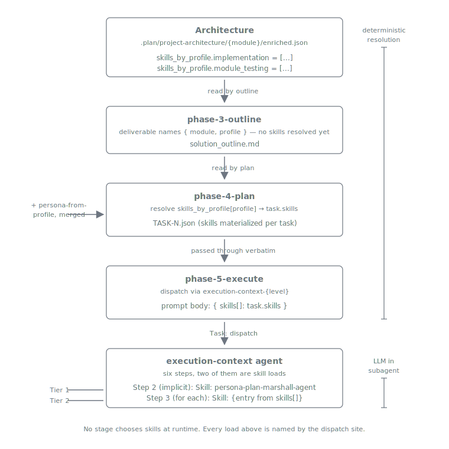

= Skill Handling
:nofooter:
:toc: left
:toclevels: 2

xref:../../README.md[Plan Marshall] » xref:README.adoc[Concepts]

How Plan Marshall loads skills into agent context — and why it does so *explicitly* rather than via the probabilistic skill-matching that LLM hosts default to.

== Why explicit skill loading?

In an unconstrained LLM session, "which skill applies here" is a runtime judgment the model itself makes from the prompt — useful for ad-hoc work, problematic for repeatable workflows. Two tasks with similar wording can pull in different skill sets and produce divergent outputs.

Plan Marshall flips this. Every skill loaded by a subagent is **named by the dispatch site**, resolved against `marshal.json`, materialized into the task record at plan time, and loaded in a deterministic order at dispatch time. The LLM running the subagent has zero discretion about its own context — it loads what it is told.

Two consequences:

* **Reproducibility.** The same `(module, profile)` pair produces the same `task.skills` list, which produces the same loaded context across runs.
* **Auditability.** Every `Skill:` call is logged with the plan id, the dispatch name, and the skill notation. The work log is the authoritative answer to "what was in this subagent's context."

== Three tiers of skill

Every dispatch's context is built from up to three tiers, stacked in order:

[cols="1,1,3", options="header"]
|===
| Tier | Source | Examples

| **Tier 1 — System** | `skill_domains.system.defaults` in `marshal.json`. Loaded by the dispatcher unconditionally; never in the caller's `skills[]` array. | link:../../marketplace/bundles/plan-marshall/skills/dev-general-practices/SKILL.md[`plan-marshall:dev-general-practices`]
| **Tier 2 — Domain** | `skill_domains.{domain}` in `marshal.json`, materialized into `task.skills` via per-module `skills_by_profile`. Loaded per task. | link:../../marketplace/bundles/pm-dev-java/skills/java-core/SKILL.md[`pm-dev-java:java-core`], link:../../marketplace/bundles/pm-dev-java/skills/junit-core/SKILL.md[`pm-dev-java:junit-core`], link:../../marketplace/bundles/plan-marshall/skills/dev-general-module-testing/SKILL.md[`plan-marshall:dev-general-module-testing`]
| **Workflow + Extensions** | Profile-routed (link:../../marketplace/bundles/plan-marshall/skills/execute-task/SKILL.md[`execute-task`] for phase-5 tasks) or finding-routed (`ext-triage-{domain}` during finalize). Resolved via `manage-config` lookups, passed through `skills[]`. | link:../../marketplace/bundles/plan-marshall/skills/execute-task/SKILL.md[`plan-marshall:execute-task`], link:../../marketplace/bundles/pm-dev-java/skills/ext-triage-java/SKILL.md[`pm-dev-java:ext-triage-java`]
|===

Tier 1 always loads first. Tier 2 and the workflow / extension entries load in the order the dispatch site arranged them — typically domain knowledge before workflow logic so the workflow can apply the loaded standards.

== From architecture to dispatch — the data flow

Skills travel through the planning pipeline as a deterministic data flow. Nothing about "which skills load" is decided by the model.

Each transition is a manage-* script call or a workflow-driven assignment. The canonical step-by-step is link:../../marketplace/bundles/plan-marshall/skills/ref-workflow-architecture/standards/skill-loading.md[`ref-workflow-architecture/standards/skill-loading.md`].

== `dev-general-practices` — the implicit Tier-1 skill

The one skill every subagent loads regardless of what the dispatch site says. It carries the workflow-discipline hard rules: one Bash command per call, no shell loops or `$()`, `.plan/` access only through `manage-*` scripts, no direct `gh` / `glab`, no hard-coded build commands.

How it loads: the `execution-context` agent's Step 2 — before any caller-named skill — runs

[source]
----
Skill: plan-marshall:dev-general-practices
----

Step 3 then walks `skills[]` for caller-named loads. If a caller accidentally passes `plan-marshall:dev-general-practices` in `skills[]`, the dispatcher de-dupes.

The skill itself follows **reference-mode** loading — it doesn't execute logic; it pulls in link:../../marketplace/bundles/plan-marshall/skills/dev-general-practices/standards/general-development-rules.md[`standards/general-development-rules.md`] and (on demand) related standards files. The hard rules live there; the skill is the loader.

== `dev-general-module-testing` — a profile-driven Tier-2 skill

Language-agnostic testing methodology (AAA pattern, coverage thresholds, test-double taxonomy, property-based testing, determinism patterns). It is **not** in `system.defaults`, so it doesn't load on every dispatch — only on dispatches whose `task.skills` list contains it.

When does that happen? When `task.profile == "module_testing"` *and* the module's `skills_by_profile.module_testing` array names it. The architecture-enrichment step picks this up automatically when domain detection identifies testable code in the module.

Concretely: a Java module's `enriched.json` will carry roughly

[source,json]
----
{
  "skills_by_profile": {
    "implementation": ["pm-dev-java:java-core", "pm-dev-java:java-cdi"],
    "module_testing": ["pm-dev-java:java-core",
                       "pm-dev-java:junit-core",
                       "plan-marshall:dev-general-module-testing"]
  }
}
----

At plan time, task-plan reads that and writes `task.skills` accordingly. At dispatch, the execution-context agent loads them in order — and because `dev-general-practices` already loaded first, the testing skill's reference-mode standards layer on top of the foundational rules.

This is what "loaded in the context with profile" means: the skill's presence is a deterministic function of `(module, profile)`, not an LLM judgment.

== Execution-context loading sequence — at dispatch time

When a `Task:` dispatch fires (e.g., from `phase-5-execute` to execute one task), the `execution-context` agent runs six steps. Skill loading is steps 2-3.

[cols="1,3", options="header"]
|===
| Step | Action

| 1 | **Validate the prompt-body contract** — `name`, `plan_id`, `skills[]`, exactly one of `workflow` / `instructions`, `WORKTREE`. Missing fields → return error TOON, abort.
| 2 | **Load Tier 1 implicitly** — `Skill: plan-marshall:dev-general-practices`. Unconditional. Not in `skills[]`.
| 3 | **Load `skills[]` in order** — for each entry, `Skill: <entry>`. Each load is logged with the work-log notation `[SKILL] (plan-marshall:execution-context.{name}) Loaded {skill}`. A failed load returns `error_type: skill_load_failure` and aborts.
| 4 | **Acquire the workflow body** — resolve the `workflow:` notation to a marketplace path and `Read` it, or treat `instructions:` text as the body verbatim.
| 5 | **Execute the workflow body** — the loaded skills are now in the subagent's context. The body may issue further `Skill:` calls inline for additional reference loads (in-context, not subagent dispatch).
| 6 | **Log completion** — `[STATUS] ... Complete`.
|===

The `Skill` tool is in the agent's `tools:` frontmatter, which is what makes steps 2-3 mechanically possible. The dispatcher is allowed to load skills; the workflow body inside it is allowed to load more if it needs them.

For *why* every dispatch routes through one canonical agent with six emitted level variants, see xref:execution-context.adoc[Execution Context]. This page covers *what loads into that agent's context*.

== Profiles

The profile is the *category of work* a task represents — production code vs test code vs integration test vs quality / docs. It drives two things:

1. Which skills enter the dispatched context (the Tier-2 selection from `skills_by_profile`).
2. Which workflow skill executes the task (the phase-5 `resolve-workflow-skill` lookup — see below).

The profile slots, as declared in `ExtensionBase.APPLICABLE_PROFILES`:

[cols="1,2,2", options="header"]
|===
| Profile | Purpose | Detection signal

| `implementation` | Create / modify production code | Always included
| `module_testing` | Create / modify test code (unit / module level) | Always included
| `integration_testing` | Integration tests with containers or external services | Signal-based — e.g. Failsafe plugin, testcontainers dependency
| `quality` | Documentation standards, code-quality checks | Always included
| `documentation` | Documentation-specific tasks (AsciiDoc, ADRs) | Signal-based — module contains `doc/*.adoc` files
|===

A sixth slot, `core`, is special: it carries foundation patterns and standards that *always* merge into every other profile. It is not selected per-task — it loads alongside whichever profile the task names.

=== Profile-driven workflow-skill override

The system default workflow body for every task is link:../../marketplace/bundles/plan-marshall/skills/execute-task/SKILL.md[`plan-marshall:execute-task`]. A domain can replace it per profile via `skill_domains.{domain}.workflow_skills.{profile}` in `marshal.json`:

[source,json]
----
"skill_domains": {
  "java": {
    "workflow_skills": {
      "implementation": "pm-dev-java:java-implementation",
      "module_testing": "pm-dev-java:java-module-testing"
    }
  }
}
----

At dispatch time `manage-config resolve-workflow-skill --domain {domain} --phase {profile}` checks the override first and falls back to the system default. The TOON return includes a `fallback: true|false` field so the caller knows which path resolved.

When *should* a domain override? When the work genuinely differs from the generic shape — different verification commands, different test-framework idioms, different coding patterns it must enforce. Minor style differences should stay in domain skills loaded as Tier-2, not in a forked workflow body.

Full contract — required input parameters, return-structure invariants, validation rules — in link:../../marketplace/bundles/plan-marshall/skills/extension-api/standards/profiles.md[`extension-api/standards/profiles.md`].

== Skill domains in `marshal.json`

The `skill_domains` block is the project-level registry that maps detected domains (`java`, `javascript`, `oci`, …) to skill lists per profile. Two parts:

* `skill_domains.system` — Tier 1 defaults plus workflow-skill mappings (`execute-task`, phase skills).
* `skill_domains.{domain}` — per-domain skills organised by profile (`implementation`, `module_testing`, `integration_testing`, `quality`, `documentation`) plus extension points (`triage`, `outline`, `recipe`, `self-review`).

The wizard seeds this from each installed bundle's `plan-marshall-plugin` manifest. Tuning lives in xref:../user/configuration.adoc#skill-domains[User Guide › Configuration › Skill domains]; canonical schema in link:../../marketplace/bundles/plan-marshall/skills/manage-config/standards/skill-domains.md[`skill-domains.md`] / link:../../marketplace/bundles/plan-marshall/skills/manage-config/standards/skill-domains-operations.md[`skill-domains-operations.md`].

== Auditing what loaded

The dispatch-time work log under `.plan/local/logs/` is the authoritative record. Each `Skill:` call inside `execution-context` writes a line like

[source]
----
[SKILL] (plan-marshall:execution-context.execute-task-7) Loaded pm-dev-java:java-core
[SKILL] (plan-marshall:execution-context.execute-task-7) Loaded pm-dev-java:junit-core
[SKILL] (plan-marshall:execution-context.execute-task-7) Loaded plan-marshall:dev-general-module-testing
----

Grep the work log to answer "what did task N actually load." If a skill is missing from the log, it never loaded — regardless of what the workflow body claims to have applied.

== Related

* link:../../marketplace/bundles/plan-marshall/skills/ref-workflow-architecture/standards/skill-loading.md[`skill-loading.md`] — canonical step-by-step of the two-tier loading + extensions
* link:../../marketplace/bundles/plan-marshall/skills/ref-workflow-architecture/standards/agents.md[`agents.md`] — agent inventory and the dispatch-vs-context-load distinction
* link:../../marketplace/bundles/plan-marshall/agents/execution-context.md[`execution-context.md`] — the dispatcher agent body (Steps 1-6)
* link:../../marketplace/bundles/plan-marshall/skills/dev-general-practices/SKILL.md[`dev-general-practices/SKILL.md`] — the Tier-1 skill
* link:../../marketplace/bundles/plan-marshall/skills/dev-general-module-testing/SKILL.md[`dev-general-module-testing/SKILL.md`] — the profile-driven Tier-2 example
* link:../../marketplace/bundles/plan-marshall/skills/execute-task/SKILL.md[`execute-task/SKILL.md`] — the profile-routed workflow skill
* link:../../marketplace/bundles/plan-marshall/skills/manage-config/standards/skill-domains.md[`skill-domains.md`] — the `marshal.json` schema for skill domains
* xref:execution-context.adoc[Concepts › Execution Context] — why one dispatcher + level variants
* xref:planning-workflow.adoc[Concepts › Planning Workflow] — where each tier loads during the six-phase pipeline
