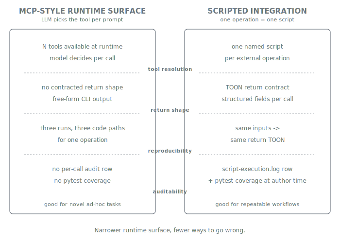

= Tools and Scripts
:nofooter:
:toc: left
:toclevels: 3
:toc-title: Table of Contents
:sectnums:
:source-highlighter: highlight.js

xref:../../README.md[Plan Marshall] » xref:README.adoc[Concepts]

A typical MCP setup hands the LLM a directory of tools and lets the model decide which to invoke per prompt. That is useful when the task shape is novel; it is corrosive when the task shape is fixed and you want reproducibility. Plan Marshall does **not** expose external systems to the LLM via MCP, live API exploration, or any other runtime-discovered surface. Every external integration ships as a Python *script* owned by a plan-marshall skill, called through the script-executor proxy with a contracted TOON return, and authenticated via credentials the LLM never sees.

== Why scripts, not MCP

Plan Marshall's failure mode without this discipline is well-documented: an LLM given access to `gh` directly will sometimes use `gh pr review`, sometimes `gh api repos/...`, sometimes raw `git log` parsing — three different code paths for one operation. The wider the runtime tool surface, the broader the variance. Scripts narrow that surface to one path per operation, with the trade-offs the diagram names: deterministic, contracted, tested, auditable, and pre-built at marketplace authoring time rather than discovered at runtime.

LSP integration is on the roadmap for the IDE-side use case — structured symbol lookup, refactoring affordances — and will follow the same deterministic-script discipline: a thin Python wrapper presenting a contracted TOON API in front of the language server. The "no MCP" position is specifically about runtime tool *routing* being an LLM decision; LSP for editor integration is a different problem.

== The integration skill pattern

Every external system gets a dedicated skill under `marketplace/bundles/plan-marshall/skills/{name}/` with the standard shape: a SKILL.md documenting operations + enforcement + TOON output contract, one or more Python scripts implementing the operations, and a `{provider}_provider.py` declaring credential needs when the integration calls authenticated HTTPS. Invocation always routes through the executor proxy with the standard `python3 .plan/execute-script.py {bundle}:{skill}:{script}` shape; skill authors get a uniform API to compose against, and the LLM gets one named operation to call with structured I/O.

The current integration roster:

* `tools-integration-ci` — unified GitHub + GitLab abstraction. Every CI/PR operation routes here. **Direct `gh`/`glab` calls are forbidden by `persona-plan-marshall-agent`.**
* `workflow-integration-github` and `workflow-integration-gitlab` — per-provider PR review-comment producers feeding the findings pipeline.
* `workflow-integration-sonar` — Sonar issue producer feeding the findings pipeline.
* `workflow-integration-git` — local git workflow (conventional commits, artifact cleanup, optional push, worktree management).

All five expose operations through the same invocation shape, return TOON, and route HTTPS auth through the same `RestClient` and credential store.

== Credentials — outside LLM reach

External-HTTPS integrations need authentication tokens. `manage-providers` handles the lifecycle so the LLM never sees a credential: tokens are stored outside the project tree (so they survive `rm -rf .plan/` and never enter git) and the credential files are filesystem-protected by the `manage-providers` skill. Tokens are entered by the user interactively at setup time; at runtime the LLM dispatches the operation, and the script reads the credential to construct the auth header. The `RestClient` consumed by every integration refuses to send an auth header over plain HTTP. The credential never enters LLM context, never appears in TOON output, and never lands in logs.

A skill declares it needs credentials by shipping a `{provider}_provider.py` next to its scripts; the discovery is automatic via `manage-providers discover-and-persist`. The contract — every field, validation rules, runtime invocation flow — lives in link:../../marketplace/bundles/plan-marshall/skills/extension-api/standards/ext-point-provider.md[`ext-point-provider.md`].

[CAUTION]
====
**"The LLM never sees the credential" is a filesystem-level guarantee, not a metaphysical one.**

The token lives on disk under `~/.plan-marshall-credentials/` with restrictive permissions, read by the integration script at HTTPS-call time, and dropped from memory when the script exits. What the LLM dispatches is the operation; what the script does with the credential happens behind the dispatch. If the credential file is world-readable, copied into the project tree, or echoed by a misconfigured script, the guarantee fails. The contract is good and the defaults are right; the operator still has to not undermine them.
====

== Related

* link:../../marketplace/bundles/plan-marshall/skills/tools-integration-ci/SKILL.md[`tools-integration-ci/SKILL.md`] — unified CI provider abstraction (the `pr`, `checks`, `issue`, `branch` subcommand surface).
* link:../../marketplace/bundles/plan-marshall/skills/workflow-integration-github/SKILL.md[`workflow-integration-github/SKILL.md`] — GitHub PR review producer.
* link:../../marketplace/bundles/plan-marshall/skills/workflow-integration-gitlab/SKILL.md[`workflow-integration-gitlab/SKILL.md`] — GitLab MR review producer.
* link:../../marketplace/bundles/plan-marshall/skills/workflow-integration-sonar/SKILL.md[`workflow-integration-sonar/SKILL.md`] — Sonar issue producer.
* link:../../marketplace/bundles/plan-marshall/skills/workflow-integration-git/SKILL.md[`workflow-integration-git/SKILL.md`] — local git commit + worktree workflow.
* link:../../marketplace/bundles/plan-marshall/skills/manage-providers/SKILL.md[`manage-providers/SKILL.md`] — credential store, `RestClient`, the filesystem-protection invariants.
* link:../../marketplace/bundles/plan-marshall/skills/extension-api/standards/ext-point-provider.md[`ext-point-provider.md`] — provider declaration contract: `{provider}_provider.py` shape, `get_provider_declarations()` return dict, runtime invocation flow.
* link:../../marketplace/bundles/plan-marshall/skills/tools-script-executor/SKILL.md[`tools-script-executor/SKILL.md`] — the executor proxy through which every script call flows.
* xref:security.adoc[Concepts › Security] — why narrowing the runtime surface matters.
* xref:build-management.adoc[Concepts › Build Management] — the same deterministic-script pattern for the build-system surface.
* xref:audit-trail.adoc[Concepts › Audit Trail] — where every script call is logged.
* xref:orchestration.adoc[Concepts › Orchestration] — the small-ops carve-out that consumes this scripted CI/git surface from above the plan lifecycle, and the `--store orchestrator` reuse of the `manage-status`/`manage-logging` script layer.
