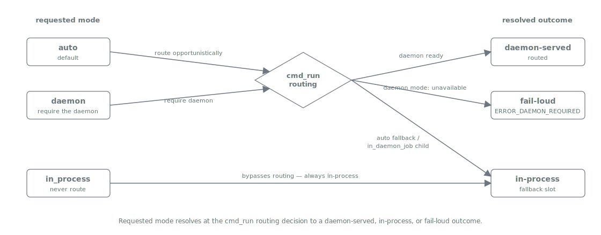

= Build Architecture (marshalld)
:nofooter:
:toc: left
:toclevels: 3
:toc-title: Table of Contents
:sectnums:
:source-highlighter: highlight.js

xref:../../README.md[Plan Marshall] » xref:README.adoc[Developer Guide]

This is the as-built interaction architecture of the `marshalld` build server at developer altitude — the component map, the request flows, the job state machine, and the deliberate absences. It answers *how* the pieces fit; for *what* the build server is and *why* it exists, read the concept page xref:../concepts/build-server.adoc[Concepts › Build Server], which this document cross-references rather than duplicates.

== Component map

The build server is three skills plus a shared protocol library, over a machine-global state directory. The client and control skill sit on the session/operator side of a Unix domain socket; the daemon and its four cores sit on the other.

[.text-center]
....
 operator (human)                     Claude session (orchestrator / leaf)
      │                                        │
      │ manage-build-server                    │ build-server-client
      │ (register/unregister/                  │ (submit/wait/ping/preflight)
      │  start/stop/drain/status/              │        │
      │  install/upgrade)                      │        │ change-ledger: job_id
      ▼                                        ▼        ▼
 registry.json  ◄───────── reads ──────────  Unix socket (0600, owner-checked,
 (+ audit log)                                 length-prefixed JSON frames)
      ▲                                                 │
      │ reads                                           ▼
 ┌────┴──────────────── marshalld (ppid=1, double-forked) ─────────────────┐
 │  VERIFIER  ──►  SCHEDULER  ──►  SUPERVISOR  ──►  JOURNAL                 │
 │  (S1/S2      (max_slots,      (asyncio child   (specs/results/ETA,       │
 │   verify-     per-project      per job, clean   retention + GC,          │
 │   not-        round-robin,     baseline env,    restart replay)          │
 │   resolve)    idempotent       success|failure|                         │
 │               attach)          timeout|killed)                          │
 └───────────────────────────────────┼─────────────────────────────────────┘
                                      ▼ child: python3 {tree}/.plan/execute-script.py {notation} …

 ~/.plan-marshall/  marshalld/{socket, daemon.pid, daemon.log, registry.json,
                              registry-audit.log, journal/, job-logs/}
                    build-queue.json  (the single machine-global slot substrate)
....

The shared protocol library `_build_server_protocol` is imported by both sides: it owns the length-prefixed JSON frame codec (a 4-byte big-endian length prefix + a UTF-8 JSON body, so nested/multi-line error payloads round-trip losslessly), the `JobSpec` struct, and the status-schema helpers that map to and from the shared `_build_result` shape. Neither the client nor the daemon re-declares the wire contract.

The daemon's four cores are separable pure units wired behind the socket:

* **Verifier** (`_marshalld_verifier`) — S1/S2 positional verification of every submit against the project's registration; a pure function given a resolver injection.
* **Scheduler** (`_marshalld_scheduler`) — an in-memory bounded-slot admitter with per-project round-robin fairness and idempotent-submit fingerprint attach; no I/O.
* **Supervisor** (`_marshalld_supervisor`) — one `asyncio` subprocess per admitted job with a clean server-side baseline env, stream capture to a per-job log, liveness tracking, and terminal classification.
* **Journal** (`_marshalld_journal`) — the durable on-disk record of specs, results, and per-command ETA history, with a bounded retention window, GC, and restart replay.

== Flows

The interaction architecture is eight flows. F1–F2 are the operator/session setup; F3–F5 are the hot path of a served build; F6 is the fallback; F7–F8 are the resilience and lifecycle mechanics.

=== F1 — Registration (the enable signal)

The operator runs `manage-build-server register` (user-invocable only). It upserts the project — keyed by its canonical, symlink-resolved root — into the machine-global `registry.json` via the `_build_server_registry` module, recording the worktree containers and the notation allowlist, and appends one line to the append-only registration audit log. Registration is the ONLY enablement; there is no config knob and nothing git-tracked.

=== F2 — Preflight (session readiness)

At phase-1-init the session makes one deterministic `build_server preflight` call. The client reads the registry for the project root: an unregistered project returns `disabled` with NO daemon round-trip (an unregistered project never touches the socket). A registered project completes the S3 identity handshake and returns `ready` (the daemon answered with the expected version) or `down` + a named reason. The init step branches on the one TOON — `disabled`/`ready` proceed silently, `down` asks the operator — and the daemon is never auto-started.

Preflight readiness is only ONE of the two inputs to the build-execute routing decision (see xref:execution-modes[Execution modes]). The other is the caller's explicit `--execution-mode` (`auto` | `in_process` | `daemon`). Preflight answers *can this build be routed*; the requested execution_mode answers *should it be — and what happens when it cannot*. The routing is therefore no longer "route whenever registered-and-ready"; readiness is necessary but not sufficient, and a not-ready preflight resolves differently per requested mode.

=== F3 — Submit

A submit happens only when the routing decision resolves to *routed*: the requested execution_mode is `auto` or `daemon` (never `in_process`), the build carries no client env / working-dir override the daemon cannot honour, and preflight is `ready`. Under those conditions the routing seam (`_build_execute_factory`) — or any build-dispatching context — calls `build_server submit`. The client first runs the S3 handshake (the socket must be owned by the caller's own uid and answer the expected protocol version; an impostor socket is treated as unreachable, never trusted), then sends the job spec over a fresh short-lived connection. The daemon's verifier applies S1/S2 (below); on acceptance the scheduler enqueues the job (or attaches an identical in-flight one by fingerprint) and the journal records the spec. The daemon returns `queued` + a `job_id`, and the client persists that `job_id` to the change-ledger (`kind=job`) so a reaped or rebuilt session can re-attach from plan state alone. The seam records the resolved outcome as `resolved=routed`, alongside the requested mode, for the requested-vs-resolved audit trail.

=== F4 — Schedule and execute

Admission is bounded by `max_slots` (`build.queue.max_slots`, default 5). When a slot is free the scheduler admits the next job under per-project round-robin fairness (FIFO within a project), and the supervisor spawns one `asyncio` child in the submitted tree with a clean server-side baseline env — the client's environment is never forwarded and no provider secret reaches the build. The child's combined output streams to a per-job log as it is produced (durable even if the wait is reaped), each chunk marks liveness, and on exit the supervisor classifies the terminal status and the journal records the result and updates the command's ETA history.

=== F5 — Wait (server-side bounded long-poll)

The session calls `build_server wait` (re-attaching via the ledger `job_id` when none is passed). The daemon holds the connection up to the wait bound: it returns a terminal status-TOON as soon as the job settles, or on bound expiry a *live* running status carrying `elapsed` / `eta` / `last_progress` — never a timeout-shaped empty body. The client re-issues `wait` on a running return; it MUST NOT `run_in_background` or `sleep` the wait, because a harness-reaped wait costs exactly one re-poll while the build keeps running in the daemon.

=== F6 — The non-routed outcomes (in-process fallback and fail-loud)

When the routing decision does NOT resolve to *routed* — preflight is not `ready` (unregistered, or registered but `down`), the build carries an env / working-dir override, or the caller requested `in_process` — the resolved outcome depends on the requested execution_mode:

* **`auto`** — the seam runs the build in-process under a single machine-global build-queue slot (`build_queue`, the same `build-queue.json` the daemon coordinates on) and records the degradation reason. Resolved outcome: `resolved=in_process`. This is the historical fallback behaviour, now the `auto`-mode branch.
* **`in_process`** — the seam never attempts to route at all (no preflight, no submit) and runs in-process under the same slot. Resolved outcome: `resolved=in_process`.
* **`daemon`** — a genuine unavailability is a HARD failure, not a silent fallback: the seam emits a loud error envelope (`error=daemon_required`, `ERROR_DAEMON_REQUIRED`, exit 1) and the build does NOT run in-process. Resolved outcome: `resolved=fail-loud`. The sole exception is an `in_daemon_job` re-entrant build — this process IS the daemon's own child re-running the executor, so it MUST proceed in-process (`resolved=in_process`) rather than recurse.

Whichever branch fires, a build takes exactly one limiter path, never both, so slots are never double-counted; an unregistered `auto`/`in_process` build is byte-identical to the pre-build-server behaviour. Every resolved outcome records BOTH the requested mode and the resolved outcome (`routed` | `in_process` | `fail-loud`) so the routing decision is auditable after the fact.

=== F7 — Kill detection and restart replay

A child the supervisor did not itself terminate — a `SIGKILL`, a harness reap, a daemon crash — is classified `killed`, its own terminal status ("externally killed — not flaky, do not blind-retry"), never folded into `failure`. On a daemon restart the journal replays: terminal results that are still within the retention window remain readable, while any job that was in-flight when the old daemon died is marked `killed` (its child died with the supervisor) — never silently resumed.

=== F8 — Daemon lifecycle

`manage-build-server start` double-forks the daemon (first fork + `setsid`, second fork, cwd → `/`, stdio → `/dev/null`) so it re-parents to PID 1 and holds no controlling terminal. On bind it takes over a stale socket only after liveness-probing the previous pidfile (a live owner refuses the takeover), `chmod`s the socket `0600` inside the `0700` state dir, and writes its pidfile. `drain` stops accepting new submits while finishing running jobs and answering waits; `stop` force-terminates; `install` / `upgrade` are the version-pinned (re)starts.

[#execution-modes]
== Execution modes and the routing decision

Every build carries an explicit `--execution-mode` — `auto` (the default), `in_process`, or `daemon` — declared once on the shared `run` subparser so all four build tools (maven, gradle, npm, pyproject) inherit it. The mode is the *requested* routing intent; the `cmd_run` routing decision maps it, together with preflight readiness and any env / working-dir override, to a *resolved* outcome. This requested-vs-resolved distinction supersedes the older "route whenever registered-and-ready" description: readiness alone no longer decides the path.

The three modes differ only in what happens when the daemon cannot serve the build:

[cols="1,3", options="header"]
|===
| Requested mode | Resolved outcome

| `auto`
| Route to the daemon when preflight is `ready` and no env / working-dir override is present (`resolved=routed`, F3); otherwise fall back in-process under the machine-global slot, recording the degradation reason (`resolved=in_process`, F6). The historical default behaviour.

| `in_process`
| Never attempt to route — no preflight, no submit. Always build in-process under the slot (`resolved=in_process`). Deterministic regardless of live daemon state.

| `daemon`
| Require the daemon. Route when ready (`resolved=routed`); on any genuine unavailability — daemon down, unregistered, an unroutable tool, or an env / working-dir override the daemon cannot honour — fail loud with `ERROR_DAEMON_REQUIRED` (exit 1), NEVER a silent in-process fallback (`resolved=fail-loud`, F6). The sole in-process exception is an `in_daemon_job` re-entrant build (the daemon's own child re-running the executor).
|===

Every resolved outcome is logged with BOTH the requested mode and the resolved outcome (`routed` | `in_process` | `fail-loud`), so the routing decision for any build is reconstructable from the log alone.

All four build tools reach this routing decision through the SINGLE shared `cmd_run` built by `create_execute_handlers` in `_build_execute_factory` — none of them defines its own. A tool that needs extra behaviour on the in-process leg supplies that executor through the factory's in-process-executor seam instead of forking a `cmd_run`: pyproject passes its one-shot `.pyprojectx` self-heal retry that way, so the self-heal wraps only the in-process leg and can never bypass the routing decision. A routed build runs inside the daemon child, which re-enters the same factory and applies the wrapper there, so the self-heal is available on both paths without either path duplicating the routing logic. The non-routed outcomes this seam produces are the ones enumerated in F6.

== Job state machine

A job moves through the journal's status field. `queued` and `running` are non-terminal; the four terminal statuses end the job; `not_found` is what a wait sees once a terminal result ages out of the retention window. A bound-expiry `wait` reports a `running` snapshot but does not change the state.

[.text-center]
....
                submit (verified)
                      │
                      ▼
                  ┌───────┐   slot free (admit)   ┌─────────┐
     attach ─────►│ queued│ ─────────────────────►│ running │
   (idempotent    └───────┘                       └────┬────┘
    fingerprint)                                       │
                                        ┌──────────────┼──────────────┬───────────────┐
                                        ▼              ▼              ▼               ▼
                                    ┌────────┐    ┌─────────┐    ┌─────────┐     ┌────────┐
                                    │success │    │ failure │    │ timeout │     │ killed │
                                    └───┬────┘    └────┬────┘    └────┬────┘     └───┬────┘
                                        └──────────────┴─────┬───────┴──────────────┘
                                                             │ retention window elapses (GC)
                                                             ▼
                                                        ┌──────────┐
                                                        │ not_found│
                                                        └──────────┘

  (bound-expiry wait ⇒ a live `running` snapshot: elapsed / eta / last_progress — not a state change)
....

== Verify-not-resolve (S1/S2)

The verifier is the daemon's trust boundary and the reason a submit can be accepted from an untrusted session without the daemon resolving anything on its behalf.

* **S1 — positional argv-template check.** The command is non-empty; `command[0]` (the interpreter) matches the registered baseline by basename; `command[1]` is exactly `{exec_path}/.plan/execute-script.py` inside the submitted tree; `command[2]` (the executor notation) is on the project's allowlist; the remaining args are plain, NUL-free strings.
* **S2 — exec-path canonicalisation.** The exec path canonicalises (symlinks resolved) to the registered canonical root, OR to a live linked worktree whose `git-common-dir` resolves to that root and which sits under a registered container. Anything escaping the registered tree (`..` traversal, a symlink out, an unregistered worktree) is refused.

Any single deviation returns `refused(reason=…)` and is logged; the daemon never resolves a path, a notation, or a wrapper for the client.

== Deliberate absences

The design leaves several things intentionally unbuilt. They are recorded here so a future contributor does not mistake an absence for an oversight.

[cols="1,3", options="header"]
|===
| Not built | Why

| A config knob or git-tracked flag to enable the build server
| Registration IS the enable signal (F1). An always-available knob would erode the operator-interactivity wall and make the daemon a silent default.

| A retry-on-`killed` path
| A kill is not flakiness. The `killed` status is surfaced verbatim ("do not blind-retry"); the caller decides, and the daemon never re-dispatches an identical killed job on its own.

| Client-environment forwarding into the build child
| The child runs from a fixed server-side baseline whitelist (S2). Forwarding client env would let a submit smuggle credentials or override `PATH` into the build.

| Remote-CI waits as daemon jobs
| CI waits consume no local build slot and run no local subprocess — nothing to reap that would lose local work — so they stay on the bounded `ci:wait` primitives, out of the daemon's scope.

| An interactive-priority tier in the scheduler
| Admission is `max_slots` with per-project round-robin fairness only. A priority tier is recorded as a future lever, not built.

| Cross-distro / cross-machine state sharing
| State is machine-global per host (per WSL distro on Windows): each host has its own registry, daemon, and `build-queue.json`. Two distros are two independent build-server machines by design.
|===

== Related

* xref:../concepts/build-server.adoc[Concepts › Build Server] — the what/why companion: the wait/work split, the scope criterion, registration-as-enablement, and the status-TOON guarantees, at concept altitude.
* xref:../concepts/parallelism-and-locking.adoc[Concepts › Parallelism and Locking] — the machine-global build-queue limiter that both the daemon and the F6 fallback consume as one slot substrate.
* xref:../user/installation.adoc[User Guide › Installation] — the POSIX / WSL2 platform requirement and the per-distro daemon lifecycle.
* link:../../marketplace/bundles/plan-marshall/skills/manage-build-server/SKILL.md[`manage-build-server/SKILL.md`] — the operator control-surface contract (register / lifecycle).
* link:../../marketplace/bundles/plan-marshall/skills/build-server-client/SKILL.md[`build-server-client/SKILL.md`] — the submit / wait / ping / preflight client contract.
