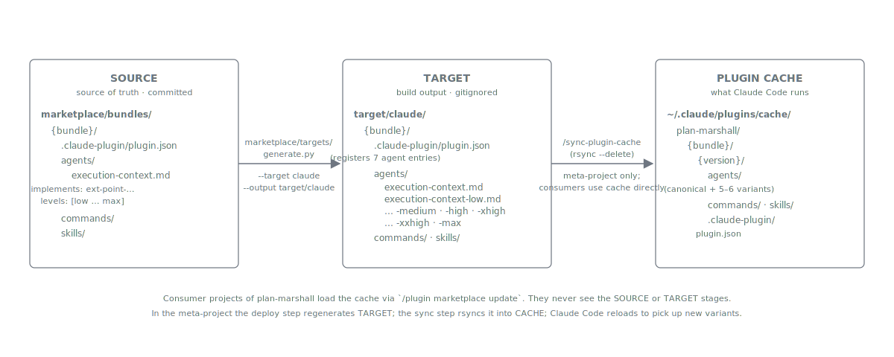

= Marketplace Build
:nofooter:
:toc: left
:toclevels: 3

xref:../../README.md[Plan Marshall] » xref:index.adoc[Developer Guide]

How the marketplace source under `marketplace/bundles/` is transformed into deployable plugin artifacts. This document is orientation — the canonical specs live next to the code they govern.

== Pipeline

The middle hop (`target/claude/`) is produced by `marketplace/targets/generate.py --target claude` or by the link:../../.claude/skills/finalize-step-deploy-target/SKILL.md[`project:finalize-step-deploy-target`] finalize step in the meta-project. The `/sync-plugin-cache` slash command rsyncs that directory into the plugin cache; consumer projects of Plan Marshall use the cache directly via `/plugin marketplace update` and never see the SOURCE or TARGET stages.

== Variant Emission

The `marketplace/targets/claude/emitter.py` reader walks each bundle. For an agent declaring `implements: plan-marshall:extension-api/standards/ext-point-dynamic-level-executor`, the emitter produces six files:

1. The **canonical** no-suffix file (e.g. `execution-context.md`) with `implements:` and `levels:` stripped. Claude Code dispatches this when the resolver returns `inherit`. The dispatched subagent inherits the parent session's model.
2. Five **variants** (`execution-context-{low|medium|high|xhigh|xxhigh}.md`), each with `model:` and `effort:` baked into the frontmatter from the level → primitive mapping in link:../../marketplace/bundles/plan-marshall/skills/plan-marshall/standards/effort-levels.md[`effort-levels.md`].

`plugin.json` registers all six entries for the canonical so Claude Code's agent registry sees every variant.

The marketplace ships exactly one role-eligible canonical agent: `plan-marshall:execution-context`. Every plan-marshall `Task:` invocation dispatches one of its six variants. The workflow body the agent runs is supplied at dispatch time via the `workflow` field in the prompt body, per link:../../marketplace/bundles/plan-marshall/skills/extension-api/standards/ext-point-execution-context-workflow.md[`ext-point-execution-context-workflow.md`].

== Adding a Workflow Doc

A new workflow doc lives under `{bundle}:{skill}/workflow/{file}.md` (single-phase consumer) or `plan-marshall/skills/plan-marshall/workflow/{file}.md` (multi-phase / cross-cutting). The doc declares `implements: plan-marshall:extension-api/standards/ext-point-execution-context-workflow` in frontmatter and provides at minimum an Inputs table, Workflow steps, and an Output contract (`status` + `display_detail`).

No new agent file is required — the new workflow is dispatched through the existing six `execution-context` variants by calling sites that pass the new workflow's `{bundle}:{skill}/workflow/{file}.md` notation in the `workflow` prompt-body field.

== Dispatch-Cost Considerations

Each `Task:` dispatch carries a fixed overhead (skill-load preamble, Worktree Header echo, return-TOON marshalling). The granularity heuristics in link:../../marketplace/bundles/plan-marshall/skills/extension-api/standards/dispatch-granularity.md[`extension-api:dispatch-granularity`] govern when a step belongs in a dispatch envelope vs. inline in the orchestrator's context:

* **Script-over-dispatch** — deterministic work (regex matches, structural checks, build invocations) lives in a script; the dispatch is reserved for LLM judgement.
* **Bundle-shared-context** — a multi-step LLM workflow runs inside ONE dispatch envelope rather than N sequential dispatches.
* **Per-iteration only when parallel-or-different-models** — spinning up N parallel dispatches is justified when each subagent runs independently. The sole such case in the marketplace is the `enrich-module` workflow dispatched under `--phase phase-6-finalize` from `architecture-refresh` Tier-1.

== Adapter System

The marketplace generator also supports non-Claude targets via adapters under `marketplace/targets/`:

[source,bash]
----
python3 marketplace/targets/generate.py --target opencode --output target/opencode
----

The OpenCode adapter produces output conforming to the OpenCode specification; only the Claude target is validated end-to-end. Adapter implementations register in `TARGET_REGISTRY` (see `marketplace/targets/generate.py`).

== Plugin cache sync (meta-project only)

When modifying plugin source files (skills, agents, commands) inside the Plan Marshall meta-project, changes do not take effect until the plugin cache is updated. After editing files in `marketplace/bundles/`, run:

[source]
----
/sync-plugin-cache
----

This synchronises all bundles from `target/claude/` to `~/.claude/plugins/cache/plan-marshall/` using rsync with `--delete` to ensure exact mirroring. The slash command and its finalize-step counterpart are project-local under `.claude/skills/` — consumer projects do not get this surface, only the meta-project.

== Registered marketplace path

The Claude Code marketplace registration MUST point at `target/claude/`, not at the source `marketplace/` directory. The source `marketplace/bundles/<bundle>/.claude-plugin/plugin.json` declares only the canonical agent files; the build target expands each role-eligible agent into per-level variants (`{name}-low.md` through `{name}-xxhigh.md`) under `target/claude/<bundle>/agents/` and emits a variant-aware `plugin.json` plus a top-level `target/claude/.claude-plugin/marketplace.json`. Registering the source path makes Claude Code's plugin loader install only the canonicals, so every dispatch site that resolves to `execution-context-{level}` fails with `Agent type not found`.

One-time migration on a developer machine:

1. Ensure `target/claude/` is current: `python3 marketplace/targets/generate.py --target claude --output target/claude`.
2. Re-point the marketplace: edit `~/.claude/plugins/known_marketplaces.json` so the `plan-marshall` entry's `source.path` and `installLocation` point at `/path/to/plan-marshall/target/claude` (NOT `.../marketplace`). Alternatively, in-app: `/plugin marketplace remove plan-marshall` then `/plugin marketplace add /path/to/plan-marshall/target/claude`.
3. Reinstall the plugins so install metadata picks up the variant-aware `plugin.json`: `claude plugin uninstall plan-marshall@plan-marshall && claude plugin install plan-marshall@plan-marshall` (repeat per bundle as needed).
4. Restart Claude Code or run `/reload-plugins`.
5. Verify the variants are registered: ask a fresh session to list `plan-marshall:` entries from its available-agents header. Expect canonical + six level variants.

== Related

* xref:../concepts/execution-context.adoc[Concepts › Execution Context] — why one dispatcher
* xref:../concepts/effort-and-models.adoc[Concepts › Effort and Models] — entry-point map for the per-role model system
* link:../../marketplace/bundles/plan-marshall/skills/extension-api/standards/ext-point-dynamic-level-executor.md[`ext-point-dynamic-level-executor.md`] — agent-emission contract
* link:../../marketplace/bundles/plan-marshall/skills/extension-api/standards/ext-point-execution-context-workflow.md[`ext-point-execution-context-workflow.md`] — workflow-doc contract
* link:../../marketplace/bundles/plan-marshall/skills/plan-marshall/standards/effort-roles.md[`effort-roles.md`] — role registry
