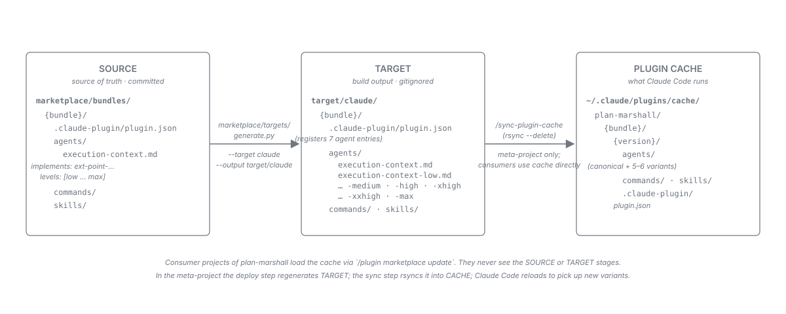

= Marketplace Build
:nofooter:
:toc: left
:toclevels: 3

xref:../../README.md[Plan Marshall] » xref:README.adoc[Developer Guide]

How the marketplace source under `marketplace/bundles/` is transformed into deployable plugin artifacts. This document is orientation — the canonical specs live next to the code they govern.

== Pipeline



The middle hop (`target/claude/`) is produced by `marketplace/targets/generate.py --target claude` or by the link:../../.claude/skills/finalize-step-deploy-target/SKILL.md[`project:finalize-step-deploy-target`] finalize step in the meta-project. The `/sync-plugin-cache` slash command rsyncs that directory into the plugin cache; consumer projects of Plan Marshall use the cache directly via `/plugin marketplace update` and never see the SOURCE or TARGET stages.

== Variant Emission

The Claude-target reader under `marketplace/targets/claude/` walks each bundle. The dispatcher entry point is `emitter.py`; the variant-emission logic (`LEVEL_TABLE`, `emit_variants_for_agent`, the role-eligibility check) lives in the sibling `variant_emitter.py`. For an agent declaring `implements: plan-marshall:extension-api/standards/ext-point-dynamic-level-executor`, the emitter produces up to eight files:

1. The **canonical** no-suffix file (e.g. `execution-context.md`) with `implements:` and `levels:` stripped. Claude Code dispatches this when the resolver returns `inherit`. The dispatched subagent inherits the parent session's model.
2. Seven **level-suffixed variants** (`execution-context-{level-1|level-2|level-3|level-4|level-5|level-6|level-7}.md`), each with `model:` and `effort:` baked into the frontmatter from the level → primitive mapping in link:../../marketplace/bundles/plan-marshall/skills/plan-marshall/standards/effort-levels.md[`effort-levels.md`]. The `-level-6` and `-level-7` variants are alias-capability-gated — the build emitter's guard skips a variant when the resolved alias does not accept the level's effort (`xhigh` / `max`), leaving fewer files in that case.

`plugin.json` registers every emitted entry so Claude Code's agent registry sees the canonical and each level variant.

The marketplace ships two role-eligible canonical agents: `plan-marshall:execution-context` and `plan-marshall:execution-context-reader`. Every plan-marshall `Task:` invocation dispatches a canonical or one of its level variants. The workflow body the agent runs is supplied at dispatch time via the `workflow` field in the prompt body, per link:../../marketplace/bundles/plan-marshall/skills/extension-api/standards/ext-point-execution-context-workflow.md[`ext-point-execution-context-workflow.md`].

== Adding a Workflow Doc

A new workflow doc lives under `{bundle}:{skill}/workflow/{file}.md` (single-phase consumer) or `plan-marshall/skills/plan-marshall/workflow/{file}.md` (multi-phase / cross-cutting). The doc declares `implements: plan-marshall:extension-api/standards/ext-point-execution-context-workflow` in frontmatter and provides at minimum an Inputs table, Workflow steps, and an Output contract (`status` + `display_detail`).

No new agent file is required — the new workflow is dispatched through the existing seven `execution-context` variants by calling sites that pass the new workflow's `{bundle}:{skill}/workflow/{file}.md` notation in the `workflow` prompt-body field.

== Dispatch-Cost Considerations

Each `Task:` dispatch carries a fixed overhead (skill-load preamble, Worktree Header echo, return-TOON marshalling). The granularity heuristics in link:../../marketplace/bundles/plan-marshall/skills/extension-api/standards/dispatch-granularity.md[`extension-api:dispatch-granularity`] govern when a step belongs in a dispatch envelope vs. inline in the orchestrator's context:

* **Script-over-dispatch** — deterministic work (regex matches, structural checks, build invocations) lives in a script; the dispatch is reserved for LLM judgement.
* **Bundle-shared-context** — a multi-step LLM workflow runs inside ONE dispatch envelope rather than N sequential dispatches.
* **Per-iteration only when parallel-or-different-models** — spinning up N parallel dispatches is justified when each subagent runs independently. The sole such case in the marketplace is the `enrich-module` workflow dispatched under `--phase phase-6-finalize` from `architecture-refresh` Tier-1.

== Adapter System

The marketplace generator also supports non-Claude targets via adapters under `marketplace/targets/`:

[source,bash]
----
uv run python marketplace/targets/generate.py --target opencode --output target/opencode
----

The OpenCode adapter produces output conforming to the OpenCode specification; only the Claude target is validated end-to-end. Adapter implementations register in `TARGET_REGISTRY` (see `marketplace/targets/generate.py`).

=== The `pr-agent` target — a published reviewer artifact set

Not every target emits an assistant bundle tree. The `pr-agent` target emits a reviewer artifact set: one Markdown artifact per derived review domain under `{output}/packs/`, plus `spine.md` carrying the cross-cutting review charter. The set is published to `cuioss/pr-agent-settings`, where the org's PR-Agent reviewer reads it.

[source,bash]
----
uv run python marketplace/targets/generate.py --target pr-agent --output target/pr-agent
----

Three consequences follow from that difference, and all are load-bearing.

**Its output is a build artifact, like every other target's.** `target/pr-agent/packs/` is gitignored exactly as `target/claude/` and `target/opencode/` are; this repository tracks no generated reviewer configuration. That is the fuller alignment with link:../adr/006-Generated-tree_drift_is_gated_at_the_consume_boundary_not_in_CI.adoc[ADR-006]: nothing generated is committed, so generated-tree currency is uniformly a consume-boundary concern rather than a mixture of committed and derived state. `.github/workflows/pr-agent-packs-publish.yml` regenerates the set on merge to `main` and opens the publish pull request.

**The artifact set is orthogonal, and a repository composes by selecting.** A domain artifact carries that domain's part alone, and the charter appears exactly once — in `spine.md`. A repository that is several languages at once names several published artifacts instead of carrying one file that folds them together, so a rule change is published once rather than regenerated into every consumer. The run takes no selection argument: it emits the whole derived set, and the generated header names the argument-free command that reproduces it.

**The generic bundle-tree post-emit steps are gated off for it.** The CLI stamps the deterministic version into every bundle `plugin.json` and emits a `dist-manifest.json` at each output root. Both are bundle-tree semantics and would be wrong artifacts in a reviewer-artifact directory, so `TargetBase` declares an `emits_bundle_tree` property (default `true`) that this target overrides to `false`. The gate is not optional: `--target all` reaches that path for every registered target.

The emission rules — the derived domain set, the spine that carries the charter once, the two-part category budget, and the verbatim substantiation and anti-fabrication clauses — are documented in link:../../marketplace/targets/README.md[`marketplace/targets/README.md`] § PR-Agent target.

A repo-root reviewer descriptor is recognized by the change-footprint classifier as owner-less infrastructure config, so it classifies `config` rather than `unknown`; see link:../../marketplace/bundles/plan-marshall/skills/manage-execution-manifest/standards/decision-rules.md[`decision-rules.md`] § "Owner-less recognition (no build owner)". That classification governs the basename family and is unchanged by this repository carrying no such file of its own.

== Deterministic Versioning and Staleness Signaling

The generator derives a deterministic, monotonic version from source alone and emits it — together with content fingerprints — into a per-target `dist-manifest.json`. The installed executor and `marshal.json` embed the version and fingerprints they were provisioned at, so a later session can detect when its derived state has fallen behind the published marketplace.

=== The `0.1.N` version scheme

The single base version `0.1` lives only in `marketplace/.claude-plugin/marketplace.json` (`metadata.version`). link:../../marketplace/targets/generate.py[`generate.py`] computes the full version as `{base}.{N}`, where `N` is the first-parent commit count (`git rev-list --count --first-parent HEAD`). The result is deterministic — the same commit yields the same version in CI and locally — and monotonic, since `N` only grows along first-parent history.

Version comparison is a full int-tuple compare with no zero-padding, so `0.1.9` sorts below `0.1.10` and a future `0.2` base bump orders correctly above every `0.1.N`. An empty or `unknown` sentinel parses to the empty tuple — the lowest possible version — so a fresh or unstamped surface is never treated as newer than a real published version.

The source bundle `plugin.json` files keep the static base version; only the generated target tree carries the live per-landing `0.1.N`, which the generator stamps into every target-tree bundle `plugin.json`. An explicit `--version` flag overrides the computed value verbatim — CI uses it to stamp an identical version across both target legs.

=== The `dist-manifest.json` fields

The generator emits one `dist-manifest.json` at each target output root, carrying six fields:

[cols="1,3"]
|===
| Field | Meaning

| `version`
| The deterministic `0.1.N` version this tree was generated at.

| `source_sha`
| The source commit sha (`git rev-parse HEAD`) the tree was generated from.

| `executor_scripts_fingerprint`
| Machine-portable fingerprint of the executor's script set — relativized notation-to-path mappings, insensitive to script-body edits, so it moves only when a script is added, removed, moved, or renamed.

| `executor_changed_at_version`
| The version at which `executor_scripts_fingerprint` last changed.

| `config_seed_fingerprint`
| Canonical-JSON hash of the default config seed (`get_default_config()`).

| `config_changed_at_version`
| The version at which `config_seed_fingerprint` last changed.
|===

The two `changed_at` fields are the staleness signal: a consumer whose embedded version is older than a `changed_at` value knows the corresponding derived state is stale.

=== CI-side `changed_at` derivation

The `changed_at` values are derived entirely CI-side by the link:../../.github/workflows/claude-distribute.yml[`claude-distribute.yml`] distribute workflow — there is no finalize step and no commit back to `main`. On each publish the workflow fetches the previous `dist-manifest.json` from the current dist-branch tip and passes it to the generator via `--previous-manifest`. The generator diffs each fingerprint against that previous manifest:

* an unchanged fingerprint carries the previous `changed_at` forward;
* a changed fingerprint advances `changed_at` to the current version;
* a first publish (no previous manifest) bootstraps every `changed_at` to the current version.

The workflow checks out full history (`fetch-depth: 0`, needed for the first-parent count) and serializes its runs per target via a `concurrency` group, so concurrent pushes never race on the orphan-branch publish or the previous-manifest fetch.

=== Executor and config staleness signaling

The installed executor embeds `MARSHALL_VERSION`, and `marshal.json` stamps `system.provisioned_version` / `system.config_seed_fingerprint` at init (refreshed by `manage-config sync-defaults`). The deterministic `generate_executor preflight` verb (see link:../../marketplace/bundles/plan-marshall/skills/tools-script-executor/SKILL.md[`tools-script-executor` SKILL.md] § Canonical invocations) compares these embedded values against the installed `dist-manifest.json` under two asymmetric ownership rules:

* **The executor is safe derived state** (ADR-002, the move-based cwd-pinned model). When its embedded version is older than `executor_changed_at_version`, the verb regenerates it in place and reports `executor_action: regenerated`; otherwise `executor_action: fresh`.
* **`marshal.json` holds user decisions and is never auto-mutated.** When `system.provisioned_version` is older than `config_changed_at_version`, the verb reports `marshal_status: stale` advisory-only, routing the user to `/marshall-steward` for a config reconcile rather than rewriting their config.

A fresh install with no manifest resolves both `changed_at` values to the empty sentinel, so nothing is stale and the verb is a no-op reporting `fresh`. The verb is surfaced at two sites: the `/plan-marshall` cross-session re-entry preflight and the `/marshall-steward` health menu (via link:../../marketplace/bundles/plan-marshall/skills/marshall-steward/SKILL.md[`marshall-steward` SKILL.md] `determine_mode check-staleness`).

== Open-Standard Alignment

Plan Marshall's component format predates and overlaps with the `SKILL.md` open standard published at https://agentskills.io[agentskills.io]. This section is an informative gap analysis — it records where the two agree, where Plan Marshall extends the spec, and how the adapter system above relates to the standard. It makes no behavioural claims and adds no build steps.

=== Where the formats conform

The open standard defines a skill as a directory containing a `SKILL.md` file whose YAML frontmatter carries a `name` and a `description`. Every Plan Marshall skill satisfies this base shape: each lives at `marketplace/bundles/<bundle>/skills/<skill>/SKILL.md` and declares `name` plus `description` in the form the spec expects (see link:../../marketplace/bundles/pm-plugin-development/skills/plugin-architecture/references/frontmatter-standards.md[`frontmatter-standards.md`] § Skill Frontmatter). A reader that understands only the open standard can therefore discover and name every Plan Marshall skill from its frontmatter alone.

=== Where Plan Marshall extends the spec

Plan Marshall adds frontmatter fields the open standard does not define. These are additive — a spec-only reader ignores them, and they never change the meaning of `name` or `description`:

* `user-invocable` (required) — whether the skill appears in the slash menu or is loaded only internally.
* `mode` (required) — the execution archetype (`knowledge` / `workflow` / `script-executor` / `manifest`) that tells an agent how to consume the skill.
* `implements` (optional) — declares that the skill satisfies a Plan Marshall extension-point contract.
* `targets` (optional) — the build targets the component ships to; absent means every target that emits a component tree. Consumed by the adapter system below, which omits the component from any target the list does not name.

The further optional fields are listed in xref:../../marketplace/bundles/pm-plugin-development/skills/plugin-architecture/references/frontmatter-standards.md[`frontmatter-standards.md`] § Optional Fields rather than restated here, and that list is not an exhaustive register — a field may instead be declared by the extension-point contract that owns it. None of these fields is part of the agentskills.io spec; they are Plan Marshall's own workflow metadata.

=== How the adapter system relates to the standard

The `marketplace/targets/` adapter system (see _Adapter System_ above) is Plan Marshall's own multi-assistant export mechanism — it transforms the source bundles into per-target output such as `target/claude/` and `target/opencode/`. It is **not** an agentskills.io conformance layer: it neither validates against the published spec nor emits a spec-conformant package. The adapter predates the standard and serves a different purpose (cross-assistant portability of Plan Marshall's own format), so the two are independent. A future agentskills.io target, if one were added, would register in `TARGET_REGISTRY` like any other adapter.

== Plugin cache sync (meta-project only)

When modifying plugin source files (skills, agents, commands) inside the Plan Marshall meta-project, changes do not take effect until the plugin cache is updated. After editing files in `marketplace/bundles/`, run:

[source]
----
/sync-plugin-cache
----

This synchronises all bundles from `target/claude/` to `~/.claude/plugins/cache/plan-marshall/` using rsync with `--delete` to ensure exact mirroring. The slash command and its finalize-step counterpart are project-local under `.claude/skills/` — consumer projects do not get this surface, only the meta-project.

=== Derived-state finalize steps run under every execution profile

For plan-marshall itself, the cache-deploy steps — `project:finalize-step-deploy-target`, `/sync-plugin-cache`, and the on-main executor regeneration — are correctness-required derived state, not optional ceremony. They carry `lane.class: derived-state` and run under *every* execution-profile posture by default (including `minimal`), so a lean posture cannot silently ship a stale cache. An operator may still override one to `off`, but that emits a loud correctness warning ("dropping sync-cache ships a broken cache") rather than a silent drop.

This is meta-project-only: a consumer project has no derived-state finalize steps, so its `minimal` floor carries none. For the execution-profile lane mechanism the postures act on, see xref:../user/configuration.adoc#execution-profile-lane-selection[User Guide → Configuration → Execution-profile lane selection].

== OpenCode inner loop (meta-project only)

The Claude inner loop is one command: edit `marketplace/bundles/`, run
`/sync-plugin-cache`, done. The OpenCode inner loop is the same shape,
via the project-local `/sync-opencode` skill:

```bash
uv run python marketplace/targets/generate.py --target opencode --output target/opencode
/sync-opencode
```

The middle hop (`target/opencode/`) is produced by the OpenCode generator
(see _Adapter System_ above — the emitter and its singular
`skill/`/`agent`/`command/` layout are documented next to the code under
`marketplace/targets/opencode/`, and are not restated here). `/sync-opencode`
deploys that tree into an OpenCode config directory with the singular→plural
directory rename OpenCode expects, removes stale **managed** entries (those in
the `{bundle}-{skill}` namespace of the bundles being synced) while never
touching unmanaged user entries or agents, and reports its actions as a TOON
document. It is the exact counterpart of `/sync-plugin-cache` for the OpenCode
target, and like that skill it is project-local — consumer projects never
generate OpenCode output. See `.claude/skills/sync-opencode/SKILL.md` for the
source-of-truth statement and parameters table.

The reopen-closed loop is then the same as Claude's: edit source, regenerate,
`/sync-opencode`, verify against a temp target (`--target-dir`) to avoid
perturbing a live config dir.

=== Deploy options and precedence

The destination of a sync is one of three:

*(a) Sync into the global config dir (daily work).* The default
`~/.config/opencode/` is where OpenCode reads user-level configuration, and
`/sync-opencode` writes there by default. Suitable for day-to-day iteration.

*(b) Point `OPENCODE_CONFIG_DIR` at a plural-renamed staging copy.* `sync-opencode`
accepts `--target-dir`, so a staging copy can be produced and validated before
the global dir is touched. Two properties of this path must be stated:

- A **committed project-local `.opencode/` shadows the env-var directory.** When
  a project root carries its own `.opencode/`, OpenCode resolves that over
  `OPENCODE_CONFIG_DIR`, so the env var only takes effect for a target directory
  outside such a project — or a project with no `.opencode/`.
- The env var **cannot** point at the singular `target/opencode/` directly. The
  generated tree is singular-layout (`skill/`/`agent`/`command/`), and the
  singular→plural rename is exactly what `/sync-opencode` performs. Pointing the
  var at `target/opencode/` yields a directory OpenCode does not discover
  components from.

*(c) A marketplace-install path.* Installing the distributed OpenCode bundle
from a distribution ref exercises the distribution path, not the inner loop. It
is **validation-gated**: the OpenCode consumption path against the distribution
refs is unverified on a live client (see `distribution.adoc`).

Options (a) and (b) are each exercised without a live OpenCode session:
generate, sync into a temp `--target-dir`, and diff the resulting plural tree
against expectations. Option (c) is different — it installs from a distribution
ref, which only a live client can exercise — so it stays explicitly pending
live-client validation.

== Registered marketplace path

The Claude Code marketplace registration MUST point at `target/claude/`, not at the source `marketplace/` directory. The source `marketplace/bundles/<bundle>/.claude-plugin/plugin.json` declares only the canonical agent files; the build target expands each role-eligible agent into per-level variants (`{name}-level-1.md` through `{name}-level-7.md` — seven suffix variants, with `-level-6` and `-level-7` alias-capability-gated) under `target/claude/<bundle>/agents/` and emits a variant-aware `plugin.json` plus a top-level `target/claude/.claude-plugin/marketplace.json`. Registering the source path makes Claude Code's plugin loader install only the canonicals, so every dispatch site that resolves to `execution-context-{level}` fails with `Agent type not found`.

One-time migration on a developer machine:

1. Ensure `target/claude/` is current: `uv run python marketplace/targets/generate.py --target claude --output target/claude`.
2. Re-point the marketplace: edit `~/.claude/plugins/known_marketplaces.json` so the `plan-marshall` entry's `source.path` and `installLocation` point at `/path/to/plan-marshall/target/claude` (NOT `.../marketplace`). Alternatively, in-app: `/plugin marketplace remove plan-marshall` then `/plugin marketplace add /path/to/plan-marshall/target/claude`.
3. Reinstall the plugins so install metadata picks up the variant-aware `plugin.json`: `claude plugin uninstall plan-marshall@plan-marshall && claude plugin install plan-marshall@plan-marshall` (repeat per bundle as needed).
4. Restart Claude Code or run `/reload-plugins`.
5. Verify the variants are registered: ask a fresh session to list `plan-marshall:` entries from its available-agents header. Expect canonical + seven level variants.

== Related

* xref:../concepts/execution-context.adoc[Concepts › Execution Context] — why one dispatcher
* xref:../concepts/execution-context.adoc#per-role-model-selection[Concepts › Execution Context › Per-Role Model Selection] — entry-point map for the per-role model system
* link:../../marketplace/bundles/plan-marshall/skills/extension-api/standards/ext-point-dynamic-level-executor.md[`ext-point-dynamic-level-executor.md`] — agent-emission contract
* link:../../marketplace/bundles/plan-marshall/skills/extension-api/standards/ext-point-execution-context-workflow.md[`ext-point-execution-context-workflow.md`] — workflow-doc contract
* link:../../marketplace/bundles/plan-marshall/skills/plan-marshall/standards/effort-roles.md[`effort-roles.md`] — role registry
