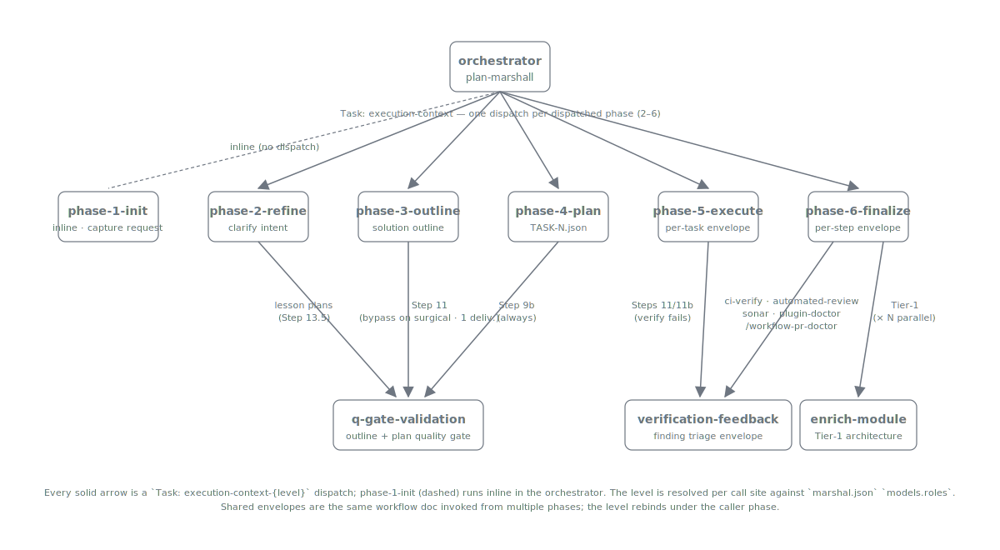

# Call Graph — Every Dispatch Path Starting from `plan-marshall`

Holistic view of every dispatch path in the plan-marshall bundle: orchestrator entry, per-phase dispatches under the 6 phase-scoped role groups, plus the inline-script steps that earn no envelope. Companions:

- **`agents.md`** — the dispatch contract (prompt-body fields, `Task: execution-context` shape, mandatory rules).
- **`dispatch-walkthrough.md`** — three concrete end-to-end traces for representative dispatches.
- **`../../extension-api/standards/dispatch-granularity.md`** — the heuristics that decide which call sites get a dispatch envelope vs. an inline script.
- **`../../plan-marshall/standards/effort-roles.md`** — the 6-group phase-scoped role registry (per-call-site level resolution).

This doc is the **graph** view; the others are the **contract**, **examples**, and **heuristics** views of the same surface.



> **Note on the dispatch target name.** Every dispatch in the graphs below is written as `execution-context` for clarity. The actual `Task:` target on the wire is `execution-context-{level}` where `{level}` ∈ `{low, medium, high, xhigh, xxhigh, max, inherit}` is resolved at dispatch time via `manage-config effort resolve-target --phase <caller-phase> [--role <subkey>]`. The level is a runtime detail (chosen by the role-key registry), not a structural one — so the graphs hide it.

Legend (used in every diagram below):

```
┌──────┐
│ BOX  │  LLM dispatch envelope (Task: execution-context)
└──────┘

  /SCR/    Deterministic script (no envelope)
  ?USR?    AskUserQuestion gate (propagates to host UI)
[VFB]     verification-feedback envelope (producer-mode bundling;
          fires from phase-5-execute build-runner and phase-6-finalize sonar / pr-comment /
          plugin-doctor / pr-state)

  ──►      In-context flow (within an envelope / orchestrator context)
  ══►      Task dispatch — crosses a subagent envelope boundary
  ┄┄►      Conditional in-context flow (predicate-gated, no envelope)
  ╵┄═►     Conditional dispatch (predicate-gated, crosses an envelope)
```

---

## 1. Top-level entry

```
┌───────────────────────────────────────────────────────────────────────────────┐
│                                                                               │
│                       TOP-LEVEL DISPATCH ENTRY                                │
│                                                                               │
│   USER                                                                        │
│    │                                                                          │
│    │  /plan-marshall action=create task=...                                   │
│    ▼                                                                          │
│   /plan-marshall slash command/                                               │
│    │                                                                          │
│    │  Skill: plan-marshall:plan-marshall                                      │
│    ▼                                                                          │
│   ┌─────────────────────────────────────────────────────────────────────┐    │
│   │  plan-marshall skill   (orchestrator, main context)                 │    │
│   │  ═══════════════════                                                │    │
│   │                                                                     │    │
│   │  • Reads manage-status / manage-architecture state                  │    │
│   │  • Resolves the target via                                          │    │
│   │      manage-config effort resolve-target --role <role-key>          │    │
│   │  • Dispatches each phase as:                                        │    │
│   │      Task: plan-marshall:execution-context                          │    │
│   │      prompt body = name + plan_id + skills[] + workflow + WORKTREE  │    │
│   │  • Marks step done via                                              │    │
│   │      manage-status mark-step-done                                   │    │
│   │  • Drives the phase loop via                                        │    │
│   │      manage-status transition                                       │    │
│   └─────────────────────────────────────────────────────────────────────┘    │
│    │                                                                          │
│    ╞══► execution-context   role=phase-1-init   workflow=phase-1-init/SKILL.md     │
│    ╞══► execution-context   role=phase-2-refine   workflow=phase-2-refine/SKILL.md   │
│    ╞══► execution-context   role=phase-3-outline   workflow=phase-3-outline/SKILL.md  │
│    ╞══► execution-context   role=phase-4-plan   workflow=phase-4-plan/SKILL.md     │
│    ╞══► execution-context   role=phase-5-execute   workflow=execute-task/SKILL.md     │
│    │                                 (one dispatch per task in the queue)     │
│    ╘══► execution-context   role=phase-6-finalize.{step}                               │
│                              workflow=phase-6-finalize/workflow/{step}.md     │
│                              (one dispatch per dispatched manifest step)      │
│                                                                               │
└───────────────────────────────────────────────────────────────────────────────┘
```

The orchestrator never spawns a raw `Task: general-purpose`. Every subagent dispatch targets `plan-marshall:execution-context` (with the level variant resolved from the role key). The workflow doc + skill loads flow through the prompt body — see `agents.md` for the full contract.

---

## 2. Per-phase detail

Each phase envelope runs the workflow doc inside the subagent context, calling inline scripts and sometimes sub-dispatching cross-phase cores.

### 2.1 phase-1-init

```
┌───────────────────────────────────────────────────────────────────────────────┐
│  PHASE-1 ENVELOPE          execution-context    role=phase-1-init                  │
│  ════════════════                                                             │
│                                                                               │
│  Inside the dispatch:                                                         │
│                                                                               │
│    /manage-architecture snapshot/        (script)                             │
│    /manage-references init/              (script)                             │
│    /manage-lessons lesson-auto-suggest/  (script)                             │
│      │                                                                        │
│      │  ambiguous (no recipe match)                                           │
│      ╵┄═►  execution-context  (LLM fallback — uses effort,            │
│                                no role key)                                   │
│                                                                               │
│    /manage-config domain-detect/         (script)                             │
│      │                                                                        │
│      │  ambiguous (multi-domain or zero match)                                │
│      ╵┄┄►  ?AskUserQuestion?            (human-input territory)               │
│                                                                               │
│    LLM judgement inside the envelope: pre-flight reference verification       │
│    (Step 4b — bundles into this envelope, shares manage-architecture          │
│     / manage-references context with the rest of the phase)                   │
│                                                                               │
└───────────────────────────────────────────────────────────────────────────────┘
```

### 2.2 phase-2-refine

```
┌───────────────────────────────────────────────────────────────────────────────┐
│  PHASE-2 ENVELOPE          execution-context    role=phase-2-refine                  │
│  ════════════════                                                             │
│                                                                               │
│  Inside the dispatch (the confidence loop iterates HERE — never N envelopes): │
│                                                                               │
│    /workflow-integration-git baseline-reconcile/    (script — Step 3d)        │
│      │  emits findings → bundled-in LLM classification                        │
│      ▼                                                                        │
│    LLM judgement loop        Steps 3b/3c/8/9/10/11/12                         │
│    ─────────────────                                                          │
│    • Step 3b/3c: source / proposed-fix verification                           │
│    • Step  8:    analyze request quality                                      │
│    • Step  9:    analyze in architecture context                              │
│    • Step 10:    /manage-status aggregate-confidence/  (script — pure math)   │
│    • Step 11:    ?AskUserQuestion? (clarify with user)                        │
│    • Step 12:    refine request → loop back to 8 until confidence ≥ threshold │
│                                                                               │
│  After the envelope returns:                                                  │
│                                                                               │
│    Step 13.5 (lesson-derived plans only)                                      │
│      ╵┄═►  [q-gate-validation]   (separate envelope, shared core)       │
│                                                                               │
└───────────────────────────────────────────────────────────────────────────────┘
```

### 2.3 phase-3-outline

```
┌───────────────────────────────────────────────────────────────────────────────┐
│  PHASE-3 ENTRY + ENVELOPE                                                     │
│  ═════════════════════════                                                    │
│                                                                               │
│  Before the dispatch (orchestrator-side, Step 4):                             │
│                                                                               │
│    /manage-status change-type-heuristic/   (script — keyword classifier)      │
│      │                                                                        │
│      │  ambiguous                                                             │
│      ╵┄═►  execution-context   (LLM fallback — uses effort,           │
│                                 no role key)                                  │
│      │                                                                        │
│      ▼                                                                        │
│                                                                               │
│  PHASE-3 ENVELOPE           execution-context    role=phase-3-outline                 │
│    track={simple OR complex} runtime input — same envelope, same role         │
│                                                                               │
│    Simple Track (Steps 6-8)                                                   │
│      • /target validation: ls -la per affected file/   (script)               │
│      • LLM: create deliverables                                               │
│      • LLM: Simple Q-Gate                                                     │
│                                                                               │
│    Complex Track (Steps 9-11)                                                 │
│      • /domain-resolve, /architecture which-module/   (scripts)               │
│      • LLM: Steps 9c + 10 + 10b iterate per-deliverable IN-CONTEXT            │
│        (per-deliverable loop never spawns per-iteration subagents)            │
│                                                                               │
│  After the envelope returns:                                                  │
│                                                                               │
│    Step 11 ╵┄═►  [q-gate-validation]                                    │
│             (bypassed — no dispatch — when scope_estimate=surgical AND        │
│              change_type ∈ {bug_fix, tech_debt, verification} AND             │
│              deliverable_count=1; see phase-3-outline/SKILL.md Step 11)       │
│                                                                               │
└───────────────────────────────────────────────────────────────────────────────┘
```

### 2.4 phase-4-plan

```
┌───────────────────────────────────────────────────────────────────────────────┐
│  PHASE-4 ENVELOPE          execution-context    role=phase-4-plan                  │
│  ════════════════                                                             │
│                                                                               │
│  Orchestrator-side prep:                                                      │
│    /manage-solution-outline load-deliverables/   (script — Step 3)            │
│    /manage-tasks dependency-graph/               (script — Step 4)            │
│                                                                               │
│  Inside the dispatch (Steps 5+6+7 — task-creation loop iterates HERE):        │
│                                                                               │
│    LLM judgement loop, per deliverable                                        │
│    ─────────────────────────────────                                          │
│    • Step 5: create tasks from profiles (1:N, optional-skill LLM matching)    │
│    • Step 6: anchoring, breaking-refactor split, self-modifying check         │
│                ?AskUserQuestion? when split decision is ambiguous             │
│    • Step 7: holistic verification tasks                                      │
│                                                                               │
│  Orchestrator-side post:                                                      │
│    /manage-tasks topological-sort/               (script — Step 8)            │
│    /manage-execution-manifest compose/           (script — Step 8b)           │
│    /manage-tasks qgate-mechanical-checks/        (script — Step 9)            │
│      coverage / skill-resolution / acyclic / files-exist /                    │
│      keyword-drift / structural-token-drift                                   │
│                                                                               │
│    ══►  [q-gate-validation]   (Step 9b — unconditional;                 │
│         module-mapping + scope-criterion validators against live ground truth)│
│                                                                               │
└───────────────────────────────────────────────────────────────────────────────┘
```

### 2.5 phase-5-execute

```
┌───────────────────────────────────────────────────────────────────────────────┐
│  PHASE-5-EXECUTE ORCHESTRATOR    (main context)                               │
│  ════════════════════════════                                                 │
│                                                                               │
│   /manage-tasks task-queue/   (script)                                        │
│      │                                                                        │
│      │ for each task in dependency order                                      │
│      ▼                                                                        │
│   ┌─────────────────────────────────────────────────────────────────────┐    │
│   │  PHASE-5 ENVELOPE        execution-context    role=phase-5-execute          │    │
│   │  ════════════════                                                   │    │
│   │                                                                     │    │
│   │    workflow=execute-task/SKILL.md                                   │    │
│   │    skills[] = task-declared list from TASK-N.json                   │    │
│   │                                                                     │    │
│   │    Steps: execute → verify (LLM + scripts inside)                   │    │
│   │    Returns verification.passed: true|false                          │    │
│   └─────────────────────────────────────────────────────────────────────┘    │
│      ▲                                                                        │
│      ║ (one Task dispatch per queue item)                                     │
│      ║                                                                        │
│      │                                                                        │
│      ├── verification.passed: true                                            │
│      │     │                                                                  │
│      │     ▼                                                                  │
│      │   /Step 9 independent change verification/    (3 deterministic         │
│      │     • git-diff empty-test                      re-checks; NO LLM)      │
│      │     • obfuscation-pattern grep                                         │
│      │     • exit-code compare                                                │
│      │     │                                                                  │
│      │     ▼                                                                  │
│      │   /Built-in verification:                                              │
│      │     quality_check / build_verify / coverage_check/   (scripts)         │
│      │                                                                        │
│      └── verification.passed: false                                          │
│            │  leaf returns triage_required (Steps 11 / 11b persist           │
│            │  findings via manage-findings qgate add, then return);          │
│            │  ORCHESTRATOR owns the dispatch below                           │
│            │  finding_type = verification-failure OR quality-gate-failure     │
│            ╵┄═►  [verification-feedback]   (dispatched by the orchestrator             │
│                    │                        after the leaf returns)          │
│                    │ fix_tasks_created                                        │
│                    └──► back to task queue                                    │
│                                                                               │
└───────────────────────────────────────────────────────────────────────────────┘
```

### 2.6 phase-6-finalize

```
┌───────────────────────────────────────────────────────────────────────────────┐
│  PHASE-6-FINALIZE  ORCHESTRATOR    (main context)                             │
│  ══════════════════════════════                                               │
│                                                                               │
│   /manage-execution-manifest read-steps/   (script)                           │
│      │                                                                        │
│      │ per-step dispatch loop                                                 │
│      ▼                                                                        │
│   ┌────────────────────────────────────────────────────────────────────┐     │
│   │                                                                    │     │
│   │  DEFAULT BUILT-IN STEPS — manifest order:                          │     │
│   │                                                                    │     │
│   │   /commit-push/                  (inline — trivial)                │     │
│   │   /pre-push-quality-gate/        (inline — build invocation)       │     │
│   │   (CI completion resolved as dispatcher-side precondition before  │     │
│   │    each consumer step that declares requires: [ci-complete] —     │     │
│   │    not a sibling step in this list)                                │     │
│   │                                                                    │     │
│   │    automated-review   ┐                                            │     │
│   │     /ci pr wait-for-comments/                                      │     │
│   │     /github_pr comments-stage/                                     │     │
│   │     /manage-findings list/  (count check)                          │     │
│   │       │ pending > 0                                                │     │
│   │       ╵┄═►  [verification-feedback]   finding_type=pr-comment               │     │
│   │                                                                    │     │
│   │    sonar-roundtrip    ┐                                            │     │
│   │     /sonar fetch-and-store/                                        │     │
│   │     /manage-findings list/  (count check)                          │     │
│   │       │ pending > 0                                                │     │
│   │       ╵┄═►  [verification-feedback]   finding_type=sonar-issue              │     │
│   │                                                                    │     │
│   │    architecture-refresh   ┐                                        │     │
│   │     /Tier 0 inline:   discover affected modules/                   │     │
│   │       │ per affected module (parallel fan-out)                     │     │
│   │       ╞══►  [enrich-module] × N          │     │
│   │                                                                    │     │
│   │    ┌──────────────────────────────────────────────────────────┐    │     │
│   │    │  ══►  execution-context  --phase phase-6-finalize (no --role)          │    │     │
│   │    │  ══►  execution-context  --phase phase-6-finalize --role post-run-review    │    │     │
│   │    └──────────────────────────────────────────────────────────┘    │     │
│   │       (dedicated dispatches — LLM cores for body composition       │     │
│   │        and lesson extraction)                                      │     │
│   │                                                                    │     │
│   │   /branch-cleanup/               (inline — git ops + AUQ)          │     │
│   │   /record-metrics/               (inline — script)                 │     │
│   │   /archive-plan/                 (inline — script; MUST be last)   │     │
│   │   /finalize-step-print-phase-breakdown/   (inline — renderer)      │     │
│   │                                                                    │     │
│   │  PROJECT STEPS (meta-project only):                                │     │
│   │   /project:finalize-step-deploy-target/        (inline)            │     │
│   │   /project:finalize-step-sync-plugin-cache/    (inline)            │     │
│   │   /project:finalize-step-regenerate-executor/  (inline)            │     │
│   │    project:finalize-step-plugin-doctor                             │     │
│   │       ╵┄═►  [verification-feedback (producer=plugin-doctor)]                                  │     │
│   │    project:finalize-step-pre-submission-self-review                │     │
│   │       ══►  execution-context  role=phase-6-finalize.pre-submission-         │     │
│   │            self-review                                             │     │
│   │                                                                    │     │
│   │  OPT-IN STEPS (not in default 17-step set):                        │     │
│   │    ══►  execution-context  --phase phase-6-finalize --role post-run-review              │     │
│   │            (8 LLM aspects iterate IN-CONTEXT)                      │     │
│   │    ══►  execution-context  --phase phase-6-finalize --role verification-feedback (producer=pr-state)                  │     │
│   │            (diagnose + report + internal loop;                     │     │
│   │             overflow returns to the orchestrator, which            │     │
│   │             re-fires on the next entry — no in-envelope            │     │
│   │             sub-dispatch)                                          │     │
│   │                                                                    │     │
│   └────────────────────────────────────────────────────────────────────┘     │
│                                                                               │
└───────────────────────────────────────────────────────────────────────────────┘
```

---

## 3. Phase-scoped sub-keys — workflows that fire from multiple phases

The phase-scoped resolver bubbles every dispatch up from the caller phase's sub-key (or default) to `effort`. Workflows that fire from multiple phases sit as **sub-keys under every phase that invokes them** — the same workflow doc runs, the level just resolves under whichever phase fires the dispatch. Every arrow below is a `Task: execution-context` dispatch crossing an envelope boundary.

```
┌───────────────────────────────────────────────────────────────────────────────┐
│  PHASE-SCOPED INVOCATION MAP                                                  │
│  ══════════════════════════════                                               │
│                                                                               │
│   phase-5-execute leaf returns triage_required           ═╗                          │
│   (Step 11 verification-failure / Step 11b              ═╣                          │
│    quality-gate-failure); orchestrator dispatches      ═╝══►  [verification-       │
│                                                          feedback]            │
│                                                          (orchestrator owns the│
│                                                          dispatch after the    │
│                                                          leaf returns; phase-  │
│                                                          5-execute; producer=  │
│                                                          build-runner)        │
│                                                                               │
│   phase-6-finalize automated-review                        ═╗                          │
│   phase-6-finalize sonar-roundtrip                         ═╣                          │
│   phase-6-finalize project:finalize-step-plugin-doctor     ═╬══►  [verification-       │
│   /workflow-pr-doctor slash command               ═╝     feedback]            │
│                                                          (phase-6-finalize; producer=  │
│                                                          pr-comment / sonar / │
│                                                          plugin-doctor /      │
│                                                          pr-state)            │
│                                                                               │
│   phase-2-refine Step 13.5 (lesson plans only)           ═╗                          │
│   phase-3-outline Step 11   (outline-time Q-Gate)         ═╬══►  [q-gate-validation]  │
│   phase-4-plan Step 9b   (plan-time Q-Gate)            ═╝     (resolves under the  │
│                                                          calling phase's      │
│                                                          default — no --role) │
│                                                                               │
│   any phase loading dev-agent-behavior-rules      ═══►  [research]            │
│   (when external research is needed; ad-hoc)            (resolves under the   │
│   /research outside any plan                            calling phase's       │
│                                                         `research` sub-key,   │
│                                                         or --default when     │
│                                                         standalone)           │
│                                                                               │
│   phase-6-finalize architecture-refresh Tier-1                                         │
│     ══►  [enrich-module]  × N parallel                                        │
│          (one envelope per affected module — the only per-iteration           │
│           parallel dispatch in the contract; resolves under                   │
│           --phase phase-6-finalize, no --role)                                         │
│                                                                               │
└───────────────────────────────────────────────────────────────────────────────┘
```

`verification-feedback` is the most-shared envelope. Inside it, findings are pre-grouped by `(domain, rule_id)` and a single batched LLM decision per group decides FIX / SUPPRESS / ACCEPT / AskUserQuestion. The findings live in the per-plan store and are queried **by reference** as the subagent's first workflow step — they are never embedded in the prompt body. Producer-mode runtime input branches Step 1; the triage core (Steps 1-6) is shared. Full algorithm in `../../plan-marshall/workflow/triage.md`; envelope orchestration in `../../plan-marshall/workflow/verification-feedback.md`.

`enrich-module` is the only per-iteration **parallel** dispatch in the contract (every other per-X loop iterates in-context inside one envelope; see `../../extension-api/standards/dispatch-granularity.md` § 4).

---

## 4. The 6-group phase-scoped role registry — overlay

The hierarchical role registry (`marshal.json` `models.roles`) groups every dispatch site under one of 6 phase groups. Every group is polymorphic — its value may be a string (single-level shorthand for the entire phase) or an object whose recognised sub-keys are listed below. The resolver bubbles up from the deepest match, then the variant emitter pins the `(model, effort)` primitive that ends up baked into the dispatched `execution-context-{level}` variant frontmatter.

```
┌───────────────────────────────────────────────────────────────────────────────┐
│  models.roles  (in marshal.json)                                              │
│  ═══════════════════════════════                                              │
│                                                                               │
│   models.roles                                                                │
│     ├── phase-1-init            (string OR { default?, research? })                │
│     ├── phase-2-refine            (string OR { default?, research? })                │
│     ├── phase-3-outline            (string OR { default?, research? })                │
│     ├── phase-4-plan            (string OR { default?, research? })                │
│     ├── phase-5-execute            (string OR { default?, verification-feedback?,     │
│     │                        research? })                                     │
│     └── phase-6-finalize            (typically object: { default?,                     │
│                              verification-feedback?, post-run-review?,        │
│                              research? })                                     │
│                                                                               │
│   Fallback chain (bubbling, deepest first):                                   │
│     1. models.roles.<phase>.<subkey>   explicit per-workflow override         │
│     2. models.roles.<phase>.default    phase-wide default slot                │
│     3. models.roles.<phase>            string shorthand for the whole phase   │
│     4. effort                  plan-wide default                      │
│     5. inherit                         sentinel — canonical no-suffix variant │
│                                                                               │
└───────────────────────────────────────────────────────────────────────────────┘
```

**6 top-level groups; zero mandatory keys.** A minimal config is `{}` — every dispatch resolves via `effort` → `inherit`.

The resolver accepts four lookup forms:
- `--phase phase-6-finalize`                            — bare group (walks the bubbling chain)
- `--role phase-6-finalize.verification-feedback`       — dotted
- `--phase phase-6-finalize --role verification-feedback` — two-flag
- `--default`                                  — short-circuit, fetch `effort`

See `../../plan-marshall/standards/effort-roles.md` for the full registry.

Level values resolve to `(model, effort)` per `../../plan-marshall/standards/effort-levels.md` (six tiers: `low`, `medium`, `high`, `xhigh`, `xxhigh`, `max`, plus the `inherit` sentinel). The graphs above abbreviate the dispatched target to `execution-context`; on the wire it's `execution-context-{level}` with `{level}` filled in by the resolver.

---

## 5. The dispatch-vs-script verdict — at a glance

The granularity heuristics live in `../../extension-api/standards/dispatch-granularity.md`. Per-candidate verdict:

| Candidate work | Verdict | Reason |
|----------------|---------|--------|
| phase-1-init Step 5c lesson auto-suggest | Script + LLM fallback | Recipe registry match is deterministic; ambiguous case escalates. |
| phase-1-init Step 7 domain detection | Script + AskUserQuestion | Single match auto-selects; ambiguity is human-input territory. |
| phase-2-refine confidence loop | Bundle into `phase-2-refine` | Steps 3b/3c/8/9/10/11/12 share context. |
| phase-2-refine Step 3d baseline reconciliation | Hybrid — script + bundle | git fetch/diff is mechanical; classification bundles into `phase-2-refine`. |
| phase-2-refine Step 10 confidence aggregation | Script | Pure weighted math. |
| phase-2-refine Step 13.5 Q-Gate (lesson) | `--phase phase-2-refine` (q-gate-validation tracks phase default) | Workflow shared with phase-3-outline and phase-4-plan. |
| phase-3-outline Step 4 change-type | Script + LLM fallback | Keyword classifier resolves majority; ambiguous escalates. |
| phase-3-outline Complex Track Steps 9c+10+10b | Bundle into `phase-3-outline` | Per-deliverable loop iterates in-context. |
| phase-3-outline Step 11 Q-Gate (outline-time) | `--phase phase-3-outline` (q-gate-validation tracks phase default) | Bypassed when `scope_estimate=surgical` AND `change_type ∈ {bug_fix, tech_debt, verification}` AND `deliverable_count=1`. |
| phase-4-plan Steps 5+6+7 task creation | Bundle into `phase-4-plan` | Per-deliverable loop iterates in-context. |
| phase-4-plan Step 9 mechanical Q-Gate checks | Script | Pure regex + graph + filesystem. |
| phase-4-plan Step 9b LLM Q-Gate | `--phase phase-4-plan` (q-gate-validation tracks phase default) | Unconditional after every successful phase-4-plan invocation (module-mapping + scope-criterion validators reconcile LLM-authored shape against live ground truth). |
| phase-5-execute per-task execution | `phase-5-execute.default` per-task dispatch | One envelope per task. |
| phase-5-execute Step 9 independent verification | Inline scripts | git diff + grep + exit-code; no LLM. |
| phase-5-execute Step 11/11b triage | `phase-5-execute.verification-feedback` (producer=build-runner) | Producer pre-flight, then triage Steps 1-6. |
| phase-6-finalize commit-push, branch-cleanup, etc. (10 steps) | Inline scripts | No LLM judgement. CI completion is a dispatcher-side precondition (`requires: [ci-complete]`) resolved inline before consumer dispatch, not a sibling step. |
| phase-6-finalize create-pr | `--phase phase-6-finalize` (create-pr tracks phase default) | Body composition is LLM work. |
| phase-6-finalize automated-review orchestration | Inline scripts + `phase-6-finalize.verification-feedback` (producer=pr-comment) | Producer + enumeration inline; triage shared envelope. |
| phase-6-finalize sonar-roundtrip orchestration | Inline scripts + `phase-6-finalize.verification-feedback` (producer=sonar) | Same shape. |
| phase-6-finalize lessons-capture | `phase-6-finalize.post-run-review` | Lesson extraction is LLM work (shares level with retrospective). |
| phase-6-finalize pre-submission-self-review | `--phase phase-6-finalize` (tracks phase default) | Structural review (meta-project only). |
| phase-6-finalize retrospective | `phase-6-finalize.post-run-review` | 8 LLM aspects iterate in-context (shares level with lessons-capture). |
| /workflow-pr-doctor slash command | `phase-6-finalize.verification-feedback` (producer=pr-state) | Diagnose + report + internal triage via verification-feedback. |
| phase-6-finalize architecture-refresh Tier 0 | Inline scripts | Deterministic discover + diff. |
| phase-6-finalize architecture-refresh Tier 1 | `--phase phase-6-finalize` (enrich-module tracks phase default) × N parallel | The only per-iteration parallel dispatch. |
| phase-6-finalize project:finalize-step-plugin-doctor | `phase-6-finalize.verification-feedback` (producer=plugin-doctor) | Meta-project only. |

---

## 6. Reading the graphs

- **Boxes drawn with `┌ ─ ┐ │ └ ┘`** — LLM dispatch envelopes (`Task: execution-context`). Each carries a fixed ~5–15 K-token overhead (system prompt + skill loads + workflow doc + prompt envelope + tool round-trips). Earns its cost only when the LLM-judgement work clears ~10 K tokens (see `../../extension-api/standards/dispatch-granularity.md` § 1).
- **`/text/`** — Deterministic scripts. No envelope. Invoked via `python3 .plan/execute-script.py <notation> ...` from the calling context.
- **`?text?`** — `AskUserQuestion` gates. Propagate to the host UI from whichever context raises them.
- **`[verification-feedback]` / `[q-gate-validation]` / `[research]` / `[enrich-module]`** — Workflows shared across multiple call sites under the phase-scoped resolver. The same workflow doc runs from every site; the level resolves under the caller phase's sub-key (or default). See § 3 for the invocation map.

Edge styles (designed so the dispatch boundary is unambiguous at a glance):

- **`──►`** — In-context flow. Within an envelope or within the orchestrator's context.
- **`══►`** — `Task:` dispatch — crosses a subagent envelope boundary (the parent context does NOT continue inside; it waits for the dispatch to return).
- **`┄┄►`** — Conditional in-context flow. Predicate-gated (e.g., "if pending findings > 0"), but does not cross an envelope.
- **`╵┄═►`** — Conditional dispatch. Predicate-gated AND crosses an envelope. The most common pattern in this graph: a script computes a predicate, then escalates by dispatching an LLM core only when the predicate trips.

The actual target on the wire is always `execution-context-{level}` where `{level}` is resolved by `manage-config effort resolve-target --role <role-key>`. The graphs hide the `-{level}` suffix because it is a runtime choice (driven by `marshal.json` `models.roles`), not a structural one.

The granularity heuristics in `../../extension-api/standards/dispatch-granularity.md` justify each verdict in § 5's table. The contract every dispatched workflow satisfies (input contract, output contract, Worktree Header) lives in `agents.md` and `../../extension-api/standards/ext-point-execution-context-workflow.md`. Concrete code-level traces for three representative dispatches live in `dispatch-walkthrough.md`.

---

## Cross-references

- The dispatch contract — [`agents.md`](agents.md)
- Worked end-to-end traces — [`dispatch-walkthrough.md`](dispatch-walkthrough.md)
- Granularity heuristics (when to dispatch vs script vs inline) — [`../../extension-api/standards/dispatch-granularity.md`](../../extension-api/standards/dispatch-granularity.md)
- Workflow-doc implementor contract — [`../../extension-api/standards/ext-point-execution-context-workflow.md`](../../extension-api/standards/ext-point-execution-context-workflow.md)
- Role-key registry (15 keys) — [`../../plan-marshall/standards/effort-roles.md`](../../plan-marshall/standards/effort-roles.md)
- Level → `(model, effort)` primitive — [`../../plan-marshall/standards/effort-levels.md`](../../plan-marshall/standards/effort-levels.md)
- Smart-grouping triage algorithm — [`../../plan-marshall/workflow/triage.md`](../../plan-marshall/workflow/triage.md)
- Findings-pipeline (the producer/store/consumer pattern `verification-feedback` rides on) — [`findings-pipeline.md`](findings-pipeline.md)
- Phase boundaries and phase-lifecycle — [`phase-lifecycle.md`](phase-lifecycle.md), [`phases.md`](phases.md)
