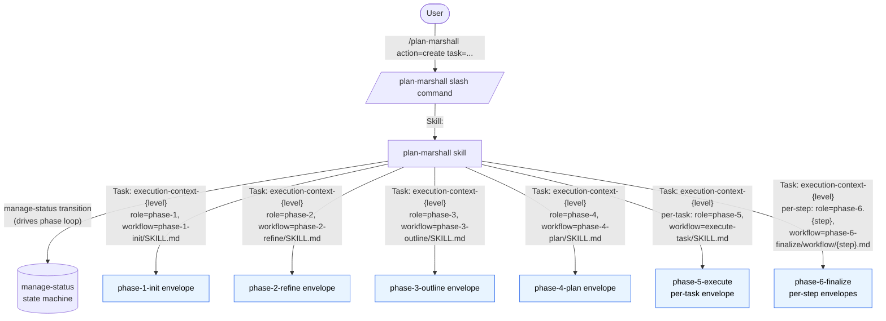
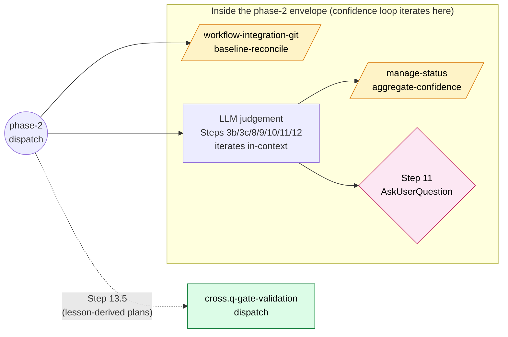
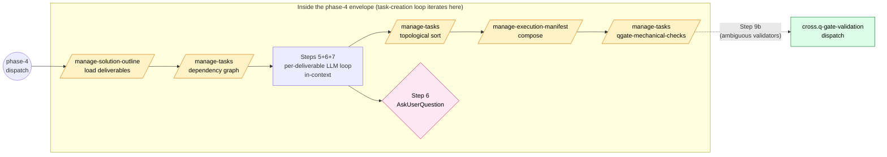
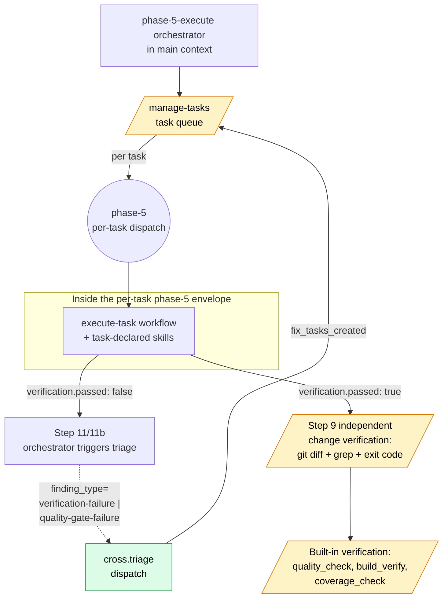
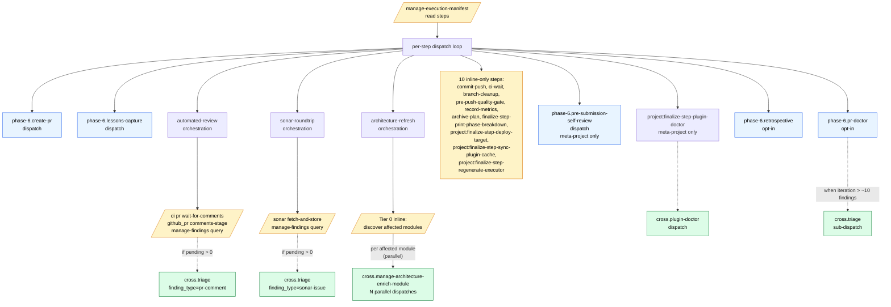
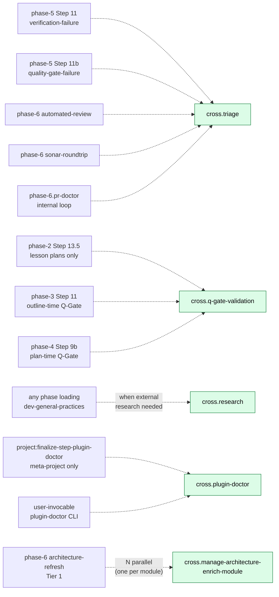
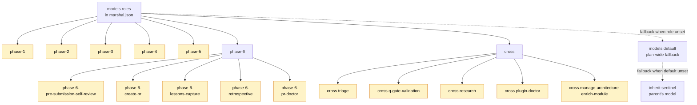

# Call Graph — Every Dispatch Path Starting from `plan-marshall`

Holistic view of every dispatch path in the plan-marshall bundle: orchestrator entry, per-phase dispatches under the 10 phase-bound role keys, cross-phase shared LLM cores under the 5 `cross.*` role keys, plus the inline-script steps that earn no envelope. Companions:

- **`agents.md`** — the dispatch contract (prompt-body fields, `Task: execution-context-{level}` shape, mandatory rules).
- **`dispatch-walkthrough.md`** — three concrete end-to-end traces for representative dispatches.
- **`../../extension-api/standards/dispatch-granularity.md`** — the heuristics that decide which call sites get a dispatch envelope vs. an inline script.
- **`../../plan-marshall/standards/model-roles.md`** — the 15-key role registry (per-call-site level resolution).

This doc is the **graph** view; the others are the **contract**, **examples**, and **heuristics** views of the same surface.

---

## 1. Top-level entry



The orchestrator never spawns a raw `Task: general-purpose`. Every subagent dispatch targets `plan-marshall:execution-context` (canonical inherit) or `plan-marshall:execution-context-{level}` (variant resolved from a role key via `manage-config models resolve-target`). The workflow doc + skill loads flow through the prompt body.

---

## 2. Per-phase detail

Each phase envelope runs the workflow doc inside the subagent context, calling inline scripts and sometimes sub-dispatching cross-phase cores. Hexagons are scripts (deterministic — no envelope). Blue rounded boxes are LLM dispatches (envelopes).

### 2.1 phase-1-init

```mermaid
flowchart LR
    P1((phase-1<br/>dispatch))

    subgraph Inside["Inside the phase-1 envelope"]
        S5d[/manage-architecture<br/>snapshot/]:::script
        S5c[/manage-lessons<br/>lesson-auto-suggest/]:::script
        S7[/manage-config<br/>domain-detect/]:::script
        S6[/manage-references<br/>init/]:::script
        AUQ{AskUserQuestion<br/>when ambiguous}:::user
    end

    P1 --> S5d
    P1 --> S5c
    P1 --> S7
    P1 --> S6

    S5c -.->|"ambiguous → fallback<br/>(uses models.default,<br/>no role key)"| LessonFB[execution-context-{level}<br/>fallback dispatch]:::dispatched
    S7 -.->|"ambiguous"| AUQ

    classDef script fill:#fef3c7,stroke:#d97706,color:#000
    classDef dispatched fill:#e8f4ff,stroke:#2563eb,color:#000
    classDef user fill:#fce7f3,stroke:#be185d,color:#000
```

### 2.2 phase-2-refine



### 2.3 phase-3-outline

```mermaid
flowchart LR
    Pre[/manage-status<br/>change-type-heuristic<br/>Step 4/]:::script
    P3((phase-3<br/>dispatch))

    Pre -.->|"ambiguous → fallback<br/>(models.default)"| CTLLM[execution-context-{level}<br/>change-type-detect<br/>fallback]:::dispatched
    Pre --> P3

    subgraph Inside["Inside the phase-3 envelope (Simple OR Complex Track)"]
        Track{track=<br/>simple OR complex}
        Simple[Simple Track Steps 6-8<br/>iterate in-context]
        Complex[Complex Track Steps 9c+10+10b<br/>per-deliverable loop in-context]
        S6V[/target validation<br/>ls -la per target/]:::script
        S9D[/architecture<br/>which-module/]:::script
    end

    Track --> Simple
    Track --> Complex
    Simple --> S6V
    Complex --> S9D

    P3 -.->|"Step 11"| QG[cross.q-gate-validation<br/>dispatch]:::cross

    classDef script fill:#fef3c7,stroke:#d97706,color:#000
    classDef dispatched fill:#e8f4ff,stroke:#2563eb,color:#000
    classDef cross fill:#dcfce7,stroke:#15803d,color:#000
```

### 2.4 phase-4-plan



### 2.5 phase-5-execute



### 2.6 phase-6-finalize



---

## 3. Cross-phase shared cores — fan-in

The five `cross.*` keys are shared LLM-judgement workflows dispatched from multiple call sites. The dispatch contract (workflow doc + skills + runtime inputs) is identical at every site; only the runtime inputs differ.



`cross.triage` is the most-shared core. Inside its envelope, findings are pre-grouped by `(domain, rule_id)` and a single batched LLM decision per group decides FIX / SUPPRESS / ACCEPT / AskUserQuestion. The findings live in the per-plan store and are queried **by reference** as the subagent's first workflow step — they are never embedded in the prompt body. Full algorithm in `../../plan-marshall/workflow/triage.md`.

`cross.manage-architecture-enrich-module` is the only per-iteration **parallel** dispatch in the contract (every other per-X loop iterates in-context inside one envelope; see `../../extension-api/standards/dispatch-granularity.md` § 4).

---

## 4. The 15-key role registry — overlay

The hierarchical role registry (`marshal.json` `models.roles`) groups every dispatch site under one of 7 groups. The resolver walks deepest-first to pick a level, then the variant emitter pins the `(model, effort)` primitive.



15 keys total: 5 flat phase-level + 5 phase-6 sub-keys + 5 cross sub-keys. The resolver accepts dotted notation (`--role phase-6.create-pr`), two-flag form (`--phase phase-6 --role create-pr`), or flat (`--role phase-1`).

Level values resolve to `(model, effort)` per `../../plan-marshall/standards/model-levels.md` (six tiers: `low`, `medium`, `high`, `xhigh`, `xxhigh`, `max`, plus the `inherit` sentinel).

---

## 5. The dispatch-vs-script verdict — at a glance

The granularity heuristics live in `../../extension-api/standards/dispatch-granularity.md`. Cross-reference for each candidate workflow:

| Candidate work | Verdict | Reason |
|----------------|---------|--------|
| phase-1 Step 5c lesson auto-suggest | Script + LLM fallback | Recipe registry match is deterministic; ambiguous case escalates. |
| phase-1 Step 7 domain detection | Script + AskUserQuestion | Single match auto-selects; ambiguity is human-input territory, not LLM. |
| phase-2 confidence loop | Bundle into `phase-2` | Steps 3b/3c/8/9/10/11/12 share context. |
| phase-2 Step 3d baseline reconciliation | Hybrid — script + bundle | git fetch/diff is mechanical; classification bundles into `phase-2`. |
| phase-2 Step 10 confidence aggregation | Script | Pure weighted math. |
| phase-2 Step 13.5 Q-Gate (lesson) | `cross.q-gate-validation` | LLM judgement shared with phase-3 and phase-4. |
| phase-3 Step 4 change-type | Script + LLM fallback | Keyword classifier resolves majority; ambiguous escalates. |
| phase-3 Complex Track Steps 9c+10+10b | Bundle into `phase-3` | Per-deliverable loop iterates in-context. |
| phase-3 Step 11 Q-Gate (outline-time) | `cross.q-gate-validation` | Shared core. |
| phase-4 Steps 5+6+7 task creation | Bundle into `phase-4` | Per-deliverable loop iterates in-context. |
| phase-4 Step 9 mechanical Q-Gate checks | Script | Pure regex + graph + filesystem. |
| phase-4 Step 9b LLM Q-Gate | `cross.q-gate-validation` | Shared core (only when mechanical script returns ambiguous). |
| phase-5 per-task execution | `phase-5` per-task dispatch | One envelope per task; the implementation+testing+build_runner pending keys collapsed into this. |
| phase-5 Step 9 independent verification | Inline scripts | git diff + grep + exit-code; no LLM. |
| phase-5 Step 11/11b triage | `cross.triage` | Shared core. |
| phase-6 commit-push, ci-wait, branch-cleanup, etc. (10 steps) | Inline scripts | No LLM judgement. |
| phase-6 create-pr | `phase-6.create-pr` | Body composition is LLM work. |
| phase-6 automated-review orchestration | Inline scripts + `cross.triage` | Producer + enumeration inline; triage shared. |
| phase-6 sonar-roundtrip orchestration | Inline scripts + `cross.triage` | Same shape. |
| phase-6 lessons-capture | `phase-6.lessons-capture` | Lesson extraction is LLM work. |
| phase-6 pre-submission-self-review | `phase-6.pre-submission-self-review` | Structural review (meta-project only). |
| phase-6 retrospective | `phase-6.retrospective` | 8 LLM aspects iterate in-context. |
| phase-6 pr-doctor | `phase-6.pr-doctor` | Diagnose + report + internal triage. |
| phase-6 architecture-refresh Tier 0 | Inline scripts | Deterministic discover + diff. |
| phase-6 architecture-refresh Tier 1 | `cross.manage-architecture-enrich-module` × N parallel | The only per-iteration parallel dispatch. |
| phase-6 project:finalize-step-plugin-doctor | `cross.plugin-doctor` | Meta-project only. |

---

## 6. Reading the graphs

- **Round/rectangular blue nodes** — LLM dispatches (envelopes). Each carries a fixed ~5–15 K-token overhead (system prompt + skill loads + workflow doc + prompt envelope + tool round-trips). They earn their cost only when the LLM-judgement work clears ~10 K tokens.
- **Hexagons (`/.../`)** — Deterministic scripts. No envelope. Invoked via `python3 .plan/execute-script.py <notation> ...` from the orchestrator's context.
- **Pink diamonds** — `AskUserQuestion` gates. Propagate to the host UI directly from whichever context raises them.
- **Green nodes** — `cross.*` shared LLM cores. Same role-key surface seen from multiple call sites.
- **Solid arrows** — Unconditional flow.
- **Dashed arrows** — Conditional / fallback / gated by a predicate (e.g., "if pending findings > 0", "ambiguous heuristic case").

The granularity heuristics in `../../extension-api/standards/dispatch-granularity.md` justify each verdict in § 5's table. The contract every dispatched workflow satisfies (input contract, output contract, Worktree Header) lives in `agents.md` and `../../extension-api/standards/ext-point-execution-context-workflow.md`. Concrete code-level traces for three representative dispatches live in `dispatch-walkthrough.md`.

---

## Cross-references

- The dispatch contract — [`agents.md`](agents.md)
- Worked end-to-end traces — [`dispatch-walkthrough.md`](dispatch-walkthrough.md)
- Granularity heuristics (when to dispatch vs script vs inline) — [`../../extension-api/standards/dispatch-granularity.md`](../../extension-api/standards/dispatch-granularity.md)
- Workflow-doc implementor contract — [`../../extension-api/standards/ext-point-execution-context-workflow.md`](../../extension-api/standards/ext-point-execution-context-workflow.md)
- Role-key registry (15 keys) — [`../../plan-marshall/standards/model-roles.md`](../../plan-marshall/standards/model-roles.md)
- Level → `(model, effort)` primitive — [`../../plan-marshall/standards/model-levels.md`](../../plan-marshall/standards/model-levels.md)
- Smart-grouping triage algorithm — [`../../plan-marshall/workflow/triage.md`](../../plan-marshall/workflow/triage.md)
- Findings-pipeline (the producer/store/consumer pattern `cross.triage` rides on) — [`findings-pipeline.md`](findings-pipeline.md)
- Phase boundaries and phase-lifecycle — [`phase-lifecycle.md`](phase-lifecycle.md), [`phases.md`](phases.md)
